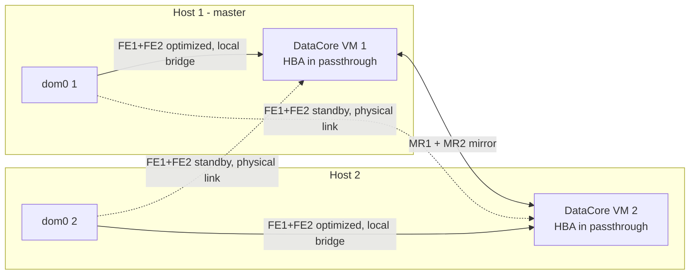

# DataCore SANsymphony PSP22 deployment on an XCP-ng 8.3 pool (2 nodes)

Version of 2026-10-09 (revision 9). The accepted deviations and the items still open are in section 11.

## 1. Scope and architecture

This procedure deploys SANsymphony 10.0 PSP22 in a hyperconverged setup on an XCP-ng 8.3 pool of 2 identical hosts. Each host runs a SANsymphony Windows VM that gets its SAS HBA through passthrough. The vDisks, mirrored between the two VMs, are presented over iSCSI to both dom0s.

**Support status.** XCP-ng is not in the DataCore compatibility matrix, which only lists XenServer 7.1, 7.2 and 8.2. Mirrored vDisks are therefore "Not Qualified" on it: they work, but without contractual support for high availability. The XenServer HCL also advises against hosting the storage controller on the hypervisor it serves, because of boot ordering. The procedures in section 9 address this risk.

**Conventions.** All site-specific values live in two variables files: `datacore-xcp.conf` on the XCP-ng side (section 3.1) and `DataCoreNode.psd1` on the Windows side (section 5.1). The procedure refers to them by variable name:

- **N** is the node number (1 or 2), **P** the partner node (3 − N). Node 1 is the pool master.
- **Host N** is the XCP-ng host `HOSTS[N]`; **DataCore VM N** is the SANsymphony VM `DC_VMS[N]`, which runs on host N.
- A storage address is written `SUBNET[network]` followed by the last octet: `DC_OCT[N]` for DataCore VM N, `HOST_OCT[N]` for the dom0 of host N.
- Values given in parentheses are the defaults of the variables files, given as examples.
- **Both scripts are driven from their menu.** Each step gives the menu entry as *number* `name` (for example **5** `host`), then the equivalent direct command, which stays usable for cron, the UPS agent and SSH. The menus are described in sections 3.2 and 5.2.



Each dom0 has 4 paths per LUN:

- 2 optimized paths (ALUA prio 50) to the local DataCore VM;
- 2 standby paths (prio 10) to the remote DataCore VM.

**Local paths do not go through the physical NICs.** The dom0 and the DataCore VM of the same host are plugged into the same OVS bridge: this traffic stays inside the host. It therefore does not depend on cables, but on dom0 CPU (netback). Only the standby paths and the mirror use the physical links.

**The front-end ports only serve the dom0s.** Between the two DataCore VMs, the only iSCSI connections are those of the mirror, on MR1 and MR2. No connection is opened from one DataCore server to the front-end ports of the other.

Consequences:

- **Loss of a whole node**: I/O on the surviving node carries on without failover, since its active paths are local.
- **Loss of the local DataCore VM alone** (crash, hang) while the host stays up: I/O on that host freezes for the detection time, then fails over to the standby paths. This delay is about 15 s (section 7).

**Addressing plan**

| Network | Physical NIC | Subnet | dom0 of host N | DataCore VM N | MTU |
| --- | --- | --- | --- | --- | --- |
| Pool management (`MGMT_NET`) | pool management NIC or bond | site addressing | host management IP | none, unless `DC_MGMT_NET` is empty | site value |
| DataCore VM management (`DC_MGMT_NET`, `MGMT_NET` if empty) | see section 2 | site addressing | none | `Nodes[N].MgmtIp` | site value |
| DC-FE1 | `NIC[DC-FE1]` | `SUBNET[DC-FE1]`.0/24 (10.200.11) | `HOST_OCT[N]` (11 / 12) | `DC_OCT[N]` (21 / 22) | `MTU` (9000) |
| DC-FE2 | `NIC[DC-FE2]` | `SUBNET[DC-FE2]`.0/24 (10.200.12) | `HOST_OCT[N]` | `DC_OCT[N]` | `MTU` |
| DC-MR1 | `NIC[DC-MR1]` | `SUBNET[DC-MR1]`.0/24 (10.200.21) | none | `DC_OCT[N]` | `MTU` |
| DC-MR2 | `NIC[DC-MR2]` | `SUBNET[DC-MR2]`.0/24 (10.200.22) | none | `DC_OCT[N]` | `MTU` |

Management is not configured by the scripts: the pool keeps its own, and the DataCore VM gets a static site IP on the network named by `DC_MGMT_NET`. The storage networks are /24s without a gateway. They must not be routed, advertised in a VPN, used anywhere else in the IT system, or overlap the management network or a range that could extend it. Before deployment, check that no existing route or VPN covers these subnets: otherwise dom0 or Windows could pick the wrong interface. The defaults group storage under 10.200.0.0/16, with a third octet that reflects the function (1x for front-end, 2x for mirror).

The mirror stays strictly VM to VM: the dom0s have no IP on MR1/MR2. Physical NICs are chosen per function in `NIC`, after running **1** `nics`.

## 2. Prerequisites

**Hardware, per host**

- I/O virtualization (Intel VT-d or AMD-Vi) enabled in the BIOS/UEFI.
- A dedicated boot controller (M.2 RAID card, onboard controller…). It holds dom0 and the local SR that hosts the DataCore VM. This SR must never depend on DataCore.
- A SAS HBA in IT mode dedicated to passthrough, with only the DataCore pool disks behind it. It must not share any PCI function with another device.
  - Record its BDF on **each** host with `lspci -nn`: it can differ from one host to the other.
  - The variables file takes one BDF per node (`PCI_BDF`).
- 2 FE links and 2 MR links, spread over at least two physical NICs, with the same MTU end to end (`MTU`, 9000 by default).
  - With 2 nodes, the 4 links can be cabled directly host to host, without a switch. This removes a point of failure, and the switch-side MTU question goes away.
  - In that case, validate the "FE link cut" test of section 8: local traffic must keep flowing in the bridge when the physical link goes down.
- A management network separate from the 4 storage NICs, **on a bond of two NICs** (active/passive, ideally across two switches). The HA network heartbeat only goes over this network. On a 2-host pool, losing it on one host ends, after `HA_TIMEOUT`, in the fence of one of the two hosts even though storage and DataCore are healthy (test of section 8): the hosts cannot tell this from a crash of the other one. The bond is the only protection.
- **The management VIF of the DataCore VMs must not depend on the single management link of a host.** The DataCore servers talk to each other over this network: when the management cable of host 2 was unplugged with the DataCore VMs on that same link, they lost each other and the front-end of host 2 was cut. With the DataCore VMs on a dedicated network, DataCore stayed healthy. Put VIF 0 on a dedicated network (`DC_MGMT_NET`) or on the bonded management network.
- A UPS able to trigger a command on the master (NUT or vendor agent), to run `./datacore-xcp.sh stop --ups`. Its runtime must cover the full shutdown, production VMs included (budget in section 9), and the command must be triggered early enough. A simultaneous power loss on both nodes has two effects: DataCore RAM-cached writes are lost, and the next boot gets stuck (section 9).
- BIOS/UEFI of each host set as DataCore recommends for a DataCore Server (the DataCore VM shares the host's CPUs): Intel Turbo Boost disabled, power saving (C-states) disabled with the Static High / maximum performance profile, Collaborative Power Control disabled, AES-NI enabled, Hyper-Threading enabled on CPUs from 2014 or later. The server vendor's low-latency profile applies unless it contradicts these settings.
- If the storage links go through switches: no Spanning Tree on the iSCSI ports (STP, RSTP, MSTP), hardware flow control on the NICs and the switch ports, no oversubscription, switch MTU above `MTU`.

**Software**

- XCP-ng 8.3 up to date, with the same patches on both hosts.
- Windows Server 2025 (XCP-ng template `WIN_TEMPLATE`), with licensing for the 2 VMs.
  - Windows Server 2025 has been qualified by DataCore since SANsymphony 10.0 PSP21.
  - Install the latest Microsoft Monthly Rollup for the OS and for .NET.
- XCP-ng Windows PV Tools.
- SANsymphony 10.0 PSP22. The license must be activated within 30 days, otherwise the software stops.
- Windows HBA driver, supplied by the vendor and matched to its firmware.
- DataCore script `iSCSI_Best_Practices_3.11.ps1` (version 3.11 or later, which supports Windows Server 2025).
- DataCore cmdlets (`DataCore.Executive.Cmdlets` module), installed with SANsymphony. Used by the `Ports`, `Hosts`, `Test` and `PrePatch` phases, with a local connection under the Windows administrator account.
- The DataCore Windows Integration Kit is only used on Windows hosts. It is not required here, since the initiators are the XCP-ng dom0s.

**Environment**

- One or more NTP servers reachable from the management network (`NTP_SERVERS`), preferably the same source as the domain PDC emulator.
- Passwordless key-based SSH as `root` from each dom0 to the other, on the management addresses. It is set up by **2** `ssh-setup` (section 4), which asks for the root password of the other host once. `sync` requires it; `ha-on` and `resume` use it to check the other host (if it fails, they ask for a manual confirmation). `status` shows whether it works.
- Xen Orchestra (XOA) must not be hosted on the DataCore SR. Otherwise it is unavailable during a cold start, which is exactly when it is needed. Place it outside the pool, or on a local SR.
- **HA is never disabled or enabled from Xen Orchestra.** XO enables HA without a timeout: the pool goes back to the XAPI default instead of `HA_TIMEOUT` (120 s), and a cut of the DataCore links then ends in a fence (test of section 8). Only **16** `ha-off` and **15** `ha-on` are used. `check` and `status` raise an alert if the timeout is not `HA_TIMEOUT`; `ha-on` fixes it.
- Xen Orchestra **Rolling Pool Update** is forbidden on this pool:
  - it tries to migrate the DataCore VMs, which is impossible;
  - it chains reboots without waiting for resynchronization.

  Patching goes exclusively through `maint N` / `resume N` (section 9).

**Delivered files**

| File | Where | Role |
| --- | --- | --- |
| `datacore-xcp.sh` | `/root` on both hosts | The whole XCP-ng side: SSH between hosts, network, IQN, NTP, multipath, iSCSI, passthrough, DataCore VMs, SR, HA, operations, monitoring. Contains no site value |
| `datacore-xcp.conf` | `/root` on both hosts, next to the script | **All** XCP-ng side variables |
| `Set-DataCoreNode.ps1` | `C:\DataCore\Scripts` on each DataCore VM | Windows network, page file, SkipAsSource, Windows Update, dumps, call to the DataCore Best Practices script, iSCSI initiator (mirror links), DMC ports and XCP-ng hosts through the DataCore cmdlets, Windows patching, tests. Contains no site value |
| `DataCoreNode.psd1` | `C:\DataCore\Scripts`, next to the script | **All** Windows side variables (identical on both VMs) |
| `iSCSI_Best_Practices_3.11.ps1` | `C:\DataCore\Scripts` | DataCore script, called by the `PostInstall` phase |

The scripts are updated by replacing the file, without touching the site values. The commands use no `<...>` placeholder, which bash would interpret as a redirection. After any change on the XCP-ng side, **3** `sync` copies script and variables to the other host; `status` shows the md5 fingerprint of both files for comparison.

## 3. `datacore-xcp.sh` script and `datacore-xcp.conf` file

### 3.1 Variables file

The script loads `datacore-xcp.conf` from its own folder (or the file pointed to by `DATACORE_XCP_CONF`). It checks that every mandatory variable is present before any command and stops with the name of the missing variable. The file uses bash syntax: keep the array parentheses, the quotes and the `declare -A` statements.

For the manual commands in this procedure, load the file into the current shell: `. /root/datacore-xcp.conf`. The variables (`HOSTS`, `SR_NAME`…) can then be used directly.

| Variable | When to set it | How to get it |
| --- | --- | --- |
| `HOSTS`, `DC_VMS` | Before anything | `xe host-list params=name-label`; names chosen for the DataCore VMs |
| `NIC`, `MGMT_NET` | Before `pool-net` | **1** `nics`: one NIC per function, same name on both hosts, excluding management |
| `DC_MGMT_NET` | Before `dcvm N` | `xe network-list params=name-label`: network of the management VIF of the DataCore VMs (section 2). Empty = `MGMT_NET` |
| `SUBNET`, `HOST_OCT`, `DC_OCT`, `MTU` | Before `host N` | Addressing plan (section 1). Copy identically into `DataCoreNode.psd1` |
| `IQN_PREFIX`, `HOST_IQN` | Before `host N` | Site convention (section 4.1). Value suggested at the prompt, can be changed |
| `NTP_SERVERS` | Before `host N` | Site NTP servers. Mandatory |
| `PCI_BDF` | Before `pci-check N` | `lspci -nn \| grep -iE 'sas\|raid'` on **each** host |
| `DC_VCPU`, `DC_RAM_GIB`, `DC_DISK_GIB`, `LOCAL_SR`, `DC_VCPU_MASK` | Before `dcvm N` | Sizing. `DC_VCPU`: 10 at least (DataCore rule: 4 vCPU + 3 per pair of iSCSI ports, here the FE pair and the MR pair; +1 with performance recording). Empty `LOCAL_SR` = automatic detection |
| `WIN_TEMPLATE`, `WIN_ISO` | Before `dcvm N` | `xe template-list params=name-label \| grep -i windows`; `xe cd-list` |
| `SR_NAME` … `SHUTDOWN_TIMEOUT` | Reference values | Do not change without a reason |

File: [`datacore-xcp.conf`](../scripts/en/datacore-xcp.conf) (`scripts/en/` folder of the repository).

### 3.2 Commands and menu

Copy the script to `/root` on both hosts (`chmod +x`), together with its variables file. Each command checks that it runs in the right place: on the master, or on the host of the given node. Commands that change something are logged in `/var/log/datacore-xcp.log`.

**Menu.** Run without an argument from a console (`./datacore-xcp.sh`), the script opens a command menu grouped by stage: host preparation, DataCore VMs, iSCSI storage and HA, operations. The header shows the host, its node number and its actual role (master or member). Each entry states where to run it: `[M]` master, `[L]` local host, `[2]` each host. The menu asks for the arguments:

- `host`, `pci-check`, `pci-hide`: local node, enforced (these commands refuse any other node);
- `dcvm`, `dcpci`, `maint`, `resume`: node number to enter;
- `sr`, `ha`: LUN picked from the list of DataCore LUNs seen by the host (paths, size, SR already created);
- `protect`: VM picked from a list (state, HA priority), then start order;
- `stop`: normal or UPS mode.

The menu shows the equivalent direct command, returns to the menu after each action (an error only aborts the action, and so does Ctrl+C) and logs as in direct execution. With a command as argument, the script runs it directly (cron, UPS agent, SSH); `help` lists the commands. Without an argument and without a console, it shows the help and returns code 1.

| Menu | Command | Where | Action |
| --- | --- | --- | --- |
| 1 | `nics` | any host | Lists the physical NICs of each host (device, MAC, network, IP, management) to fill in `NIC` |
| 2 | `ssh-setup` | any host | Sets up key-based root SSH between the two dom0s, in both directions: key pair created if missing, host keys recorded, public keys exchanged. Asks for the root password of the other host once. Can be rerun |
| 3 | `sync` | any host | Copies the script and `datacore-xcp.conf` to the other host (scp), then shows the md5 on both sides. Refused until `ssh-setup` has been run |
| 4 | `pool-net` | master | Checks the `NIC` selection on both hosts, then renames the networks to DC-FE1/FE2/MR1/MR2, applies `MTU`, replugs the PIFs. Refused if a DataCore VM is running |
| 5 | `host N` | host N | IQN (suggested value, can be typed in), dom0 FE IPs (without touching an already correct PIF), XAPI multipathing, NTP (through XAPI if the host manages it, otherwise `chrony.conf`), multipath `custom.conf` (ALUA handler included), scheduled tasks `/etc/cron.d/datacore-xcp` (`relogin`, `check`, with an explicit `PATH`). Can be rerun on a pool in service (the IQN can then no longer be changed) |
| 6 | `netcheck` | each host | Non-fragmented ping at `MTU` size to the other host's dom0 on FE1 and FE2 |
| 7 | `pci-check N` | host N | Blocking checks before hiding (IOMMU, LVM PVs, dom0 root), then inventory of the dom0 disks |
| 8 | `pci-hide N` | host N | Refused if the other host is not reachable; `pci-check N`, then XAPI hiding of the HBA and reboot |
| 9 | `dcvm N` | master | Checks the `WIN_TEMPLATE` template and the networks, then creates DataCore VM N **without the HBA**: VHD disk, static RAM, VIFs with fixed MACs (VIF 0 on `DC_MGMT_NET`), auto_poweron |
| 10 | `dcpci N` | master | Attaches the HBA to DataCore VM N (VM halted), after Windows and the PV tools are installed |
| 11 | `iscsi` | each host | Login to the 4 portals, rescan of the sessions, session count, list of DataCore LUNs with their path count and the DataCore SR they back, effective `recovery_tmo`. Before vDisks are served: 4 sessions, no LUN |
| 12 | `relogin` | each host (cron, every minute) | Restores the session to any DataCore portal that has no session and answers on port 3260, then re-reads the kernel ALUA state of the paths that multipathd sees `ready` and the kernel does not see as active (device rescan, then session rescan). Only acts if a DataCore SR is attached on the host. Covers a host reboot, a cold start and a loss of access to DataCore (section 10) |
| 13 | `sr SCSIID` | master | Creates the data LVMoISCSI SR and sets it as default SR (multipathing required) |
| 14 | `ha SCSIID` | master | Creates the heartbeat SR and enables HA (`HA_TIMEOUT`) |
| 15 | `ha-on` | master | Enables HA with `HA_TIMEOUT`, with the same checks as `ha`. Before enabling, waits up to 10 min for each host to have 4 `ready` paths per LUN, active for the kernel (`relogin` then `check` on each host, over SSH for the other one). If HA is already enabled with another timeout (HA toggled from Xen Orchestra), offers to disable and re-enable it with `HA_TIMEOUT` |
| 16 | `ha-off` | master | Disables HA before a planned operation. Replaces any HA action in Xen Orchestra |
| 17 | `protect VM [order]` | master | Checks that the VM (name or UUID) is agile, then protects it with HA |
| 18 | `status` | any host | State of the hosts, multipathing, DataCore VMs and their HBA, PBDs, HA and its timeout (pool and `xhad.conf`), IQN, multipath (handler included), iSCSI sessions, paths with kernel ALUA state, local `recovery_tmo`, multipath configuration (`mpverify`), SSH to the other host, md5 of the script and variables |
| 19 | `check [--quiet]` | each host (cron, 5 min) | Re-reads the kernel ALUA state as `relogin` does. Reports any DataCore LUN with fewer than 4 `ready` paths, any `ready` path still not active for the kernel and, on the master, HA enabled with a timeout other than `HA_TIMEOUT` (syslog unless `--quiet`, exit code 1) |
| 20 | `mpverify` | each host | Checks that the effective multipath configuration is still the one written by `host N` (`defaults`, DataCore block, `hwhandler='1 alua'` on the maps) and that the cron file carries its `PATH`. An XCP-ng update can replace the multipath files. Exit code 1 on drift: rerun `host N` |
| 21 | `start` | master | Ordered cold start: the DataCore VM stopped last starts first, and DataCore must answer on port 3260 before the other one starts; uncontrolled shutdown detected (section 9). Then SRs, HA and protected VMs by order |
| 22 | `stop [--ups]` | master | Ordered full shutdown: **clean shutdown of all guest (production) VMs first**, in parallel, forced after `SHUTDOWN_TIMEOUT`, with a check that none is left; then SRs, DataCore VM 2 then 1 (last shutdown recorded in the pool database), then the other host and the master last; `--ups` without confirmation, hosts included |
| 23 / 24 | `maint N` / `resume N` | master | Put a node into maintenance / bring it back (XCP-ng patching). `resume N` first runs `mpverify` on host N and stops on drift |
| 25 | `rescue` | stuck host | Emergency exit from HA (statefile deadlock) |

File: [`datacore-xcp.sh`](../scripts/en/datacore-xcp.sh) (`scripts/en/` folder of the repository).

## 4. Host preparation and DataCore VM creation

The pool must already be built, with management on the `MGMT_NET` network. Put `datacore-xcp.sh` and `datacore-xcp.conf` in `/root` on the master, then open the menu: `chmod +x datacore-xcp.sh; ./datacore-xcp.sh`. The same file is opened on host 2 once step 5 has copied it there.

| Step | Where | Menu | Direct command | Expected |
| --- | --- | --- | --- | --- |
| 1 | master | **1** `nics` | `./datacore-xcp.sh nics` | One NIC per function → `NIC` |
| 2 | each host | (shell) | `lspci -nn \| grep -iE 'sas\|raid'` | BDF of the HBA → `PCI_BDF[N]` |
| 3 | master | (shell) | `vi datacore-xcp.conf` | Table in section 3.1 |
| 4 | master | **2** `ssh-setup` | `./datacore-xcp.sh ssh-setup` | Root password of host 2 asked once; "working in both directions" |
| 5 | master | **3** `sync` | `./datacore-xcp.sh sync` | Identical md5 on both hosts |
| 6 | master | **4** `pool-net` | `./datacore-xcp.sh pool-net` | 4 DC- networks at `MTU` on both hosts |
| 7 | each host | **5** `host` | `./datacore-xcp.sh host N` | Accept or type the IQN; note the final IQN shown |
| 8 | each host, once step 7 is done on both | **6** `netcheck` | `./datacore-xcp.sh netcheck` | OK on FE1 and FE2 |
| 9 | each host | **7** `pci-check` | `./datacore-xcp.sh pci-check N` | No BLOCKING line |

In the menu, `host`, `pci-check` and `pci-hide` take the local node by themselves: N is only typed in direct execution (1 on the master, 2 on the other host).

If `ssh-setup` fails with "key refused", check `PermitRootLogin` and `PubkeyAuthentication` in `/etc/ssh/sshd_config` of the other host. Rerun it after a host is reinstalled (its host key changes). `status` shows on each host whether SSH to the other one works.

### 4.1 dom0 IQNs

`host N` shows the current IQN, then suggests a value, in this order of priority: `HOST_IQN[N]` if set, otherwise `IQN_PREFIX:host-name`, otherwise the current IQN. Enter accepts the suggestion; any other input replaces it. The format is checked: `iqn.YYYY-MM.reversed.domain[:name]`, lowercase (for example `iqn.2026-09.lan.example:xcp-01`). The change goes through XAPI, which rewrites `/etc/iscsi/initiatorname.iscsi`.

The IQN is set **before** the first `iscsi` command and before the hosts are registered in the DMC: the script refuses the change as soon as an iSCSI session is open. Manual equivalent, on the host concerned:

```bash
. /root/datacore-xcp.conf
H=$(xe host-list name-label="${HOSTS[1]}" --minimal)          # [2] for host 2
xe host-param-set uuid=$H iscsi_iqn=iqn.2026-09.lan.example:xcp-01
grep InitiatorName /etc/iscsi/initiatorname.iscsi
```

### 4.2 NTP

`host N` detects whether XAPI manages NTP (the host's `ntp-mode` field, present on recent XCP-ng 8.3 versions). In that case XAPI rewrites `chrony.conf`, and any manual change would be lost: the script then goes through `xe`, with the servers in `NTP_SERVERS`, and prints "NTP managed by XAPI". Otherwise it writes `chrony.conf`.

Equivalent manual procedure, on the master, for each host:

```bash
. /root/datacore-xcp.conf
H=$(xe host-list name-label="${HOSTS[1]}" --minimal)                        # [2] for host 2
xe host-param-get uuid=$H param-name=ntp-mode                               # error = NTP not managed by XAPI -> chrony.conf
xe host-param-set uuid=$H ntp-custom-servers="$(IFS=,; echo "${NTP_SERVERS[*]}")"
xe host-param-set uuid=$H ntp-mode=Custom                                   # depending on the XAPI version: ntp_mode_custom
xe host-param-get uuid=$H param-name=ntp-mode
# then on the host concerned
chronyc sources                                                             # one source marked '*'
```

The value accepted by `ntp-mode` depends on the XAPI version (`Custom` or `ntp_mode_custom`); the script tries both. If it is refused, `xe host-param-list uuid=$H | grep -i ntp` shows the current mode and its syntax. Do not edit `chrony.conf` manually on a host in XAPI mode.

### 4.3 HBA hiding: one host at a time, host 2 first

`pci-hide N` reboots the host. While the master (host 1) reboots, host 2 has no master: no `xe` command works on it, `pci-check 2` and `pci-hide 2` included. Host 2 is therefore hidden first, then the master, waiting for each host to be fully back. `pci-hide N` refuses to run until the other host is back (`host-metrics-live`).

| Step | Where | Menu | Direct command | Expected |
| --- | --- | --- | --- | --- |
| 1 | host 2 | **8** `pci-hide` | `./datacore-xcp.sh pci-hide 2` | Confirm the BDF; host 2 reboots |
| 2 | master | **18** `status` | `./datacore-xcp.sh status` | Wait until host 2 is `enabled` and `host-metrics-live` |
| 3 | host 2 | **7** `pci-check` | `./datacore-xcp.sh pci-check 2` | HBA in `pci-assignable-list`, disks gone from dom0 |
| 4 | master | **8** `pci-hide` | `./datacore-xcp.sh pci-hide 1` | Host 2 loses its master during this reboot: run nothing on it |
| 5 | master | **7** `pci-check`, then **18** `status` | `./datacore-xcp.sh pci-check 1` | XAPI can take a few minutes to answer; both hosts enabled and live |

### 4.4 DataCore VMs

On the master: **9** `dcvm`, node 1, then again for node 2 (`./datacore-xcp.sh dcvm 1`, then `dcvm 2`).

`dcvm N` first checks that the `WIN_TEMPLATE` template and the 5 networks exist; otherwise it lists the available Windows templates, or names the missing network, and stops. The HBA is **not** attached at creation: it is attached by **10** `dcpci`, after Windows and the PV tools are installed (section 5). The Windows installer thus only sees the system disk: the DataCore pool disks cannot be picked as a destination by mistake, and a native controller driver does not get installed before the vendor's.

Checkpoints:

- **Before `pci-hide N`**: `pci-check N` must show the dom0 root and the local SR on the boot controller disks (`lsblk`/`pvs` inventory). Behind `PCI_BDF[N]` there must be only the DataCore pool disks. A wrong BDF hides the boot controller, and the host no longer boots (section 10).
- **After `host N`**:
  - the final IQN shown is the expected one;
  - `XAPI multipathing: true`;
  - `chronyc sources` shows a source marked `*`;
  - `polling_interval 10` and `fast_io_fail_tmo 5` appear in the `defaults` section shown, and `no_path_retry 6` in the DataCore block. `fast_io_fail_tmo` sets the iSCSI detection delay (section 7), which can be checked after the SR is created.
- **`netcheck`** validates the MTU of the switches (or of the direct cabling) on FE before Windows is installed. MR can only be tested from the VMs (section 5).
- **The DataCore VM** is pinned to its host. Once the HBA is attached, it can neither migrate nor take a memory snapshot: during updates, it shuts down. `has-vendor-device=false` prevents Windows Update from installing or replacing the PV drivers.
- **The VIFs** get fixed MACs `02:dc:00:0N:00:0i`, where N is the node number and i the VIF index. This is the only reliable marker on the Windows side, which does not enumerate PV adapters in VIF order:

  | VIF (i) | Windows MAC (N = node number) | XCP-ng network | Windows name |
  | --- | --- | --- | --- |
  | 0 | `02-DC-00-0N-00-00` | `DC_MGMT_NET` (`MGMT_NET` if empty) | MGMT |
  | 1 | `02-DC-00-0N-00-01` | DC-FE1 | DC-FE1 |
  | 2 | `02-DC-00-0N-00-02` | DC-FE2 | DC-FE2 |
  | 3 | `02-DC-00-0N-00-03` | DC-MR1 | DC-MR1 |
  | 4 | `02-DC-00-0N-00-04` | DC-MR2 | DC-MR2 |

- **Management VIF of an existing DataCore VM.** To move VIF 0 to `DC_MGMT_NET` without recreating the VM, keep its MAC (the Windows side identifies the adapter by it). One DataCore VM at a time, vDisks *Up to date*, HA disabled (**16** `ha-off`), on the master:

  ```bash
  . /root/datacore-xcp.conf
  N=1                                                            # then 2
  VM=$(xe vm-list name-label="${DC_VMS[$N]}" --minimal)
  VIF=$(xe vif-list vm-uuid=$VM device=0 --minimal)
  MAC=$(xe vif-param-get uuid=$VIF param-name=MAC)
  NET=$(xe network-list name-label="$DC_MGMT_NET" --minimal)
  echo "$VM $VIF $MAC $NET"                                      # 4 values expected, MAC 02:dc:00:0N:00:00
  xe vif-unplug uuid=$VIF; xe vif-destroy uuid=$VIF
  VIF=$(xe vif-create vm-uuid=$VM network-uuid=$NET device=0 mac=$MAC)
  xe vif-plug uuid=$VIF                                          # VM running; otherwise taken into account at start
  ```

  Then check in the DMC that both servers see each other, and re-enable HA with **15** `ha-on`.
- **vCPU and reservation**: `DC_VCPU` is 10 by default (DataCore rule, section 3.1). DataCore requires guaranteed CPU and RAM for a DataCore VM: here, static RAM and a CPU weight of 65535. The `Test` phase warns below `MinVcpu`.
- **NUMA (optional)**: on a dual-socket host, set `DC_VCPU_MASK[N]` to the CPUs of the socket that carries the HBA and the storage NICs, before `dcvm N`.

Then start each VM on its host with the command printed by `dcvm`, and open its console in Xen Orchestra.

## 5. DataCore VMs: Windows and SANsymphony installation

### 5.1 Windows variables file

`DataCoreNode.psd1` holds all Windows side values. It is identical on both VMs: the node number is passed with `-Node`; without `-Node`, the script detects it from the MGMT adapter MAC and the Windows name, then asks for confirmation. The script checks that every key is present at startup.

| Key | Content | Must match |
| --- | --- | --- |
| `Nodes` | Windows name and management IP of each DataCore VM | `DC_VMS`; site management addressing. `MgmtIp` is mandatory |
| `Subnets`, `DcOct`, `HostOct`, `Mtu` | Addressing and MTU of the storage networks | `SUBNET`, `DC_OCT`, `HOST_OCT`, `MTU` in `datacore-xcp.conf` |
| `Metric` | Metric of the storage interfaces | Reference values, do not change |
| `BestPracticeScript` | Local path of the DataCore script | Copy location (step 4) |
| `BestPracticeFilter` | Adapter-name filter passed to the DataCore script | Must select exactly DC-FE1, DC-FE2, DC-MR1, DC-MR2 (checked) |
| `InitiatorPorts` | Ports whose Microsoft initiator connects to the matching port of the partner | **MR1 and MR2 only.** The front-end ports are not connected between the DataCore servers |
| `IqnSuffix` | End of the IQN of each target port, applied by the `Ports` phase; used to pick the target in the `Initiator` phase | `fe1`, `fe2`, `mr1`, `mr2` |
| `PagefileSizeMB` | Fixed size of the page file on C: | 4096 |
| `Hosts` | Name and dom0 IQN of each XCP-ng host, for the `Hosts` phase | `HOSTS[N]`; final IQN shown by `host N` (section 4.1), lowercase |
| `VirtualDisks` | DMC names of the mirrored vDisks served to both hosts by the `Hosts` phase (data, then heartbeat) | vDisks created in section 6, step 5 |
| `MinVcpu` | vCPU threshold checked by `Test` | `DC_VCPU` (10) |

File: [`DataCoreNode.psd1`](../scripts/en/DataCoreNode.psd1) (`scripts/en/` folder of the repository).

### 5.2 Script phases and menu

**Menu.** Run without `-Phase` from an administrator PowerShell console (`.\Set-DataCoreNode.ps1`), the script detects the node, asks for confirmation, then opens the menu of the phases. The header shows the server, its node, its partner and the state of the DataCore services. The menu shows the equivalent direct command (`-Node N -Phase Name`), and returns to the menu after each phase: an error stops the phase, not the menu.

| Menu | Phase | When | Action |
| --- | --- | --- | --- |
| 1 | `Prepare` | Before SANsymphony installation | Renaming of the 5 adapters by MAC, check of the MGMT IP, IP/MTU/bindings of the storage adapters with SkipAsSource, hosts file (partner only), power plan, Windows Update without automatic reboot and without drivers, fixed page file on C:, user-mode dumps. Refused if a DataCore service is running |
| 2 | `Ports` | Once, on DataCore VM 1, after SANsymphony installation, **before any vDisk** | DataCore cmdlets, for the ports of both servers identified by their fixed MAC: *Front-end* role on FE1/FE2, *Mirror* on MR1/MR2, no role on MGMT, IQN renamed with `IqnSuffix`, port names (`DC-01 FE1 10.200.11.21`), Microsoft initiator named `DC-01 Initiator`. Refused if a vDisk exists; IQN not changed if Microsoft initiator sessions are open (except `-Force`) |
| 3 | `PostInstall` | After `Ports`, **before any vDisk is served** | Removal of SkipAsSource, then DataCore iSCSI Best Practices script on DC-FE1/FE2/MR1/MR2 (restarts these adapters) |
| 4 | `Initiator` | After `PostInstall` on both VMs | Persistent connections of the Microsoft iSCSI initiator to **MR1 and MR2** of the partner, from the local IP on the same network; target picked by its IQN suffix. Then, after confirmation, removal of any connection to the front-end ports of the partner left by an earlier version |
| 5 | `Hosts` | Once, on DataCore VM 1, after `iscsi` on both dom0s and the *Refresh* of the ports, vDisks *Up to date* | DataCore cmdlets: checks that the dom0 IQNs are known to the DMC, creates or corrects each host `HOSTS[N]` (Citrix XenServer, Multipathing, ALUA, Preferred Server DataCore VM N), assigns its IQN, serves `VirtualDisks` with redundant paths (4 per host), shows the SCSIids for `sr` and `ha` |
| 6 | `Test` | After `Initiator`, then at will | Pings at `Mtu` size, adapter state, initiator sessions (warning if one targets a front-end port), page file, NTP, Windows Update, driver exclusion, dumps, vCPU, hosts file, DataCore state (servers, ports, hosts, vDisks) |
| 7 | `PreUpgrade` | Before a PSP | Sets SkipAsSource back |
| 8 | `PostUpgrade` | After a PSP | Removes SkipAsSource, without replaying the Best Practices |
| 9 | `PrePatch` | Before Windows Update, DataCore Server stopped in the DMC | Checks that the server is stopped (cmdlets), stops the DataCore Executive service and sets it to Manual, saves its previous start type |
| 10 | `PostPatch` | After Windows Update and reboot | Restores the start type of the DataCore Executive service and starts it |

### 5.3 Walkthrough, on each DataCore VM

1. **Windows**: install Windows Server 2025 from the Xen Orchestra console. Only the system disk is visible (HBA not attached).
2. **PV tools**: install the XCP-ng Windows PV Tools, reboot, then apply all updates (OS and .NET).
3. **Management adapter, identified by its MAC**: do not rely on the `Ethernet`, `Ethernet 2`… names or on their order. An FE adapter can show up first and be mistaken for the management adapter. The management adapter is the one whose MAC ends with `-00-00` (table in section 4.4). From the console, after filling in the first 5 lines:

   ```powershell
   $Node   = 1                 # node number of this VM
   $MgmtIp = ''                # management IP of the VM (= Nodes[N].MgmtIp)
   $Prefix = 24                # prefix length of the management network
   $Gw     = ''                # gateway of the management network
   $Dns    = @('')             # DNS servers
   $Mac = '02-DC-00-{0:X2}-00-00' -f $Node
   Get-NetAdapter | Sort-Object MacAddress | Format-Table Name, MacAddress, Status -AutoSize
   $Nic = Get-NetAdapter | Where-Object MacAddress -eq $Mac
   Rename-NetAdapter -Name $Nic.Name -NewName MGMT
   New-NetIPAddress -InterfaceAlias MGMT -IPAddress $MgmtIp -PrefixLength $Prefix -DefaultGateway $Gw
   Set-DnsClientServerAddress -InterfaceAlias MGMT -ServerAddresses $Dns
   Get-NetIPConfiguration -InterfaceAlias MGMT
   ```

   Next, rename the server with `Nodes[N].Name` (`Rename-Computer`) and join it to the domain if planned. Outside a domain, set NTP to the same source as the hosts: `w32tm /config /manualpeerlist:"ntp-server" /syncfromflags:manual /update`, replacing `ntp-server`. The `Prepare` phase refuses to continue if `Nodes[N].MgmtIp` is not on the adapter with MAC `-00-00`, and names the adapter that wrongly holds it.
4. **Scripts**: copy `Set-DataCoreNode.ps1`, `DataCoreNode.psd1` and `iSCSI_Best_Practices_3.11.ps1` to `C:\DataCore\Scripts`. Complete `DataCoreNode.psd1` (at least `Nodes`), identical on both VMs. Open the menu in an administrator PowerShell console, and confirm the node detected:

   ```powershell
   Set-ExecutionPolicy -Scope Process -ExecutionPolicy Bypass -Force
   Set-Location C:\DataCore\Scripts
   .\Set-DataCoreNode.ps1
   ```
5. **1** `Prepare`, on **both VMs** (`-Node N -Phase Prepare`), then reboot (page file).
   - The server name must now resolve only to the management IP.
   - The hosts file only gets an entry for the partner: DataCore advises against an entry for the local server, and `Prepare` removes it if present.
   - If the VMs are domain members, check with `gpresult /h` that no GPO overrides the Windows Update policy or the page file.
6. **HBA**: shut down Windows, attach the HBA from the master with **10** `dcpci` (`./datacore-xcp.sh dcpci N`), then start the VM with the `xe vm-start` command it prints. Install the vendor HBA driver. The disks show up uninitialized: leave them as they are.
7. **SANsymphony**, on **DataCore VM 1 only**: install SANsymphony 10.0 PSP22. The wizard creates the Server Group and deploys DataCore VM 2 remotely. If the name resolution in step 5 still returned a storage IP, do not tick any role on any port in the wizard: they will be assigned in step 8.
8. **2** `Ports`, on **DataCore VM 1 only**, once both servers are in the Server Group and started (`-Node 1 -Phase Ports`). Through the DataCore cmdlets, for the iSCSI ports of **both** servers, identified by their fixed MAC `02-DC-00-0N-00-0i` (the `PhysicalName` field of `Get-DcsPort`):
   - DC-FE1 and DC-FE2 as *Front-end* only; DC-MR1 and DC-MR2 as *Mirror* only; no role on MGMT;
   - port IQN: the DataCore number (`-01`, `-02`…) is replaced by the `IqnSuffix` suffix of the function (step 10);
   - port name: server name, function, IP (`DC-01 FE1 10.200.11.21`); Microsoft iSCSI initiator named `DC-01 Initiator`.

   Each role or IQN change resets the port. The phase can be replayed: it only changes what differs. It refuses to run as soon as a vDisk exists, and does not change an IQN if Microsoft initiator sessions are open (`Initiator` phase already run), except with `-Force`. Without the cmdlets, the manual equivalent is *Settings* on each port in the DMC (role, then IQN).
9. **3** `PostInstall`, on both VMs (`-Node N -Phase PostInstall`). The script checks that `BestPracticeFilter` selects exactly the 4 storage adapters, then, after confirmation, runs the DataCore script. That script sets the bindings, Nagle/Delayed ACK, RSS, RSC, SR-IOV, adapter power saving, the `DatacenterCustom` TCP profile and the transport filter for port 3260, then **restarts each adapter**. This restart cuts iSCSI I/O on the ports: the phase is only run at installation time, before any vDisk is served. The DataCore script log is written to its folder.
10. **Checking the iSCSI ports and their IQNs** set by the `Ports` phase, in the DMC or with the table shown by the phase (**6** `Test` shows it again), **before the `Initiator` phase**:
    - **port name**: server name, function, IP. For example, with the defaults, `DC-01 FE1 10.200.11.21` or `DC-02 MR2 10.200.22.22`;
    - **port IQN** (iSCSI name of the target): by default DataCore assigns `iqn.2000-08.com.datacore:` followed by the server name and a port number (`-01`, `-02`…), which says nothing about the port's function. The `Ports` phase replaces this number with the `IqnSuffix` suffix of the function, lowercase:

      | Port | Default IQN (example) | Renamed IQN |
      | --- | --- | --- |
      | FE1 of DataCore VM 1 | `iqn.2000-08.com.datacore:dc-01-01` | `iqn.2000-08.com.datacore:dc-01-fe1` |
      | FE2 | `iqn.2000-08.com.datacore:dc-01-02` | `iqn.2000-08.com.datacore:dc-01-fe2` |
      | MR1 | `iqn.2000-08.com.datacore:dc-01-03` | `iqn.2000-08.com.datacore:dc-01-mr1` |
      | MR2 | `iqn.2000-08.com.datacore:dc-01-04` | `iqn.2000-08.com.datacore:dc-01-mr2` |

      The default number does not necessarily follow the FE1, FE2, MR1, MR2 order: the `Ports` phase identifies each port by its MAC, never by this number. The server name stays in the IQN, which is therefore unique;
    - **Microsoft iSCSI initiator**, which also appears as a port of each server: named with the server name followed by `Initiator` (name only).

    The IQN is set at this stage because the `Initiator` phase picks its targets by this suffix and creates persistent connections to the IQN in effect. An IQN changed after the `Initiator` phase or after the XCP-ng hosts are registered (section 6) would break these connections and the mappings.
11. **4** `Initiator`, on both VMs, once steps 8 to 10 are done (`-Node N -Phase Initiator`). For each port in `InitiatorPorts`, the Microsoft iSCSI initiator of DataCore VM N discovers the matching port of DataCore VM P, keeps only the target whose IQN ends with the port suffix (`IqnSuffix`), and connects to it persistently. **Only the mirror links are connected**:

    | Port | Source (DataCore VM N) | Target (DataCore VM P) | Target IQN |
    | --- | --- | --- | --- |
    | MR1 | `SUBNET[DC-MR1]`.`DC_OCT[N]` | `SUBNET[DC-MR1]`.`DC_OCT[P]` | `...mr1` |
    | MR2 | `SUBNET[DC-MR2]`.`DC_OCT[N]` | `SUBNET[DC-MR2]`.`DC_OCT[P]` | `...mr2` |

    The front-end ports of a DataCore server are targets for the dom0s only: the mirror does not use them, and a connection between DataCore servers on FE serves no purpose.

    If no advertised target has the expected suffix, the script shows the advertised IQNs, moves on to the next port and ends with an error: rerun the `Ports` phase (or rename the IQN in the DMC), then rerun the phase. If several targets have the suffix, it asks which one to connect. The phase can be replayed: existing connections are kept.

    **Servers deployed with an earlier version** (FE1 and FE2 also connected): replace `Set-DataCoreNode.ps1`, set `InitiatorPorts = @('DC-MR1', 'DC-MR2')` in `DataCoreNode.psd1`, then rerun **4** `Initiator` on each VM, one at a time, vDisks *Up to date*. Once the two MR connections are confirmed, the phase lists the sessions and portals to the front-end ports of the partner and, after confirmation for each port, removes them (session, persistence, portal). It does nothing to them if an MR connection is missing. Then check in the DMC that the mirror paths still go through MR1 and MR2, and that the partner's initiator no longer appears as connected on the FE ports.
12. **6** `Test`, on both VMs: all pings must be OK, **2 initiator sessions** expected (the partner IQNs ending in `mr1` and `mr2`) and no warning about a front-end session, page file `C:\pagefile.sys` at `PagefileSizeMB` with a fixed size, driver exclusion at 1, `DumpType` at 2, `CrashDumpEnabled` at 2 (kernel dump set by the SANsymphony installer), vCPU at least `MinVcpu`, no warning on the hosts file, both DataCore servers `Online`.
13. Apply the antivirus exclusions (Defender or other) recommended by the DataCore KB for SANsymphony.

File: [`Set-DataCoreNode.ps1`](../scripts/en/Set-DataCoreNode.ps1) (`scripts/en/` folder of the repository).

In `Test`, pings to the local dom0 go through the internal bridge: they only validate the IP configuration. Pings to the partner DataCore VM and to the other dom0 validate the physical link and the MTU.

**Page file.** It is fixed at 4 GB (`PagefileSizeMB`) on C:, with the initial size equal to the maximum size and automatic management disabled. Since the VM's RAM is static, this file is little used in operation. It prevents a Windows-managed file from growing with RAM and filling the system disk. It also generally allows a kernel memory dump on a blue screen, not a complete dump. DataCore recommends a page file as large as practical, within the memory not used by its cache and leaving room for a dump: 4 GB is kept (open item, section 11).

## 6. SANsymphony configuration (DMC)

The per-host Preferred Server is the key setting for HA: it guarantees that each dom0's I/O always goes through the local DataCore VM.

1. **Port roles**: check those assigned by the `Ports` phase (section 5, step 8) (FE as *Front-end* only, MR as *Mirror* only, MGMT without a role). Combining roles on an FE port causes abnormal behavior after the service is stopped.
2. **Port names and IQNs**: check those set by the `Ports` phase (section 5, step 10). Do not change a port IQN from this point on: the Microsoft initiator connections and the dom0 sessions depend on it.
3. **Mirror paths**: after the `Initiator` phase, *Refresh* the ports of both servers. Check that the mirror paths go through the MR1 and MR2 ports of both servers, and that the initiator of a DataCore server is connected to no front-end port of the other.
4. **Disk pools**: one pool per server, with the disks of the passthrough HBA. DataCore recommendations:
   - the same SAU size on both servers (the two sources of a mirrored vDisk), chosen at creation and not changeable. DataCore suggests 128 MB for a general-purpose hypervisor pool; the DMC and `Add-DcsPool` default to 1 GB;
   - at least 2 disks, as fast as possible, in tier 1: they hold the primary and backup copies of the pool catalog;
   - if several tiers are used, all populated, and *Preserve space for new allocations* at 20% to start with;
   - no multiple LUNs cut from the same RAID set (disk thrashing);
   - snapshots, if used: dedicated pool with a small SAU, snapshots created on the non-preferred server of the vDisk.
5. **Mirrored vDisks** (creation only, serving comes in step 6):
   - data vDisk (future `SR_NAME`): size it for the actual capacity **plus headroom for snapshots**. LVMoISCSI is thick-provisioned, and a snapshot can temporarily double the space used by a VDI until coalescing.
   - names: those of `VirtualDisks` in `DataCoreNode.psd1` (default `SR-DataCore` and `SR-HA-Heartbeat`), used by the `Hosts` phase;
   - heartbeat vDisk (future `HB_SR_NAME`): **10 GB**, for the HA statefile and metadata. On this thick LVM SR, XAPI allocates about 3.7 GiB for these two VDIs on a 2-host pool (check `Xha_statefile.ha_fits_sr`, then 3 LVs totalling 3.72 GiB in the VG). HA refuses to enable if this space is not free at the first enablement. Mind the unit: a vDisk of 5 decimal GB only leaves 4.66 GiB.

   Wait for the *Up to date* state of both vDisks before step 6: DataCore serves a vDisk for the first time only when it is online and up to date, and the `Hosts` phase checks it (`DiskStatus` = `Online`).
6. **Registering the XCP-ng hosts and serving the vDisks.** The DMC only knows an initiator once it has opened a session on a target port. Without a prior session, the dom0s cannot be associated with a host and the vDisks cannot be served to them. Hence the following order:
   1. On **each** XCP-ng host: **11** `iscsi` (`./datacore-xcp.sh iscsi`). Expected: 4 sessions (FE1 and FE2 of both DataCore VMs), no LUN.
   2. In the DMC: *Refresh* the iSCSI ports of both servers. The dom0 IQNs (section 4.1) show up as initiators.
   3. On DataCore VM 1: **5** `Hosts` (`-Node 1 -Phase Hosts`), with `Hosts` filled in with the final IQNs. For each node, the phase:
      - checks that the IQN of the dom0 is known to the DMC (otherwise: `iscsi` and *Refresh* first);
      - creates the host `HOSTS[N]`, or corrects it: Citrix XenServer type, **Multipathing and ALUA enabled** (required by the DataCore XenServer guide to serve mirrored vDisks on all FE ports), Preferred Server DataCore VM N;
      - assigns the dom0 IQN to it;
      - serves each vDisk of `VirtualDisks` with redundant paths (`Serve-DcsVirtualDisk -EnableRedundancy`): FE1 and FE2 of each server, 4 paths. A different count is flagged;
      - shows the SCSIid of each vDisk (`3` followed by `ScsiDeviceIdString` in lowercase), to use with `sr` and `ha`.

      The phase can be replayed: an existing host is only corrected if it differs, and a vDisk already served is left as is. Manual equivalent in the DMC: create the host with the Citrix XenServer type, tick Multipathing and ALUA, set the Preferred Server, assign the initiator, then serve both vDisks on the 4 FE ports.
   4. Check the Preferred Server of each host (table below) and the 4 mappings per vDisk and per host in the DMC.
   5. On each host: **11** `iscsi` again. Expected: 4 paths per LUN (section 7).
7. **Configuration backup**: schedule the export of the Server Group configuration in the DMC, to a location outside both VMs.
8. **Alerts**: configure SMTP and/or SNMP delivery of SANsymphony alerts.
9. Wait for the *Up to date* state of both vDisks on both servers.

| XCP-ng host | Preferred Server | Prio 50 paths (active, local bridge) | Prio 10 paths (standby, physical link) |
| --- | --- | --- | --- |
| `HOSTS[N]` | DataCore VM N | FE1 and FE2 of DataCore VM N (`DC_OCT[N]`) | FE1 and FE2 of DataCore VM P (`DC_OCT[P]`) |

Without this setting, a host's active paths can go through the other node's DataCore VM. When that node crashes, the surviving host's I/O to the statefile freezes, and the host fences itself even though its own DataCore is intact.

## 7. XCP-ng storage and HA

This step takes 3 menu entries, once the vDisks are served to both hosts (section 6, step 6) and *Up to date*. `sr` and `ha` refuse to run if XAPI multipathing is not enabled on both hosts. In the menu, `sr` and `ha` list the DataCore LUNs seen by the host and take the SCSIid of the one picked: nothing has to be copied.

| Step | Where | Menu | Direct command | Expected |
| --- | --- | --- | --- | --- |
| 1 | each host | **11** `iscsi` | `./datacore-xcp.sh iscsi` | 4 paths per LUN (left column), one line per vDisk |
| 2 | master | **13** `sr`, pick the data LUN | `./datacore-xcp.sh sr SCSIID` | SR attached on both hosts |
| 3 | master | **14** `ha`, pick the heartbeat LUN (10 GiB) | `./datacore-xcp.sh ha SCSIID` | `HA timeout: pool '120' s`, plan for 1 failure |
| 4 | master | **17** `protect`, for each production VM | `./datacore-xcp.sh protect VM-NAME 1` | HA plan: 1 failure covered |
| 5 | each host | **18** `status` | `./datacore-xcp.sh status` | `recovery_tmo`: `4 5` (4 sessions at 5 s), no ALERT line |

```text
Paths  SCSIid  Size  SR   (4 paths expected per LUN)
4 360030d9xxxxxxxxxxxxxxxxxxxxxxxxxx 400GiB      <- data vDisk
4 360030d9yyyyyyyyyyyyyyyyyyyyyyyyyy 10GiB       <- heartbeat vDisk
```

The `replacement_timeout` in `iscsid.conf` and in the node records has no effect here: `iscsid.conf` and `iscsiadm -m node -o show` can show 20 s while the sessions run at 5 s. It is multipathd that writes the `fast_io_fail_tmo` value into the `recovery_tmo` of each iSCSI session, including sessions already open, on each `multipathd reconfigure`. This value is therefore set explicitly in the `defaults` section of `custom.conf`. Placed in `devices`, it is ignored by the multipath-tools version of XCP-ng 8.3: it does not appear in the DataCore block of `multipathd show config`. If `status` reports a session above `ISCSI_TMO_MAX`, check that the device is actually managed by multipath and that the `defaults` section of `multipathd show config` shows `fast_io_fail_tmo 5`.

If a host sees fewer than 4 paths, first check the session count shown by `iscsi` (4 expected), then the host mappings in the DMC: the vDisk must be served on the 4 FE ports. Then rerun `iscsi`. The SR must not be created with 2 paths.

Multipath only appears when the SR is created: XCP-ng runs with `find_multipaths`, this is normal. After `sr`, on each host, `multipathd show topology` must show two groups:

```text
360030d9xxxxxxxxxxxxxxxxxxxxxxxxxx dm-2 DataCore,Virtual Disk
size=400G features='1 queue_if_no_path' hwhandler='1 alua' wp=rw
|-+- policy='round-robin 0' prio=50 status=active     <- local DataCore VM
| |- 12:0:0:0 sdb 8:16 active ready running
| `- 13:0:0:0 sdc 8:32 active ready running
`-+- policy='round-robin 0' prio=10 status=enabled    <- remote DataCore VM
  |- 14:0:0:0 sdd 8:48 active ready running
  `- 15:0:0:0 sde 8:64 active ready running
```

`queue_if_no_path` is still shown, both in the topology and in the DataCore block of `multipathd show config`: the `custom.conf` entry is merged with the built-in XCP-ng entry, some of whose attributes, such as `features`, take precedence. It is `no_path_retry 6` that bounds queuing, as shown by `multipathd show maps format "%n %Q"` (value `6 chk`, not `queue`).

**ALUA handler (`hwhandler='1 alua'`, mandatory).** The kernel attaches `scsi_dh_alua` to DataCore LUNs on its own, and caches the ALUA state of each port group (`/sys/block/sdX/device/access_state`). This cache is only re-read on a notification from the target (Unit Attention). multipathd, on the other hand, queries the target at each check to compute its prio: the two views can diverge.

- When a DataCore VM goes down, its partner notifies the dom0s on the LUN receiving I/O, and the kernel moves the paths to the lost VM to `unavailable`, without any message.
- When it comes back, this notification does not always arrive. The kernel then keeps the paths `unavailable` while multipathd sees them `ready`. Any I/O sent on these paths is rejected locally, with no SCSI error logged. The checker's TUR, however, passes, which reinstates the path in a loop and resets `no_path_retry`: I/O stays queued.
- On the next failure of the other DataCore VM, these are the only remaining paths: xhad stays blocked on the statefile and the host fences.
- **After a cold start, or after access to DataCore has been cut on all paths** (both DataCore VMs unreachable, then back), the 4 paths can be in this state at once. Xen Orchestra shows the SR as connected with 4 paths, the DMC shows all paths up and the vDisks *Up to date*, yet the SR cannot be used.

With `hardware_handler "1 alua"`, dm-multipath activates the handler each time a path group is initialized (failover, failback). The state is then re-read **through the activated path**, at the moment it is about to be used. Since SANsymphony targets only advertise implicit ALUA (`supports implicit TPGS`), this activation is limited to a re-read: no STPG command is sent.

In addition, `relogin` (every minute) and `check` (every 5 minutes) re-read the state of any `ready` path the kernel does not see as active: rescan of the device, then, if that is not enough, rescan of the iSCSI sessions, which is what the `iscsi` command does. `check` returns code 1 as long as such a path remains, so that `ha-on` and `start` do not enable HA on an SR that cannot be used. The manual equivalent is **12** `relogin` or **11** `iscsi` on the host.

After `host N`, check on each host:

```bash
multipathd show topology | grep hwhandler                   # expected: hwhandler='1 alua' on each LUN
./datacore-xcp.sh status | sed -n '/== Paths/,/== iSCSI recovery/p'   # kernel ALUA state active on each ready path, no ALERT
cat /etc/cron.d/datacore-xcp                                # PATH line, relogin and check
```

If a map still shows `hwhandler='0'` after `multipathd reconfigure`, rebuild the maps with HA disabled (`multipath -r`).

**HA rules applied by the script**

- `HA_TIMEOUT` timeout of 120 s, passed at each enablement (`ha-config:timeout`). A lower value causes a fence during path failover or when the DataCore links are cut.
- **The timeout only holds if HA is enabled by the script.** HA disabled then re-enabled from Xen Orchestra comes back with the XAPI default: the `ha-configuration` field of the pool is then empty and the statefile watchdog of `xha.log` drops to 75 s. A cut of both MR links in that state fenced a host (section 8). `status` shows the timeout recorded in the pool and the one in `/etc/xensource/xhad.conf`; `check` raises the syslog alert `HA timeout ... instead of 120 s` on the master; **15** `ha-on` then offers to disable HA and re-enable it with the right value. Manual check:

  ```bash
  xe pool-param-get uuid=$(xe pool-list --minimal) param-name=ha-configuration   # expected: timeout: 120
  grep -oiE '<(StateFile|Heartbeat)Timeout>[0-9]+' /etc/xensource/xhad.conf      # expected: 120, on each host
  ```
- DataCore VMs never protected (`ha-restart-priority=""`).
- A single host failure tolerated. Each host must therefore be able to run all protected VMs **plus** its DataCore VM (`DC_RAM_GIB`) on its own: `protect` shows the HA plan after each addition.
- Enablement refused as long as both DataCore VMs are not running and the vDisks are not confirmed *Up to date*.
- Protected VMs are started by `start` according to their `order`. Re-enabling HA does not restart VMs that were shut down cleanly.

| Timer | Value | Role |
| --- | --- | --- |
| `polling_interval` | 10 s (required by DataCore) | How often failed paths are retested |
| `noop_out_interval` + `noop_out_timeout` | 5 s + 5 s (open-iscsi default, to be checked with `iscsiadm -m node -o show`) | Detection of a target that stops responding |
| `fast_io_fail_tmo` → `recovery_tmo` of the iSCSI sessions | 5 s (`defaults` of `custom.conf`) | Delay before I/O errors are returned to multipath, which then fails over. `replacement_timeout` in `iscsid.conf` is overridden |
| `no_path_retry 6` | ~60 s | Queuing when no path is left, then error |
| HA timeout | 120 s | Delay before fence (loss of statefile, or of the network heartbeat on a 2-host pool) |

Worst case for a hung local DataCore VM: about 10 s + 5 s = 15 s of freeze before failing over to the standby paths. This stays well under 120 s. This budget must be confirmed by the "hung DataCore VM" test in section 8.

**Loss of the management network.** The xHA network heartbeat goes over the management interface only. On a 2-host pool, when it is lost while the statefile stays reachable, the two hosts form two partitions of equal size: xHA keeps one and the other fences itself after `HA_TIMEOUT`. This was observed in section 8 (host 2 fenced 2 minutes after its management cable was unplugged, DataCore healthy). This is the designed behavior, not a storage fault, and no script setting changes it: the protection is the management bond of section 2.

## 8. Validation

All the scenarios below must be run and recorded (date, result, measured I/O freeze) before going into production, then after any change to the scripts, to `custom.conf` or to the SANsymphony configuration.

**Pre-test checks**

On each host, **18** `status` then **19** `check`: no ALERT line, `DataCore multipath OK`, HA timeout at 120 for the pool and for `xhad.conf`. Then:

```bash
./datacore-xcp.sh status | sed -n '/== iSCSI sessions/,/== iSCSI recovery/p'   # each host: 4 sessions, ALUA state active on each ready path
multipathd show topology | grep hwhandler                   # each host: hwhandler='1 alua'
grep "Failing path" /var/log/kern.log | tail -1             # each host: no line in the last 2 minutes
grep -E "liveset|Fencing is armed" /var/log/xha.log | tail -3   # expected: liveset (11), Fencing is armed
/opt/xensource/bin/static-vdis list                         # statefile and metadata on HB_SR_NAME
```

During each test, watch the surviving node and measure the I/O freeze from a guest VM on each host (`ioping -D /path` on Linux, `diskspd` with continuous writes on Windows):

```bash
tail -f /var/log/xha.log | grep -iE "statefile|liveset|fence|timeout"
multipathd show topology | grep -E 'prio=|failed|faulty'
tail -f /var/log/kern.log | grep --line-buffered -E "Asymmetric access state changed|alua: port group|Failing path"
```

To follow consistency between multipathd and the kernel during a test (a `DIVERGENCE` line flags a `ready` path that the kernel does not see as active):

```bash
while sleep 10; do
  echo "== $(date +%T)"
  multipathd show paths format "%d %T %p" | while read -r d chk pri; do
    f=/sys/block/$d/device/access_state; [ -f "$f" ] || continue
    s=$(cat "$f"); m=""; [[ $chk == ready && $s != active* ]] && m="  <-- DIVERGENCE"
    printf "%-4s %-7s %-3s %s%s\n" "$d" "$chk" "$pri" "$s" "$m"
  done
done | tee /root/alua-watch-$(date +%H%M).log
```

| Test | Method | Expected result |
| --- | --- | --- |
| Hard crash of node 2 | Power cut or BMC power off of host 2 | No `State-File approaching timeout` on host 1, liveset of 1 host, protected VMs restarted on host 1. When host 2 comes back: 4 sessions restored **without intervention** within the minute after port 3260 opens on DataCore VM 2 (syslog `iSCSI session restored`) |
| Hard crash of node 1 (master) | Same on host 1 | Host 2 promoted to master, protected VMs restarted |
| Hung DataCore VM | `xe vm-pause` on DataCore VM 1 (resume with `xe vm-unpause`) | I/O freeze on host 1 of about 15 s, then failover to the prio 10 paths, no fence |
| Crash of the DataCore VM alone | `xe vm-shutdown --force` on DataCore VM 1 | Host 1 fails over to DataCore VM 2 in ~5 s, no fence, resynchronization on return. After *Up to date*: no `Failing path` flapping on either host, consistent kernel ALUA state |
| Clean stop of the SANsymphony service, node 1 | *Stop DataCore Server* in the DMC | Guest VMs served by DataCore VM 2 (near-immediate ALUA failover) |
| FE link cut | Unplug FE1 on host 1 | Local paths intact (internal bridge). One prio 10 path `failed` on each dom0, no I/O error in `dmesg` |
| MR link cut | Unplug MR1 | Mirror maintained by the 2nd link |
| Both MR links cut | Unplug MR1 and MR2, HA timeout checked at 120 s beforehand | Mirror split, no fence. When the links are back: resynchronization, then within the minute kernel ALUA state active again on every `ready` path without intervention (syslog `Kernel ALUA state re-read`), SR usable on both hosts. With HA at the XAPI default (enabled from Xen Orchestra): fence of a host |
| Management network loss | Unplug host 2's management (single link, no bond) | DataCore healthy if the DataCore VMs are on `DC_MGMT_NET`. One host fences after `HA_TIMEOUT` (120 s): designed xHA behavior on 2 hosts (section 7). Its protected VMs restart on the other host |
| Management network loss, bonded management | Unplug one link of the management bond of host 2 | No heartbeat loss, no fence |
| Shutdown and cold start (`stop` / `start`) | **22** `stop`, then **21** `start` | After `stop`: key `datacore-last-stopped` set to `1:dmc`. `start` starts DataCore VM 1, asks for *Start DataCore Server*, waits for port 3260, then handles DataCore VM 2; key cleared; no full resynchronization in the DMC; SRs attached and **usable without running `iscsi` by hand**, HA enabled only once the paths are active for the kernel; protected VMs started by order, to be timed |
| UPS shutdown (`stop --ups`) | Command alone, production VMs running on both hosts, then `start` | All guest VMs stopped cleanly **before** any DataCore VM (log: `Guest VMs: all halted` before `Shutting down DC-02`), no disk error in the guests at restart; DataCore VM 2 stopped before VM 1, key set to `1:ups`; other host powered off before the master. At `start`: DataCore restarts on its own at Windows boot, DataCore VM 1 serves before VM 2 starts; vDisks consistent |
| `stop --ups` after a master failover | Crash of node 1, recovery, then `stop --ups` on host 2, now master | Host 1 powered off before host 2; DataCore VM 2 stopped before VM 1 |
| Power loss on both nodes, HA enabled | Simultaneous power off | Stuck on `attach-static-vdis`, exit with `rescue` (section 9). `start` reports the uncontrolled shutdown (key missing) and asks for the 'double failure' handling in the DMC before attaching the SRs |
| Patching cycle | `maint 2` then `resume 2` | Migration, shutdown, return, HA re-enabled |
| HA toggled from Xen Orchestra | Disable then enable HA in XO, then **19** `check` on the master | `ALERT: HA enabled with timeout 'XAPI default'`; **15** `ha-on` restores 120 s |

After each test, wait for *Up to date* on both servers and redo the pre-test checks. A second crash during a resynchronization takes the vDisk out of service.

**Results of the full series of 2026-10-08** (scripts of revision 7), which led to revision 8:

| Test | Observed | Handling |
| --- | --- | --- |
| Both MR links cut | No fence with the HA timeout at 120 s. Fence of a host when HA had been disabled then re-enabled from Xen Orchestra (timeout back to the default) | `ha-off` / `ha-on` only; timeout shown by `status`, alert from `check`, fix by `ha-on` |
| Cold start; loss of access to DataCore | SR shown as connected with 4 paths, paths `ready` but `unavailable` for the kernel, DataCore healthy; back to normal only after `./datacore-xcp.sh iscsi` | Re-read moved into `relogin` (every minute), with a session rescan; `PATH` set in the script and in the cron file (the cron tasks probably did not run, section 10); `ha-on` waits for paths active for the kernel |
| Calls from one host to the other (`sync`, `ha-on`, `resume`) | SSH between the hosts did not work | `ssh-setup` command |
| Management cable of host 2 unplugged, DataCore VMs on the management link | DataCore servers lost each other, front-end cut for host 2, host 2 fenced | DataCore VM management on `DC_MGMT_NET` |
| Same, DataCore VMs on a dedicated network | DataCore healthy; host 2 fenced after 2 min | Designed xHA behavior on 2 hosts; management bond (section 2) |
| iSCSI connections between the DataCore servers | Only the MR links are needed | `InitiatorPorts` reduced to MR1 and MR2 |

**Results of 2026-10-09** (scripts of revision 9):

| Test | Observed | Handling |
| --- | --- | --- |
| `ssh-setup` | Validated: key-based root SSH in place between the two dom0s | Open item closed (section 11) |
| UPS shutdown (`stop --ups`), production VMs running | Validated: clean shutdown of the guest VMs, then shutdown of the cluster (DataCore VMs, then hosts) | Open item closed (section 11) |

**Mandatory sequences, without reboot between steps.** The ALUA cache defect (section 7) only shows up on the second failure, on paths brought back into service by the first one. Each sequence ends with a hang of the other DataCore VM:

1. Crash of DataCore VM 2, back to *Up to date*, then DataCore VM 1 hung.
2. Hard crash of node 2, back to *Up to date*, then DataCore VM 1 hung.
3. The same sequences with the nodes swapped.

Expected result on the second failure: failover in ~15 s to the paths of the remaining DataCore VM, no `State-File approaching timeout`, no fence.

## 9. Operations

Any planned operation starts by disabling HA, and only re-enables it once both vDisks are *Up to date*. The script commands enforce this rule themselves. Outside these commands, HA is disabled with **16** `ha-off` and enabled with **15** `ha-on`, never from Xen Orchestra.

**Forbidden**: Xen Orchestra Rolling Pool Update, **disabling or enabling HA from Xen Orchestra**, patching both nodes at the same time, Windows Update automatic reboot on the DataCore VMs, snapshots and snapshot-based backups of the DataCore VMs.

| Operation | Menu (master) | Manual steps |
| --- | --- | --- |
| Full shutdown | **22** `stop`, normal | The script first shuts down all guest VMs. Then *Stop DataCore Server* in the DMC one server at a time, when the script asks: DataCore VM 2, then DataCore VM 1; the script then shuts down the other host, then the master |
| UPS shutdown | `./datacore-xcp.sh stop --ups` | None: triggered by the UPS agent; clean shutdown of all guest VMs, then Windows shutdown of the DataCore VMs (2 then 1), then of the other host, then of the master |
| Cold start | **21** `start` | Power on both hosts, wait for dom0, run `start`. After a normal `stop`: *Start DataCore Server* in the DMC on each DataCore VM when the script asks, DataCore VM 1 first. Confirm *Up to date* (HA is only enabled once the 4 paths are back and active for the kernel on each host); start the unprotected VMs |
| XCP-ng patching of a node | **23** `maint` then **24** `resume` | *Stop DataCore Server* on DataCore VM N, `yum update` and reboot, wait for resynchronization, rebalance the VMs |
| Windows patching of a DataCore VM | **16** `ha-off`, then **15** `ha-on` | See below (`PrePatch` / `PostPatch` phases) |
| SANsymphony update (PSP) | **16** `ha-off`, then **15** `ha-on` | See below |
| Change to `datacore-xcp.conf` or to the script | **3** `sync` | Check the md5 shown |
| Status | **18** `status`, **19** `check` | none |

**Shutdown order: production VMs before DataCore.** The disks of the guest VMs are on the DataCore SR: a VM still running when DataCore stops loses its disks in the middle of its writes. `stop`, in normal mode as in UPS mode, therefore proceeds in this order:

1. HA disabled;
2. clean shutdown of **all** running VMs of the pool other than the DataCore VMs, in parallel; a VM is forced off after `SHUTDOWN_TIMEOUT` (300 s), or at once if it has no guest tools;
3. check that no guest VM is left running or paused. If some are: in normal mode the script asks whether to continue; in UPS mode it reports it and continues, since power is about to run out;
4. DataCore SRs detached, then DataCore VM 2 shut down, then DataCore VM 1;
5. in UPS mode, shutdown of the other host, then of the master.

Two conditions for the VM shutdown to be really clean:

- **guest tools installed in every production VM** (XCP-ng PV Tools on Windows, `xe-guest-utilities` on Linux). Without them XAPI cannot ask the guest system to shut down and the script forces it. `xe vm-list params=name-label,PV-drivers-detected` gives the state of each VM;
- **enough UPS runtime**. Worst case: `SHUTDOWN_TIMEOUT` for the guest VMs (in parallel), then twice `SHUTDOWN_TIMEOUT` for the DataCore VMs (one after the other), then `SHUTDOWN_TIMEOUT` for the other host, that is 4 × 300 s = 20 minutes with the default value. The usual case is much shorter; time it during the test of section 8 and set the trigger threshold of the UPS agent with a margin. If the runtime is shorter, lower `SHUTDOWN_TIMEOUT` rather than letting power drop in the middle of the shutdown.

The sequence is traced in `/var/log/datacore-xcp.log` (`Guest VMs: shutting down N VM(s) BEFORE the DataCore VMs`, one line per VM, then `Guest VMs: all halted`).

**Order of the DataCore servers at shutdown and restart.** The server stopped last holds the most recent writes: it restarts first. `stop` always stops DataCore VM 2 then DataCore VM 1 (a server already stopped, for example in maintenance, is skipped). It records the last one stopped in the pool database, replicated on both hosts and independent of the master: `other-config:datacore-last-stopped`.

| Value | Origin | `start` behavior |
| --- | --- | --- |
| `N:dmc` | Normal `stop` | Starts DataCore VM N; DataCore stopped in the DMC does not restart on its own at Windows boot: *Start DataCore Server* is requested, then wait for port 3260 on FE1; same for the other server |
| `N:ups` | `stop --ups` | Starts DataCore VM N, waits for port 3260 on FE1 (DataCore restarts at boot), then the other server |
| `N:ups-force` | `stop --ups` with a forced shutdown of the last server | Handled as an uncontrolled shutdown |
| missing | Power loss, crash, or key already cleared by a `start` | Starts both DataCore VMs, then asks for the 'double failure' handling in the DMC before attaching the SRs |

If a DataCore VM is already running, it holds the up-to-date data: `start` starts the other one with no ordering constraint. The key is cleared as soon as both servers are serving. To read it:

```bash
xe pool-param-get uuid=$(xe pool-list --minimal) param-name=other-config param-key=datacore-last-stopped
```

**XCP-ng patching**: one node at a time, the master first (node 1 at installation; after an HA failover, `status` shows the actual master). The next node only starts after full resynchronization in the DMC, which can take hours. The DataCore VM shuts down; it does not migrate. `resume N` checks the multipath configuration of host N first (`mpverify`): DataCore warns that an update can replace it. On drift, run **5** `host` on that host, then `resume N` again.

**Windows patching of a DataCore VM**, one server at a time:

1. **16** `ha-off` on the master.
2. *Stop DataCore Server* on DataCore VM N in the DMC.
3. **9** `PrePatch` on DataCore VM N (`-Node N -Phase PrePatch`): checks that the server is stopped, stops the DataCore Executive service and sets it to Manual (DataCore procedure: Windows updates touch .NET, WMI and MPIO, which SANsymphony relies on).
4. Windows Update, reboot even if Windows does not ask for it, then check again for updates. No preview rollup, no driver distributed by Windows Update (excluded by `Prepare`).
5. **10** `PostPatch`: restores the start type of the service and starts it.
6. Start the DataCore Server in the DMC if it stays stopped, then wait for *Up to date*.
7. **15** `ha-on` on the master.

Handle the other server on another day, or at least after full resynchronization.

**SANsymphony update (PSP)**, one server at a time, following the DataCore release notes:

1. **16** `ha-off`.
2. *Stop DataCore Server* on DataCore VM N.
3. **7** `PreUpgrade` on DataCore VM N.
4. Install the PSP.
5. **8** `PostUpgrade`, then **6** `Test`.
6. Wait for *Up to date*, then **15** `ha-on`.

The settings of the DataCore Best Practices script survive updates: `PostUpgrade` does not replay it. Never rerun `Prepare` on a server in service (the script refuses it), nor `PostInstall`: the DataCore script restarts the storage adapters.

**Adding or replacing a storage adapter on a DataCore VM**: the DataCore Best Practices script must be replayed on the new adapter. Do it with the node in maintenance, *Stop DataCore Server* done, HA disabled: **3** `PostInstall`, renaming of the port and its IQN in the DMC (section 5, step 10), then **4** `Initiator` and **6** `Test` on both VMs.

**After any reboot of a DataCore VM or a host, after a cold start and after any loss of access to DataCore** (crash, patching, PSP, link cut), before considering the node restored, on **both** hosts: **19** `check` must answer `DataCore multipath OK`, and **18** `status` must show 4 sessions and the kernel ALUA state `active` on each `ready` path.

`relogin` restores, within a minute, the sessions to the local DataCore VM after a host reboot and the kernel ALUA state of the paths. If the SR stays unusable while Xen Orchestra shows it connected with 4 paths:

```bash
./datacore-xcp.sh check                      # 'Kernel ALUA state re-read' then 'DataCore multipath OK'
grep datacore-xcp /var/log/daemon.log /var/log/messages 2>/dev/null | tail    # actions of the cron tasks
grep datacore-xcp /var/log/cron | tail -3    # the tasks are run every minute
./datacore-xcp.sh iscsi                      # last resort: login and rescan of the sessions
```

If `relogin` logs `iSCSI login failed`, run **11** `iscsi` on that host.

**Monitoring**: `host N` installs `/etc/cron.d/datacore-xcp` on each host (`relogin` every minute, `check` every 5 minutes, with an explicit `PATH`) and removes the old `/etc/cron.d/datacore-check`. Hook the `datacore-xcp` syslog into monitoring (or into Xen Orchestra alerts):

- `Multipath degraded`: fewer than 4 `ready` paths on a LUN;
- `Kernel ALUA state re-read`: inconsistency fixed by `relogin` or `check`, logged when it appears and when it changes. `still inconsistent` means the re-read was not enough: run `iscsi` on the host and check the DMC;
- `HA timeout ... instead of 120 s`: HA enabled outside the script; **15** `ha-on` on the master;
- `iSCSI session restored` / `iSCSI login failed`: action by `relogin`.

**Backups**:

- SANsymphony configuration export (section 6);
- pool database, regularly: `xe pool-dump-database file-name=/root/pool-$(date +%F).db`, copied outside the pool;
- Xen Orchestra configuration;
- both variables files, with the site documentation.

**Growing a DataCore SR**, without interruption:

1. Extend the vDisk in the DMC.
2. On **each** host, without exception, so that no multipath map stays at the old size:

```bash
. /root/datacore-xcp.conf
SR=$(xe sr-list name-label="$SR_NAME" --minimal)      # or "$HB_SR_NAME"
ID=$(xe pbd-list sr-uuid=$SR params=device-config | grep -oE 'SCSIid: 3[0-9a-f]+' | head -1 | cut -d' ' -f2)
iscsiadm -m session --rescan
multipathd -k"resize map $ID"
multipath -ll $ID | grep size=        # new size expected
```

3. On the master: `xe sr-scan uuid=$SR`. The scan grows the PV itself: no `pvresize` is needed.
4. Check `xe sr-param-get uuid=$SR param-name=physical-size` and `vgs VG_XenStorage-$SR`.

**Replacing a DataCore pool disk**: the HBA is in passthrough, so XCP-ng does not see these disks. The replacement is done entirely on the Windows and DMC side, following the DataCore pool disk replacement procedure.

**Host stuck at boot** (xapi, xsconsole and storage-init waiting behind `attach-static-vdis`): the statefile is unreachable because the local DataCore VM has not started yet. This happens after a hard power loss on both nodes with HA enabled. The UPS-driven shutdown (`stop --ups`) prevents it. Procedure:

```bash
# On the stuck host, only if the other node is down or also stuck
./datacore-xcp.sh rescue
# If the paths are still missing: login to the local DataCore VM
./datacore-xcp.sh relogin      # or ./datacore-xcp.sh iscsi
# Then on the master
./datacore-xcp.sh ha-off
./datacore-xcp.sh start
```

**DataCore double failure** (both servers went down one after the other): SANsymphony does not bring the vDisk back into service on its own, and the paths stay `failed faulty`. In the DMC:

1. Identify in the logs the server that **went down last**.
2. Bring only its copy back into service (*Mark Up to Date* / *Enable access*, depending on the version).
3. Let the other server resynchronize when it comes back.

Forcing the other server's copy would lose the writes made after it went down. `start` detects this case (key `datacore-last-stopped` missing): it starts both DataCore VMs, then waits for confirmation of the handling in the DMC before attaching the SRs.

## 10. Known pitfalls

The scripts already include the fix for each of these cases, except the management network loss, which is handled by the hardware.

| Symptom | Cause | Fix |
| --- | --- | --- |
| The host no longer boots after PCI hiding | Boot controller hidden instead of the HBA (wrong BDF) | In GRUB, through the out-of-band console (BMC): `e`, remove `xen-pciback.hide=(...)` on the `module2 /boot/vmlinuz` line, then Ctrl+X (QWERTY keyboard). Then: `xen-cmdline --delete-dom0 xen-pciback.hide` and `xe pci-enable-dom0-access` on the boot controller, fix `PCI_BDF[N]`, then `pci-hide N` |
| No `xe` command works on host 2 during `pci-hide 1` | Master reboot: host 2 has no usable XAPI until it is back | Host 2 then master, one host at a time; `pci-hide N` refused until the other host is `host-metrics-live` |
| Storage controller detected by the Windows installer | HBA attached as soon as the VM is created | `dcvm N` does not attach it; `dcpci N` after Windows and PV tools |
| `dcvm N`: template not found | `WIN_TEMPLATE` differs from the exact name-label of the template | `dcvm` lists the Windows templates; copy the exact name |
| The VM does not start: `SR_BACKEND_FAILURE_46`, `make_chain_rw` | qcow2 VDI on a local LVM SR, `sm` 3.2.12 bug | Disk created as VHD (`sm-config:image-format=vhd`). Do not loop on `vm-start`, otherwise refcount leak |
| An FE adapter mistaken for the management adapter in Windows | Windows does not enumerate PV adapters in VIF order; `Ethernet n` names unrelated to the network | Identification by MAC `02-DC-00-0N-00-00` (section 5, step 3); `Prepare` refuses if the management IP is not on that adapter |
| The DataCore wizard refuses to assign port roles | Windows resolves its name to the storage IPs | `SkipAsSource` (phase `Prepare`, and `PreUpgrade` before an update), removed in `PostInstall` / `PostUpgrade` |
| "NTP managed by XAPI" message after `host N` | Up-to-date XCP-ng 8.3 manages `chrony.conf` through XAPI (`ntp-mode`) | `host N` sets `ntp-custom-servers` and `ntp-mode` with `xe` (section 4.2) |
| Unable to serve the vDisks to the XCP-ng hosts in the DMC | No iSCSI session opened by the dom0s: initiators unknown to the DMC | `iscsi` on each host, then *Refresh* the ports in the DMC, before registering the hosts (section 6, step 6) |
| No multipath device after the iSCSI login | `find_multipaths`: the map is only created when the SR is created | Normal; `multipath -a` to force |
| 2 paths out of 4 visible on a host | Sessions opened before the vDisk was served on all ports | Check the mappings in the DMC, then rerun `iscsi` |
| The surviving node fences when the other crashes | HA timeout too short, and active paths to the remote DataCore VM | Per-host Preferred Server, `HA_TIMEOUT` of 120 s |
| A host fences when the DataCore links (both MR) are cut, although the timeout was set to 120 s at installation | HA disabled then re-enabled from Xen Orchestra: XO passes no timeout, the pool goes back to the XAPI default (`ha-configuration` empty, statefile watchdog at 75 s in `xha.log`) | `ha-off` / `ha-on` only; `status` shows the timeout, `check` raises a syslog alert, `ha-on` re-enables HA with `HA_TIMEOUT` |
| Boot stuck on `attach-static-vdis` | Statefile unreachable, and `queue_if_no_path` queuing I/O forever | `no_path_retry 6`; `rescue` command; UPS-driven shutdown |
| Multipath `custom.conf` has no effect | Mere repetition of the built-in XCP-ng entry; `polling_interval` is only read in `defaults` | `host N` template (`features "0"`, `no_path_retry 6`, `defaults`) |
| `recovery_tmo` differs from `iscsid.conf`; `fast_io_fail_tmo` from `devices` missing in `multipathd show config` | multipathd overrides `recovery_tmo` with `fast_io_fail_tmo`; in `devices`, this parameter is ignored by the XCP-ng 8.3 version | `fast_io_fail_tmo 5` in `defaults`; `iscsid.conf` left unchanged |
| A host fences when its local DataCore VM hangs or goes down, while the remote DataCore VM is healthy. `xhad blocked for more than 120 seconds`, standby paths looping `reinstated` / `mark as failed`, no SCSI error in `kern.log` | Stale kernel ALUA cache: paths left `unavailable` after a DataCore VM came back (return notification not received), I/O rejected locally, TUR accepted. The reinstatement loop defeats `no_path_retry` | `hardware_handler "1 alua"` in `custom.conf` (re-read on each group activation); re-read by `relogin` and `check`; `access_state` check in `status` (section 7) |
| After a cold start or a loss of access to DataCore, the SR does not come back: Xen Orchestra shows it connected with 4 paths, the DMC shows all paths up and the vDisks *Up to date*, the paths are `ready` but `unavailable` for the kernel. Fixed by `./datacore-xcp.sh iscsi` | Same stale ALUA cache, on the 4 paths at once: no path group is activated, so the handler never re-reads the state. The re-read by `check` did not happen: the cron tasks probably did not run at all (next line), and `check` only rescanned the device, not the sessions | Re-read in `relogin` every minute and in `check`, by device rescan then session rescan; `ha-on` and `start` wait for paths active for the kernel |
| `relogin` and `check` have no effect when run by cron, although they work from a console. Syslog: `iSCSI login failed` every minute, never `iSCSI session restored` | cron runs `/etc/cron.d` with `PATH=/usr/bin:/bin`: `multipathd` and `iscsiadm`, in `/usr/sbin`, are not found, and the output goes to `/dev/null`. Probable cause, to be confirmed on the pool (section 11) | `PATH` exported at the top of the script and set in the cron file; `mpverify` reports a cron file without `PATH`. Rerun `host N` on each host |
| After a host reboot, 2 paths out of 4: no session to the local DataCore VM. SMlog: `No route to host`, `Connection refused`, `Discovery failed ... Trying another path` | At boot, SM tries the portals before the local DataCore VM is listening. A failed initial connection creates no session, hence no retry | `relogin` every minute (cron installed by `host N`); `ha-on` waits for the 4 paths before enabling HA |
| `sync` asks for a password, or `ha-on` / `resume` report "SSH ... failed" | No key-based SSH between the dom0s: the commands use `BatchMode`, which refuses any prompt (password, unknown host key) | `ssh-setup` once, from either host; `status` shows the state of SSH |
| One host fences 2 minutes after the management link of a host is lost, DataCore and storage healthy | xHA network heartbeat on the management interface only; 2 partitions of 1 host, one of them fences itself after `HA_TIMEOUT` | Management on a bond of two NICs (section 2). No script setting |
| Management link of a host lost: the DataCore servers lose each other, front-end cut for that host | Management VIF of the DataCore VMs on the management link of the hosts | `DC_MGMT_NET`: dedicated or bonded network for VIF 0 (sections 2 and 4.4) |
| False negative in `pci-check` (IOMMU, dom0 root, PV on the HBA) | `grep -q` at the end of a pipeline under `pipefail`: the upstream command gets SIGPIPE and the pipeline fails despite the match | `grep -c ... >/dev/null`, which reads the whole input |
| vDisk inaccessible after both DataCore VMs went down in turn | No copy guaranteed up to date | Section 9, double failure |
| `pool-ha-enable`: `SR_SOURCE_SPACE_INSUFFICIENT` on the heartbeat SR | Heartbeat LUN too small: XAPI requires ~3.7 GiB free (`xensource.log`: `ha_fits_sr ... needed=3992977408`) | 10 GB heartbeat vDisk; `ha-on` checks free space before enabling HA |
| `ha-on` refused ("MiB free") although HA already worked on this SR | Space check applied although the statefile and metadata already exist; XAPI reuses them without extra space | Check limited to the case where the `ha_statefile` and `redo_log` VDIs do not exist yet |
| `xe` command failing with `<uuid>` | Bash interprets `<` and `>` as redirections | Shell variables, never angle brackets |
| NFS SR detached on both hosts | NFS server version changed after the PBDs were created; `device-config` is read-only | Recreate the PBDs with `device-config:nfsversion` set to the right value, then `pbd-plug` |
| `Initiator` phase: "no '*mr1' target" (or another suffix) | Partner port IQN not renamed in the DMC | Rename the IQN (section 5, step 10), then rerun `Initiator` |
| `Test`: warning "initiator session to ... (not needed)" on DC-FE1 or DC-FE2 | Connections to the front-end ports of the partner created by an earlier version of the procedure | `InitiatorPorts` reduced to MR1 and MR2, then `Initiator` on each VM (section 5.3, step 11) |
| Initiator connections or dom0 sessions lost after a change in the DMC | Port IQN changed after the `Initiator` phase or after the hosts were registered | IQNs set before the `Initiator` phase, never changed afterwards |
| Site values lost with each new script version | Values written in the script itself | Variables in `datacore-xcp.conf` and `DataCoreNode.psd1` |
| UPS shutdown: production VMs are cut off without a clean shutdown, or are still running when the DataCore VMs stop | VM without guest tools (clean shutdown impossible, hence forced), or paused VM not taken into account; no check before DataCore stops; step missing from the procedure | `stop` checks that no guest VM is left running or paused before detaching the SRs and stopping DataCore, and traces each shutdown (clean or forced); guest tools and UPS runtime in section 9 |
| `stop --ups` shuts down the master before the other host | Host order fixed by number (2 then 1) while the master had changed after an HA failover; once powered off, the master no longer relays the shutdown | Order computed from the actual role: other host first, wait for its shutdown (`SHUTDOWN_TIMEOUT`), master last |
| DataCore servers restarted out of order | `start` started DataCore VM 1 then VM 2 without waiting, whichever was stopped last; *Start DataCore Server* was not requested | Shutdown always 2 then 1, recorded; `start` starts the last one stopped, waits until DataCore serves, then the other (section 9) |
| `Ports` phase refused: "Virtual disks exist" | Roles and IQNs are only set before any vDisk, since each change resets the port | Set the ports right after installation; afterwards, change a single port in the DMC, node in maintenance |
| `Hosts` phase: "Initiator ... unknown to the DMC" | No session opened by the dom0, or ports not refreshed | `iscsi` on the host, *Refresh* of the iSCSI ports of both servers, then rerun the phase |
| `Hosts` phase: "status ..., expected Online" | vDisk not yet up to date (initial synchronization) | Wait for *Up to date*, then rerun the phase |
| `resume N` stops on "multipath configuration changed" | XCP-ng update replacing the multipath files | `host N` on that host (idempotent), then `resume N` |
| EN version of `Set-DataCoreNode.ps1` (revision 5) does not load: "Variable reference is not valid" | `"$if: ..."` read by PowerShell as a scope-qualified variable | `"${if}: ..."` (revision 6) |

## 11. History and open items

This published version is revision 9 (2026-10-09). The detailed change history is in [CHANGELOG.md](../CHANGELOG.md).

**Deviations from the DataCore documentation, kept on purpose**

| Topic | DataCore documentation | Procedure | Reason |
| --- | --- | --- | --- |
| Jumbo frames | *Jumbo Frames: Disabled* in the recommended NIC settings | `MTU` 9000 end to end | Direct cabling or controlled switches; `netcheck` and `Test` check the MTU. To reconsider if a switch is added |
| `no_path_retry` | Linux guide: `fail`; XenServer guide: not set | `6` (~60 s) | Queuing bounded below `HA_TIMEOUT`, validated in phase 8 |
| `hardware_handler "1 alua"` | Not in the XenServer 8.2 or Linux guides | Set in `custom.conf` | Stale kernel ALUA cache, fences reproduced then fixed (revision 5) |
| `fast_io_fail_tmo` | Linux guide: `5` in `device` | `5` in `defaults` | Ignored in `device` by the multipath-tools of XCP-ng 8.3 |
| SCSI disk timeout | Linux guide: 80 s through a udev rule | Not applied | Absent from the XenServer guide; effect on the failover and HA budget to be tested |
| Page file | As large as practical, within the memory not used by the cache | 4 GB fixed | Static RAM, system disk sized for the OS |
| Witness | Optional, recommended against split-brain; not on a DataCore server | Not configured | Needs a third machine outside the pool; to decide |
| XCP-ng | Not in the compatibility matrix (XenServer 7.1, 7.2, 8.2) | XCP-ng 8.3 | Mirrored vDisks "Not Qualified" (section 1) |

**Items validated on the pool** (2026-10-09, scripts of revision 9), removed from the open items:

- `ssh-setup`: validated. Key-based root SSH is in place between the two dom0s.
- `stop --ups`: validated with production VMs running. Clean shutdown of the guest VMs, then shutdown of the cluster (DataCore VMs, then hosts).

**Open items before production**

- Mandatory site variables: `NTP_SERVERS`, `PCI_BDF`, `NIC` (`datacore-xcp.conf`) and `Nodes[N].MgmtIp` (`DataCoreNode.psd1`).
- **cron and `PATH` (revision 8)**: the cause given in section 10 is a deduction, not an observation. Before replacing the script, record on a host `grep datacore-xcp /var/log/daemon.log /var/log/messages | tail` and `grep datacore-xcp /var/log/cron | tail -3`: a line `iSCSI login failed` every minute confirms it. After `host N`: unplug both MR links, plug them back, and check that the kernel ALUA state comes back within the minute without `iscsi`.
- **Kernel ALUA re-read (revision 8)**: confirm that the device rescan, or failing that the session rescan, is what brings the paths back, as `iscsi` did. If `still inconsistent` stays in syslog, record `multipathd show paths format "%d %T %p"` and the `access_state` files before running `iscsi`.
- **HA timeout (revision 8)**: confirm on the pool that `ha-configuration` holds `timeout: 120` after `ha-on`, and that `/etc/xensource/xhad.conf` carries the tags `StateFileTimeout` / `HeartbeatTimeout` read by `status` (otherwise the `xhad.conf` value is shown empty, without consequence for the alert, which relies on the pool field).
- **Management loss (revision 8)**: repeat the test by unplugging the management of host 1 to record which host fences (the rule does not depend on the cable unplugged), then with the management bond in place.
- **`Initiator` phase (revision 8)**: the removal of the FE connections (`Unregister-IscsiSession`, `Disconnect-IscsiTarget`, `Remove-IscsiTargetPortal`) has only been syntax-checked. To validate on one DataCore VM, vDisks *Up to date*, before the other one; check that no persistent target to an FE port is left (`iscsicli ListPersistentTargets`).
- `hardware_handler "1 alua"`: validated by test; absent from the DataCore XenServer and Linux guides (deviation documented in section 11).
- `Ports` and `Hosts` phases: written from the PSP22 cmdlet reference, tested with simulated cmdlets only. To validate on the next dry-run deployment: the MAC in `PhysicalName`, the value of `ServerPortProperties.Role` without a role, the 4 paths created by `-EnableRedundancy` with a single initiator IQN per dom0, the `Type` value of the host (`CitrixXenServer`).
- `PrePatch` / `PostPatch`: to validate at the next Windows patching (service name, start type restored).
- SCSI disk timeout at 80 s (DataCore Linux guide): to test (failover and HA budget) before deciding.
- Witness: decide whether a witness outside the pool is deployed.
- Jumbo frames: DataCore recommends them disabled; keep 9000 only while the storage links stay direct or on controlled switches.
- NTP through XAPI: record the `ntp-mode` value accepted at the target patch level (`Custom` or `ntp_mode_custom`) and check that `chrony.conf` is no longer rewritten after reboot.
- IQN: check on a fresh host that `xe host-param-set iscsi_iqn=` rewrites `initiatorname.iscsi` and that the value survives a reboot.
- Page file fixed at 4 GB: confirm that this is compatible with DataCore support requirements for memory dumps.
- DataCore Best Practices script: record in its log the result of each setting on the XCP-ng PV adapters (RSS, RSC and SR-IOV may not be exposed).
- `WIN_TEMPLATE`: check the exact name-label of the Windows Server 2025 template on the pool (`dcvm` checks it).
- HA re-enablement: confirm that it does not restart VMs that were shut down cleanly (`start` starts them anyway).
- `stop --ups`: validate that a Windows shutdown without *Stop DataCore Server* leaves the vDisks consistent.
- `start`: check that port 3260 of a DataCore VM is closed when DataCore is stopped in the DMC and open once started (`timeout 3 bash -c "</dev/tcp/IP_FE1/3260"` from a dom0). Otherwise the `start` wait checks nothing.
- `start` after `stop --ups`: check that DataCore restarts on its own at Windows boot when it was not stopped in the DMC.
- `rescue` procedure: not replayed since the switch to `no_path_retry 6`.
- Section 8 tests to replay with revision 8: both MR links cut, management loss (single link, then bond), `stop` / `start`, and "HA toggled from Xen Orchestra". The results of the other tests of the series of 2026-10-08 are to be recorded in the site test log.
