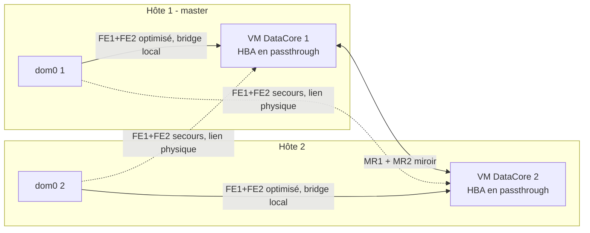

# Déploiement DataCore SANsymphony PSP22 sur pool XCP-ng 8.3 (2 nœuds)

Version du 2026-10-08 (révision 8). Les écarts assumés et les points encore ouverts sont en section 11.

## 1. Périmètre et architecture

Cette procédure déploie SANsymphony 10.0 PSP22 en hyperconvergé sur un pool XCP-ng 8.3 de 2 hôtes identiques. Chaque hôte porte une VM Windows SANsymphony qui reçoit son HBA SAS en passthrough. Les vDisks, en miroir entre les deux VM, sont présentés en iSCSI aux deux dom0.

**Statut de support.** XCP-ng est absent de la matrice DataCore, qui ne liste que XenServer 7.1, 7.2 et 8.2. Les vDisks miroir y sont donc « Not Qualified » : ils fonctionnent, mais sans support contractuel sur la haute disponibilité. La HCL XenServer déconseille aussi d'héberger la tête de stockage sur l'hyperviseur qu'elle sert, à cause de l'ordonnancement au démarrage. Les procédures de la section 9 traitent ce risque.

**Conventions.** Toutes les valeurs propres au site sont dans deux fichiers de variables : `datacore-xcp.conf` côté XCP-ng (section 3.1) et `DataCoreNode.psd1` côté Windows (section 5.1). La procédure les désigne par leur nom de variable :

- **N** est le numéro de nœud (1 ou 2), **P** le nœud partenaire (3 − N). Le nœud 1 est le master du pool.
- **Hôte N** est l'hôte XCP-ng `HOSTS[N]` ; **VM DataCore N** est la VM SANsymphony `DC_VMS[N]`, qui tourne sur l'hôte N.
- Une adresse de stockage s'écrit `SUBNET[réseau]` suivi du dernier octet : `DC_OCT[N]` pour la VM DataCore N, `HOST_OCT[N]` pour le dom0 de l'hôte N.
- Les valeurs citées entre parenthèses sont les valeurs par défaut des fichiers de variables, données à titre d'exemple.
- **Les deux scripts se pilotent par leur menu.** Chaque étape donne l'entrée du menu sous la forme *numéro* `nom` (par exemple **5** `host`), puis la commande directe équivalente, qui reste utilisable pour cron, l'agent onduleur et SSH. Les menus sont décrits en sections 3.2 et 5.2.



Chaque dom0 dispose de 4 chemins par LUN :

- 2 chemins optimisés (ALUA prio 50) vers la VM DataCore locale ;
- 2 chemins de secours (prio 10) vers la VM DataCore distante.

**Les chemins locaux ne passent pas par les cartes physiques.** Le dom0 et la VM DataCore d'un même hôte sont branchés sur le même bridge OVS : ce trafic reste interne à l'hôte. Il ne dépend donc pas des câbles, mais du CPU du dom0 (netback). Seuls les chemins de secours et le miroir empruntent les liens physiques.

**Les ports front-end ne servent que les dom0.** Entre les deux VM DataCore, les seules connexions iSCSI sont celles du miroir, sur MR1 et MR2. Aucune connexion n'est ouverte d'un serveur DataCore vers les ports front-end de l'autre.

Conséquences :

- **Perte d'un nœud entier** : l'I/O du nœud survivant continue sans bascule, puisque ses chemins actifs sont locaux.
- **Perte de la seule VM DataCore locale** (plantage, gel), l'hôte restant vivant : l'I/O de cet hôte gèle le temps de la détection, puis bascule sur les chemins de secours. Ce délai est d'environ 15 s (section 7).

**Plan d'adressage**

| Réseau | Carte physique | Subnet | dom0 de l'hôte N | VM DataCore N | MTU |
| --- | --- | --- | --- | --- | --- |
| Management du pool (`MGMT_NET`) | carte ou bond de management du pool | adressage du site | IP de management de l'hôte | aucune, sauf si `DC_MGMT_NET` est vide | celle du site |
| Management des VM DataCore (`DC_MGMT_NET`, `MGMT_NET` s'il est vide) | voir section 2 | adressage du site | aucune | `Nodes[N].MgmtIp` | celle du site |
| DC-FE1 | `NIC[DC-FE1]` | `SUBNET[DC-FE1]`.0/24 (10.200.11) | `HOST_OCT[N]` (11 / 12) | `DC_OCT[N]` (21 / 22) | `MTU` (9000) |
| DC-FE2 | `NIC[DC-FE2]` | `SUBNET[DC-FE2]`.0/24 (10.200.12) | `HOST_OCT[N]` | `DC_OCT[N]` | `MTU` |
| DC-MR1 | `NIC[DC-MR1]` | `SUBNET[DC-MR1]`.0/24 (10.200.21) | aucune | `DC_OCT[N]` | `MTU` |
| DC-MR2 | `NIC[DC-MR2]` | `SUBNET[DC-MR2]`.0/24 (10.200.22) | aucune | `DC_OCT[N]` | `MTU` |

Le management n'est pas configuré par les scripts : le pool garde le sien, et la VM DataCore reçoit une IP fixe du site sur le réseau désigné par `DC_MGMT_NET`. Les réseaux de stockage sont des /24 sans passerelle. Ils ne doivent être ni routés, ni annoncés dans un VPN, ni utilisés ailleurs dans le SI, ni chevaucher le réseau de management ou une plage susceptible de l'étendre. Vérifier avant le déploiement qu'aucune route ou aucun VPN existant ne couvre ces subnets : sinon, dom0 ou Windows pourraient choisir une mauvaise interface. Les valeurs par défaut regroupent le stockage dans 10.200.0.0/16, avec un troisième octet qui reprend la fonction (1x pour le front-end, 2x pour le miroir).

Le miroir reste strictement VM à VM : les dom0 n'ont pas d'IP sur MR1/MR2. Les cartes physiques se choisissent par fonction dans `NIC`, après **1** `nics`.

## 2. Prérequis

**Matériel, par hôte**

- Virtualisation d'E/S (Intel VT-d ou AMD-Vi) activée dans le BIOS/UEFI.
- Un contrôleur de boot dédié (carte M.2 RAID, contrôleur embarqué…). Il porte dom0 et le SR local qui héberge la VM DataCore. Ce SR ne doit jamais dépendre de DataCore.
- Un HBA SAS en mode IT dédié au passthrough, avec uniquement les disques du pool DataCore derrière lui. Il ne doit partager aucune fonction PCI avec un autre périphérique.
  - Relever son BDF sur **chaque** hôte avec `lspci -nn` : il peut différer d'un hôte à l'autre.
  - Le fichier de variables prend un BDF par nœud (`PCI_BDF`).
- 2 liens FE et 2 liens MR, répartis sur au moins deux cartes physiques, avec le même MTU de bout en bout (`MTU`, 9000 par défaut).
  - Avec 2 nœuds, les 4 liens peuvent être câblés en direct d'hôte à hôte, sans switch. On supprime ainsi un point de panne, et la question du MTU côté switch disparaît.
  - Dans ce cas, valider le test « coupure d'un lien FE » de la section 8 : le trafic local doit continuer dans le bridge quand le lien physique tombe.
- Un réseau de management séparé des 4 cartes de stockage, **sur un bond de deux cartes** (actif/passif, idéalement sur deux switchs). Le heartbeat réseau HA ne passe que par ce réseau. Sur un pool de 2 hôtes, sa perte sur un hôte se termine, après `HA_TIMEOUT`, par le fence de l'un des deux hôtes alors que le stockage et DataCore sont sains (test de la section 8) : les hôtes ne peuvent pas distinguer ce cas d'un crash de l'autre. Le bond est la seule protection.
- **Le VIF de management des VM DataCore ne doit pas dépendre du seul lien de management d'un hôte.** Les serveurs DataCore communiquent entre eux par ce réseau : au débranchement du câble de management de l'hôte 2, VM DataCore sur ce même lien, ils se sont perdus et le front-end de l'hôte 2 a été coupé. Avec les VM DataCore sur un réseau dédié, DataCore est resté sain. Placer le VIF 0 sur un réseau dédié (`DC_MGMT_NET`) ou sur le réseau de management en bond.
- Un onduleur capable de déclencher une commande sur le master (NUT ou agent constructeur), pour lancer `./datacore-xcp.sh stop --ups`. Une coupure électrique simultanée des deux nœuds a deux effets : les écritures en cache RAM de DataCore sont perdues, et le démarrage suivant bloque (section 9).
- BIOS/UEFI de chaque hôte réglé comme DataCore le recommande pour un serveur DataCore (la VM DataCore partage les CPU de l'hôte) : Intel Turbo Boost désactivé, économies d'énergie (C-states) désactivées avec le profil Static High / performances maximales, Collaborative Power Control désactivé, AES-NI activé, Hyper-Threading activé sur les CPU de 2014 ou plus récents. Le profil faible latence du constructeur s'applique, sauf s'il contredit ces réglages.
- Si les liens de stockage passent par des switchs : pas de Spanning Tree sur les ports iSCSI (STP, RSTP, MSTP), contrôle de flux matériel sur les cartes et les ports des switchs, pas de sursouscription, MTU des switchs supérieur à `MTU`.

**Logiciel**

- XCP-ng 8.3 à jour, avec les mêmes patchs sur les deux hôtes.
- Windows Server 2025 (modèle XCP-ng `WIN_TEMPLATE`), avec la licence pour les 2 VM.
  - Windows Server 2025 est qualifié par DataCore depuis SANsymphony 10.0 PSP21.
  - Installer le dernier Monthly Rollup Microsoft pour l'OS et pour .NET.
- XCP-ng Windows PV Tools.
- SANsymphony 10.0 PSP22. La licence doit être activée sous 30 jours, sinon le logiciel s'arrête.
- Pilote Windows du HBA, fourni par le constructeur et aligné sur son firmware.
- Script DataCore `iSCSI_Best_Practices_3.11.ps1` (version 3.11 ou ultérieure, qui prend en charge Windows Server 2025).
- Cmdlets DataCore (module `DataCore.Executive.Cmdlets`), installées avec SANsymphony. Utilisées par les phases `Ports`, `Hosts`, `Test` et `PrePatch`, en connexion locale sous le compte administrateur Windows.
- Le DataCore Windows Integration Kit ne sert que sur les hôtes Windows. Il n'est pas requis ici, puisque les initiateurs sont les dom0 XCP-ng.

**Environnement**

- Un ou plusieurs serveurs NTP joignables depuis le management (`NTP_SERVERS`), de préférence la même source que l'émulateur PDC du domaine.
- Connexion SSH `root` par clé, sans mot de passe, de chaque dom0 vers l'autre, sur les adresses de management. Elle est mise en place par **2** `ssh-setup` (section 4), qui demande une fois le mot de passe root de l'autre hôte. `sync` l'exige ; `ha-on` et `resume` s'en servent pour contrôler l'autre hôte (à défaut, ils demandent une confirmation manuelle). `status` indique si elle fonctionne.
- Xen Orchestra (XOA) ne doit pas être hébergé sur le SR DataCore. Sinon, il est indisponible pendant un démarrage à froid, c'est-à-dire au moment où l'on en a besoin. Le placer hors du pool, ou sur un SR local.
- **La HA ne se désactive et ne s'active jamais depuis Xen Orchestra.** XO active la HA sans timeout : le pool revient au défaut XAPI au lieu de `HA_TIMEOUT` (120 s), et une coupure des liens DataCore se termine alors par un fence (test de la section 8). On utilise uniquement **16** `ha-off` et **15** `ha-on`. `check` et `status` lèvent une alerte si le timeout n'est pas `HA_TIMEOUT` ; `ha-on` le corrige.
- Le **Rolling Pool Update** de Xen Orchestra est interdit sur ce pool :
  - il tente de migrer les VM DataCore, ce qui est impossible ;
  - il enchaîne les reboots sans attendre la resynchronisation.

  Le patching passe uniquement par `maint N` / `resume N` (section 9).

**Fichiers livrés**

| Fichier | Où | Rôle |
| --- | --- | --- |
| `datacore-xcp.sh` | `/root` des 2 hôtes | Tout le côté XCP-ng : SSH entre hôtes, réseau, IQN, NTP, multipath, iSCSI, passthrough, VM DataCore, SR, HA, exploitation, supervision. Ne contient aucune valeur de site |
| `datacore-xcp.conf` | `/root` des 2 hôtes, à côté du script | **Toutes** les variables du côté XCP-ng |
| `Set-DataCoreNode.ps1` | `C:\DataCore\Scripts` de chaque VM DataCore | Réseau Windows, fichier d'échange, SkipAsSource, Windows Update, dumps, appel du script DataCore Best Practices, initiateur iSCSI (liens miroir), ports DMC et hôtes XCP-ng par les cmdlets DataCore, correctifs Windows, tests. Ne contient aucune valeur de site |
| `DataCoreNode.psd1` | `C:\DataCore\Scripts`, à côté du script | **Toutes** les variables du côté Windows (identique sur les 2 VM) |
| `iSCSI_Best_Practices_3.11.ps1` | `C:\DataCore\Scripts` | Script DataCore, appelé par la phase `PostInstall` |

Les scripts se mettent à jour en remplaçant le fichier, sans toucher aux valeurs du site. Les commandes n'utilisent aucun placeholder `<...>`, que bash interpréterait comme une redirection. Après toute modification côté XCP-ng, **3** `sync` recopie script et variables sur l'autre hôte ; `status` affiche l'empreinte md5 des deux fichiers pour comparer.

## 3. Script `datacore-xcp.sh` et fichier `datacore-xcp.conf`

### 3.1 Fichier de variables

Le script charge `datacore-xcp.conf` depuis son propre dossier (ou le fichier désigné par `DATACORE_XCP_CONF`). Il vérifie la présence de chaque variable obligatoire avant toute commande et s'arrête avec le nom de la variable manquante. Le fichier est en syntaxe bash : conserver les parenthèses des tableaux, les guillemets et les `declare -A`.

Pour les commandes manuelles de cette procédure, charger le fichier dans le shell courant : `. /root/datacore-xcp.conf`. Les variables (`HOSTS`, `SR_NAME`…) sont alors utilisables directement.

| Variable | Quand la renseigner | Comment l'obtenir |
| --- | --- | --- |
| `HOSTS`, `DC_VMS` | Avant tout | `xe host-list params=name-label` ; noms choisis pour les VM DataCore |
| `NIC`, `MGMT_NET` | Avant `pool-net` | **1** `nics` : une carte par fonction, même nom sur les 2 hôtes, hors management |
| `DC_MGMT_NET` | Avant `dcvm N` | `xe network-list params=name-label` : réseau du VIF de management des VM DataCore (section 2). Vide = `MGMT_NET` |
| `SUBNET`, `HOST_OCT`, `DC_OCT`, `MTU` | Avant `host N` | Plan d'adressage (section 1). À reporter à l'identique dans `DataCoreNode.psd1` |
| `IQN_PREFIX`, `HOST_IQN` | Avant `host N` | Convention du site (section 4.1). Valeur proposée à la saisie, modifiable |
| `NTP_SERVERS` | Avant `host N` | Serveurs NTP du site. Obligatoire |
| `PCI_BDF` | Avant `pci-check N` | `lspci -nn \| grep -iE 'sas\|raid'` sur **chaque** hôte |
| `DC_VCPU`, `DC_RAM_GIB`, `DC_DISK_GIB`, `LOCAL_SR`, `DC_VCPU_MASK` | Avant `dcvm N` | Dimensionnement. `DC_VCPU` : 10 au minimum (règle DataCore : 4 vCPU + 3 par paire de ports iSCSI, ici la paire FE et la paire MR ; +1 avec le performance recording). `LOCAL_SR` vide = détection automatique |
| `WIN_TEMPLATE`, `WIN_ISO` | Avant `dcvm N` | `xe template-list params=name-label \| grep -i windows` ; `xe cd-list` |
| `SR_NAME` … `SHUTDOWN_TIMEOUT` | Valeurs de référence | Ne pas modifier sans raison |

Fichier : [`datacore-xcp.conf`](../scripts/fr/datacore-xcp.conf) (dossier `scripts/fr/` du dépôt).

### 3.2 Commandes et menu

Le script est à copier dans `/root` sur les deux hôtes (`chmod +x`), avec son fichier de variables. Chaque commande vérifie qu'elle tourne au bon endroit : sur le master, ou sur l'hôte du nœud indiqué. Les commandes qui modifient quelque chose sont journalisées dans `/var/log/datacore-xcp.log`.

**Menu.** Lancé sans argument depuis une console (`./datacore-xcp.sh`), le script ouvre un menu des commandes groupé par étape : préparation des hôtes, VM DataCore, stockage iSCSI et HA, exploitation. L'en-tête indique l'hôte, son numéro de nœud et son rôle réel (master ou membre). Chaque entrée précise où la lancer : `[M]` master, `[L]` hôte local, `[2]` chaque hôte. Le menu demande les arguments :

- `host`, `pci-check`, `pci-hide` : nœud local, imposé (ces commandes refusent tout autre nœud) ;
- `dcvm`, `dcpci`, `maint`, `resume` : numéro de nœud à saisir ;
- `sr`, `ha` : LUN choisie dans la liste des LUN DataCore vues par l'hôte (chemins, taille, SR déjà créé) ;
- `protect` : VM choisie dans une liste (état, priorité HA), puis ordre de démarrage ;
- `stop` : mode normal ou onduleur.

Le menu affiche la commande directe équivalente, revient au menu après chaque action (une erreur n'interrompt que l'action, Ctrl+C l'interrompt aussi) et journalise comme en exécution directe. Avec une commande en argument, le script l'exécute directement (cron, agent onduleur, SSH) ; `help` affiche la liste des commandes. Sans argument et sans console, il affiche l'aide et rend le code 1.

| Menu | Commande | Où | Action |
| --- | --- | --- | --- |
| 1 | `nics` | tout hôte | Liste les cartes physiques de chaque hôte (device, MAC, réseau, IP, management) pour renseigner `NIC` |
| 2 | `ssh-setup` | tout hôte | Met en place le SSH root par clé entre les deux dom0, dans les deux sens : paire de clés créée si elle manque, clés d'hôte enregistrées, clés publiques échangées. Demande une fois le mot de passe root de l'autre hôte. Rejouable |
| 3 | `sync` | tout hôte | Copie le script et `datacore-xcp.conf` sur l'autre hôte (scp), puis affiche les md5 des deux côtés. Refusé tant que `ssh-setup` n'a pas été lancé |
| 4 | `pool-net` | master | Vérifie la sélection `NIC` sur les 2 hôtes, puis renomme les réseaux en DC-FE1/FE2/MR1/MR2, applique `MTU`, replug des PIF. Refusé si une VM DataCore tourne |
| 5 | `host N` | hôte N | IQN (valeur proposée, saisie possible), IP FE du dom0 (sans toucher une PIF déjà correcte), multipathing XAPI, NTP (par XAPI si l'hôte le gère, sinon `chrony.conf`), `custom.conf` multipath (handler ALUA compris), tâches planifiées `/etc/cron.d/datacore-xcp` (`relogin`, `check`, avec un `PATH` explicite). Peut être relancé sur un pool en service (l'IQN n'est alors plus modifiable) |
| 6 | `netcheck` | chaque hôte | Ping non fragmenté à la taille `MTU` vers le dom0 de l'autre hôte sur FE1 et FE2 |
| 7 | `pci-check N` | hôte N | Contrôles bloquants avant masquage (IOMMU, PV LVM, racine dom0), puis inventaire des disques de dom0 |
| 8 | `pci-hide N` | hôte N | Refusé si l'autre hôte n'est pas joignable ; `pci-check N`, puis masquage XAPI du HBA et reboot |
| 9 | `dcvm N` | master | Vérifie le modèle `WIN_TEMPLATE` et les réseaux, puis crée la VM DataCore N **sans le HBA** : disque VHD, RAM statique, VIF à MAC fixes (VIF 0 sur `DC_MGMT_NET`), auto_poweron |
| 10 | `dcpci N` | master | Attache le HBA à la VM DataCore N (VM arrêtée), après l'installation de Windows et des PV tools |
| 11 | `iscsi` | chaque hôte | Login sur les 4 portails, rescan des sessions, nombre de sessions, liste des LUN DataCore avec leur nombre de chemins et le SR DataCore qui les porte, `recovery_tmo` effectif. Avant le service des vDisks : 4 sessions, aucune LUN |
| 12 | `relogin` | chaque hôte (cron, chaque minute) | Rétablit la session vers tout portail DataCore sans session qui répond sur le port 3260, puis relit l'état ALUA du noyau sur les chemins que multipathd voit `ready` et que le noyau ne voit pas actifs (rescan du device, puis rescan des sessions). N'agit que si un SR DataCore est attaché sur l'hôte. Couvre le reboot d'un hôte, le démarrage à froid et la coupure d'accès à DataCore (section 10) |
| 13 | `sr SCSIID` | master | Crée le SR LVMoISCSI de données et le déclare SR par défaut (multipathing exigé) |
| 14 | `ha SCSIID` | master | Crée le SR heartbeat et active la HA (`HA_TIMEOUT`) |
| 15 | `ha-on` | master | Active la HA avec `HA_TIMEOUT`, avec les mêmes contrôles que `ha`. Avant l'activation, attend jusqu'à 10 min que chaque hôte ait 4 chemins `ready` par LUN, actifs pour le noyau (`relogin` puis `check` sur chaque hôte, par SSH pour l'autre). Si la HA est déjà active avec un autre timeout (HA manipulée depuis Xen Orchestra), propose de la désactiver et de la réactiver avec `HA_TIMEOUT` |
| 16 | `ha-off` | master | Désactive la HA avant une opération planifiée. Remplace toute action HA dans Xen Orchestra |
| 17 | `protect VM [ordre]` | master | Vérifie que la VM (nom ou UUID) est agile, puis la protège par la HA |
| 18 | `status` | tout hôte | État des hôtes, du multipathing, des VM DataCore et de leur HBA, des PBD, de la HA et de son timeout (pool et `xhad.conf`), IQN, multipath (handler compris), sessions iSCSI, chemins avec état ALUA du noyau, `recovery_tmo` locaux, configuration multipath (`mpverify`), SSH vers l'autre hôte, md5 du script et des variables |
| 19 | `check [--quiet]` | chaque hôte (cron, 5 min) | Relit l'état ALUA du noyau comme `relogin`. Signale toute LUN DataCore avec moins de 4 chemins `ready`, tout chemin `ready` resté non actif pour le noyau et, sur le master, une HA active avec un timeout différent de `HA_TIMEOUT` (syslog sauf `--quiet`, code retour 1) |
| 20 | `mpverify` | chaque hôte | Vérifie que la configuration multipath effective est toujours celle écrite par `host N` (`defaults`, bloc DataCore, `hwhandler='1 alua'` sur les maps) et que le fichier cron porte son `PATH`. Une mise à jour XCP-ng peut remplacer les fichiers multipath. Code retour 1 en cas d'écart : relancer `host N` |
| 21 | `start` | master | Démarrage à froid ordonné : la VM DataCore arrêtée en dernier démarre en premier, DataCore doit y répondre sur le port 3260 avant le démarrage de l'autre ; arrêt non maîtrisé détecté (section 9). Puis SR, HA et VM protégées par ordre |
| 22 | `stop [--ups]` | master | Arrêt complet ordonné : VM invitées, SR, VM DataCore 2 puis 1 (dernier arrêt mémorisé dans la base du pool), puis l'autre hôte et le master en dernier ; `--ups` sans confirmation, hôtes compris |
| 23 / 24 | `maint N` / `resume N` | master | Mise en maintenance / retour d'un nœud (patching XCP-ng). `resume N` lance d'abord `mpverify` sur l'hôte N et s'arrête en cas d'écart |
| 25 | `rescue` | hôte bloqué | Sortie d'urgence de la HA (deadlock statefile) |

Fichier : [`datacore-xcp.sh`](../scripts/fr/datacore-xcp.sh) (dossier `scripts/fr/` du dépôt).

## 4. Préparation des hôtes et création des VM DataCore

Le pool doit déjà être constitué, avec le management sur le réseau `MGMT_NET`. Déposer `datacore-xcp.sh` et `datacore-xcp.conf` dans `/root` du master, puis ouvrir le menu : `chmod +x datacore-xcp.sh; ./datacore-xcp.sh`. Le même fichier s'ouvre sur l'hôte 2 une fois copié par l'étape 5.

| Étape | Où | Menu | Commande directe | Attendu |
| --- | --- | --- | --- | --- |
| 1 | master | **1** `nics` | `./datacore-xcp.sh nics` | Une carte par fonction → `NIC` |
| 2 | chaque hôte | (shell) | `lspci -nn \| grep -iE 'sas\|raid'` | BDF du HBA → `PCI_BDF[N]` |
| 3 | master | (shell) | `vi datacore-xcp.conf` | Tableau de la section 3.1 |
| 4 | master | **2** `ssh-setup` | `./datacore-xcp.sh ssh-setup` | Mot de passe root de l'hôte 2 demandé une fois ; « fonctionnel dans les deux sens » |
| 5 | master | **3** `sync` | `./datacore-xcp.sh sync` | md5 identiques sur les 2 hôtes |
| 6 | master | **4** `pool-net` | `./datacore-xcp.sh pool-net` | 4 réseaux DC- à `MTU` sur les 2 hôtes |
| 7 | chaque hôte | **5** `host` | `./datacore-xcp.sh host N` | Valider ou saisir l'IQN ; noter l'IQN final affiché |
| 8 | chaque hôte, une fois l'étape 7 faite sur les deux | **6** `netcheck` | `./datacore-xcp.sh netcheck` | OK sur FE1 et FE2 |
| 9 | chaque hôte | **7** `pci-check` | `./datacore-xcp.sh pci-check N` | Aucune ligne BLOQUANT |

Dans le menu, `host`, `pci-check` et `pci-hide` prennent d'eux-mêmes le nœud local : N ne se saisit qu'en exécution directe (1 sur le master, 2 sur l'autre hôte).

Si `ssh-setup` s'arrête sur « cle refusee », vérifier `PermitRootLogin` et `PubkeyAuthentication` dans `/etc/ssh/sshd_config` de l'autre hôte. Le relancer après la réinstallation d'un hôte (sa clé d'hôte change). `status` indique sur chaque hôte si le SSH vers l'autre fonctionne.

### 4.1 IQN des dom0

`host N` affiche l'IQN actuel, puis propose une valeur, dans cet ordre de priorité : `HOST_IQN[N]` s'il est renseigné, sinon `IQN_PREFIX:nom-de-l-hôte`, sinon l'IQN actuel. Entrée valide la proposition ; toute autre saisie la remplace. Le format est contrôlé : `iqn.AAAA-MM.domaine.inverse[:nom]`, en minuscules (par exemple `iqn.2026-09.lan.exemple:xcp-01`). Le changement passe par XAPI, qui réécrit `/etc/iscsi/initiatorname.iscsi`.

L'IQN se fixe **avant** la première commande `iscsi` et avant la déclaration des hôtes dans la DMC : le script refuse le changement dès qu'une session iSCSI est ouverte. Équivalent manuel, sur l'hôte concerné :

```bash
. /root/datacore-xcp.conf
H=$(xe host-list name-label="${HOSTS[1]}" --minimal)          # [2] pour l'hôte 2
xe host-param-set uuid=$H iscsi_iqn=iqn.2026-09.lan.exemple:xcp-01
grep InitiatorName /etc/iscsi/initiatorname.iscsi
```

### 4.2 NTP

`host N` détecte si XAPI gère le NTP (champ `ntp-mode` de l'hôte, présent sur les versions récentes de XCP-ng 8.3). Dans ce cas, XAPI réécrit `chrony.conf`, et toute modification manuelle serait perdue : le script passe alors par `xe`, avec les serveurs de `NTP_SERVERS`, et affiche « NTP gere par XAPI ». Sinon, il écrit `chrony.conf`.

Procédure manuelle équivalente, sur le master, pour chaque hôte :

```bash
. /root/datacore-xcp.conf
H=$(xe host-list name-label="${HOSTS[1]}" --minimal)                        # [2] pour l'hôte 2
xe host-param-get uuid=$H param-name=ntp-mode                               # erreur = NTP non géré par XAPI -> chrony.conf
xe host-param-set uuid=$H ntp-custom-servers="$(IFS=,; echo "${NTP_SERVERS[*]}")"
xe host-param-set uuid=$H ntp-mode=Custom                                   # selon la version de XAPI : ntp_mode_custom
xe host-param-get uuid=$H param-name=ntp-mode
# puis sur l'hôte concerné
chronyc sources                                                             # une source marquée '*'
```

La valeur acceptée par `ntp-mode` dépend de la version de XAPI (`Custom` ou `ntp_mode_custom`) ; le script essaie les deux. En cas de refus, `xe host-param-list uuid=$H | grep -i ntp` montre le mode actuel et sa syntaxe. Ne pas modifier `chrony.conf` à la main sur un hôte en mode XAPI.

### 4.3 Masquage du HBA : un hôte à la fois, hôte 2 d'abord

`pci-hide N` redémarre l'hôte. Pendant le redémarrage du master (hôte 1), l'hôte 2 n'a plus de master : aucune commande `xe` n'y fonctionne, `pci-check 2` et `pci-hide 2` compris. On masque donc d'abord l'hôte 2, puis le master, en attendant le retour complet de chaque hôte. `pci-hide N` refuse de s'exécuter tant que l'autre hôte n'est pas revenu (`host-metrics-live`).

| Étape | Où | Menu | Commande directe | Attendu |
| --- | --- | --- | --- | --- |
| 1 | hôte 2 | **8** `pci-hide` | `./datacore-xcp.sh pci-hide 2` | Confirmer le BDF ; reboot de l'hôte 2 |
| 2 | master | **18** `status` | `./datacore-xcp.sh status` | Attendre que l'hôte 2 soit `enabled` et `host-metrics-live` |
| 3 | hôte 2 | **7** `pci-check` | `./datacore-xcp.sh pci-check 2` | HBA dans `pci-assignable-list`, disques absents de dom0 |
| 4 | master | **8** `pci-hide` | `./datacore-xcp.sh pci-hide 1` | L'hôte 2 perd le master pendant ce reboot : ne rien y lancer |
| 5 | master | **7** `pci-check`, puis **18** `status` | `./datacore-xcp.sh pci-check 1` | XAPI peut mettre quelques minutes à répondre ; les 2 hôtes enabled et live |

### 4.4 VM DataCore

Sur le master : **9** `dcvm`, nœud 1, puis de nouveau pour le nœud 2 (`./datacore-xcp.sh dcvm 1`, puis `dcvm 2`).

`dcvm N` vérifie d'abord que le modèle `WIN_TEMPLATE` et les 5 réseaux existent ; sinon, il liste les modèles Windows disponibles, ou nomme le réseau manquant, et s'arrête. Le HBA n'est **pas** attaché à la création : il l'est par **10** `dcpci`, après l'installation de Windows et des PV tools (section 5). L'installeur Windows ne voit ainsi que le disque système : les disques du pool DataCore ne peuvent pas être choisis par erreur comme destination, et un pilote natif du contrôleur ne s'installe pas avant celui du constructeur.

Points de contrôle :

- **Avant `pci-hide N`** : `pci-check N` doit montrer la racine dom0 et le SR local sur les disques du contrôleur de boot (inventaire `lsblk`/`pvs`). Derrière `PCI_BDF[N]`, il ne doit y avoir que les disques du pool DataCore. Un BDF erroné masque le contrôleur de boot, et l'hôte ne démarre plus (section 10).
- **Après `host N`** :
  - l'IQN final affiché est celui attendu ;
  - `Multipathing XAPI : true` ;
  - `chronyc sources` affiche une source marquée `*` ;
  - `polling_interval 10` et `fast_io_fail_tmo 5` apparaissent dans la section `defaults` affichée, et `no_path_retry 6` dans le bloc DataCore. `fast_io_fail_tmo` fixe le délai de détection iSCSI (section 7), contrôlable après la création du SR.
- **`netcheck`** valide le MTU des switchs (ou du câblage direct) sur FE avant l'installation de Windows. MR ne peut être testé que depuis les VM (section 5).
- **La VM DataCore** est épinglée à son hôte. Une fois le HBA attaché, elle ne peut ni migrer ni prendre de snapshot mémoire : lors des mises à jour, elle s'arrête. `has-vendor-device=false` empêche Windows Update d'installer ou de remplacer les pilotes PV.
- **Les VIF** reçoivent des MAC fixes `02:dc:00:0N:00:0i`, où N est le numéro de nœud et i l'index du VIF. C'est le seul repère fiable côté Windows, qui n'énumère pas les cartes PV dans l'ordre des VIF :

  | VIF (i) | MAC Windows (N = numéro de nœud) | Réseau XCP-ng | Nom Windows |
  | --- | --- | --- | --- |
  | 0 | `02-DC-00-0N-00-00` | `DC_MGMT_NET` (`MGMT_NET` s'il est vide) | MGMT |
  | 1 | `02-DC-00-0N-00-01` | DC-FE1 | DC-FE1 |
  | 2 | `02-DC-00-0N-00-02` | DC-FE2 | DC-FE2 |
  | 3 | `02-DC-00-0N-00-03` | DC-MR1 | DC-MR1 |
  | 4 | `02-DC-00-0N-00-04` | DC-MR2 | DC-MR2 |

- **VIF de management d'une VM DataCore existante.** Pour déplacer le VIF 0 vers `DC_MGMT_NET` sans recréer la VM, conserver sa MAC (c'est par elle que le côté Windows identifie la carte). Une VM DataCore à la fois, vDisks *Up to date*, HA désactivée (**16** `ha-off`), sur le master :

  ```bash
  . /root/datacore-xcp.conf
  N=1                                                            # puis 2
  VM=$(xe vm-list name-label="${DC_VMS[$N]}" --minimal)
  VIF=$(xe vif-list vm-uuid=$VM device=0 --minimal)
  MAC=$(xe vif-param-get uuid=$VIF param-name=MAC)
  NET=$(xe network-list name-label="$DC_MGMT_NET" --minimal)
  echo "$VM $VIF $MAC $NET"                                      # 4 valeurs attendues, MAC 02:dc:00:0N:00:00
  xe vif-unplug uuid=$VIF; xe vif-destroy uuid=$VIF
  VIF=$(xe vif-create vm-uuid=$VM network-uuid=$NET device=0 mac=$MAC)
  xe vif-plug uuid=$VIF                                          # VM en marche ; sinon pris en compte au démarrage
  ```

  Vérifier ensuite dans la DMC que les deux serveurs se voient, puis réactiver la HA par **15** `ha-on`.
- **vCPU et réservation** : `DC_VCPU` vaut 10 par défaut (règle DataCore, section 3.1). DataCore exige un accès garanti au CPU et à la RAM pour une VM DataCore : ici, RAM statique et poids CPU de 65535. La phase `Test` alerte sous `MinVcpu`.
- **NUMA (optionnel)** : sur un hôte bi-socket, renseigner `DC_VCPU_MASK[N]` avec les CPU du socket qui porte le HBA et les cartes de stockage, avant `dcvm N`.

Démarrer ensuite chaque VM sur son hôte avec la commande affichée par `dcvm`, puis ouvrir sa console dans Xen Orchestra.

## 5. VM DataCore : Windows et installation SANsymphony

### 5.1 Fichier de variables Windows

`DataCoreNode.psd1` porte toutes les valeurs du côté Windows. Il est identique sur les deux VM : le numéro de nœud est passé par `-Node` ; sans `-Node`, le script le détecte par la MAC de la carte MGMT et le nom Windows, puis demande confirmation. Le script vérifie la présence de chaque clé au lancement.

| Clé | Contenu | Doit correspondre à |
| --- | --- | --- |
| `Nodes` | Nom Windows et IP de management de chaque VM DataCore | `DC_VMS` ; adressage de management du site. `MgmtIp` est obligatoire |
| `Subnets`, `DcOct`, `HostOct`, `Mtu` | Adressage et MTU des réseaux de stockage | `SUBNET`, `DC_OCT`, `HOST_OCT`, `MTU` de `datacore-xcp.conf` |
| `Metric` | Métrique des interfaces de stockage | Valeurs de référence, ne pas modifier |
| `BestPracticeScript` | Chemin local du script DataCore | Emplacement de copie (étape 4) |
| `BestPracticeFilter` | Filtre de noms de cartes transmis au script DataCore | Doit sélectionner exactement DC-FE1, DC-FE2, DC-MR1, DC-MR2 (contrôlé) |
| `InitiatorPorts` | Ports dont l'initiateur Microsoft se connecte au port homologue du partenaire | **MR1 et MR2 uniquement.** Les ports front-end ne sont pas connectés entre les serveurs DataCore |
| `IqnSuffix` | Fin de l'IQN de chaque port cible, appliquée par la phase `Ports` ; sert à choisir la cible dans la phase `Initiator` | `fe1`, `fe2`, `mr1`, `mr2` |
| `PagefileSizeMB` | Taille fixe du fichier d'échange sur C: | 4096 |
| `Hosts` | Nom et IQN du dom0 de chaque hôte XCP-ng, pour la phase `Hosts` | `HOSTS[N]` ; IQN final affiché par `host N` (section 4.1), en minuscules |
| `VirtualDisks` | Noms DMC des vDisks miroirs servis aux deux hôtes par la phase `Hosts` (données, puis heartbeat) | vDisks créés en section 6, étape 5 |
| `MinVcpu` | Seuil de vCPU contrôlé par `Test` | `DC_VCPU` (10) |

Fichier : [`DataCoreNode.psd1`](../scripts/fr/DataCoreNode.psd1) (dossier `scripts/fr/` du dépôt).

### 5.2 Phases du script et menu

**Menu.** Lancé sans `-Phase` depuis une console PowerShell administrateur (`.\Set-DataCoreNode.ps1`), le script détecte le nœud, demande confirmation, puis ouvre le menu des phases. L'en-tête indique le serveur, son nœud, son partenaire et l'état des services DataCore. Le menu affiche la commande directe équivalente (`-Node N -Phase Nom`) et revient au menu après chaque phase : une erreur interrompt la phase, pas le menu.

| Menu | Phase | Quand | Action |
| --- | --- | --- | --- |
| 1 | `Prepare` | Avant l'installation SANsymphony | Renommage des 5 cartes par MAC, contrôle de l'IP de MGMT, IP/MTU/liaisons des cartes de stockage avec SkipAsSource, fichier hosts (partenaire seulement), mode d'alimentation, Windows Update sans redémarrage automatique et sans pilotes, fichier d'échange fixe sur C:, dumps en mode utilisateur. Refusée si un service DataCore tourne |
| 2 | `Ports` | Une fois, sur la VM DataCore 1, après l'installation SANsymphony, **avant tout vDisk** | Cmdlets DataCore, pour les ports des deux serveurs identifiés par leur MAC fixe : rôle *Front-end* sur FE1/FE2, *Mirror* sur MR1/MR2, aucun rôle sur MGMT, IQN renommé avec `IqnSuffix`, noms des ports (`DC-01 FE1 10.200.11.21`), initiateur Microsoft nommé `DC-01 Initiateur`. Refusée si un vDisk existe ; IQN non modifié si des sessions de l'initiateur Microsoft sont ouvertes (sauf `-Force`) |
| 3 | `PostInstall` | Après `Ports`, **avant tout service de vDisk** | Retrait de SkipAsSource, puis script DataCore iSCSI Best Practices sur DC-FE1/FE2/MR1/MR2 (redémarre ces cartes) |
| 4 | `Initiator` | Après `PostInstall` sur les 2 VM | Connexions persistantes de l'initiateur iSCSI Microsoft vers **MR1 et MR2** du partenaire, depuis l'IP locale du même réseau ; cible choisie par son suffixe d'IQN. Puis, après confirmation, retrait de toute connexion vers les ports front-end du partenaire laissée par une version antérieure |
| 5 | `Hosts` | Une fois, sur la VM DataCore 1, après `iscsi` sur les 2 dom0 et le *Refresh* des ports, vDisks *Up to date* | Cmdlets DataCore : vérifie que les IQN des dom0 sont connus de la DMC, crée ou corrige chaque hôte `HOSTS[N]` (Citrix XenServer, Multipathing, ALUA, Preferred Server VM DataCore N), affecte son IQN, sert `VirtualDisks` avec chemins redondants (4 par hôte), affiche les SCSIid pour `sr` et `ha` |
| 6 | `Test` | Après `Initiator`, puis à volonté | Pings à la taille `Mtu`, état des cartes, sessions de l'initiateur (avertissement si l'une vise un port front-end), fichier d'échange, NTP, Windows Update, exclusion des pilotes, dumps, vCPU, fichier hosts, état DataCore (serveurs, ports, hôtes, vDisks) |
| 7 | `PreUpgrade` | Avant une PSP | Remet SkipAsSource |
| 8 | `PostUpgrade` | Après une PSP | Retire SkipAsSource, sans rejouer les Best Practices |
| 9 | `PrePatch` | Avant Windows Update, serveur DataCore arrêté dans la DMC | Vérifie l'arrêt du serveur (cmdlets), arrête le service DataCore Executive et le passe en Manuel, sauvegarde son type de démarrage précédent |
| 10 | `PostPatch` | Après Windows Update et redémarrage | Rétablit le type de démarrage du service DataCore Executive et le démarre |

### 5.3 Déroulé, sur chaque VM DataCore

1. **Windows** : installer Windows Server 2025 depuis la console Xen Orchestra. Seul le disque système est visible (HBA non attaché).
2. **PV tools** : installer les XCP-ng Windows PV Tools, redémarrer, puis appliquer tous les correctifs (OS et .NET).
3. **Carte de management, identifiée par sa MAC** : ne pas se fier aux noms `Ethernet`, `Ethernet 2`… ni à leur ordre. Une carte FE peut apparaître en premier et être prise pour la carte de management. La carte de management est celle dont la MAC se termine par `-00-00` (tableau de la section 4.4). Depuis la console, après avoir renseigné les 5 premières lignes :

   ```powershell
   $Node   = 1                 # numéro de nœud de cette VM
   $MgmtIp = ''                # IP de management de la VM (= Nodes[N].MgmtIp)
   $Prefix = 24                # longueur de préfixe du réseau de management
   $Gw     = ''                # passerelle du réseau de management
   $Dns    = @('')             # serveurs DNS
   $Mac = '02-DC-00-{0:X2}-00-00' -f $Node
   Get-NetAdapter | Sort-Object MacAddress | Format-Table Name, MacAddress, Status -AutoSize
   $Nic = Get-NetAdapter | Where-Object MacAddress -eq $Mac
   Rename-NetAdapter -Name $Nic.Name -NewName MGMT
   New-NetIPAddress -InterfaceAlias MGMT -IPAddress $MgmtIp -PrefixLength $Prefix -DefaultGateway $Gw
   Set-DnsClientServerAddress -InterfaceAlias MGMT -ServerAddresses $Dns
   Get-NetIPConfiguration -InterfaceAlias MGMT
   ```

   Ensuite, renommer le serveur avec `Nodes[N].Name` (`Rename-Computer`) et le joindre au domaine si c'est prévu. Hors domaine, régler le NTP sur la même source que les hôtes : `w32tm /config /manualpeerlist:"serveur-ntp" /syncfromflags:manual /update`, en remplaçant `serveur-ntp`. La phase `Prepare` refuse de continuer si `Nodes[N].MgmtIp` n'est pas sur la carte de MAC `-00-00`, et nomme la carte qui la porte à tort.
4. **Scripts** : copier dans `C:\DataCore\Scripts` les fichiers `Set-DataCoreNode.ps1`, `DataCoreNode.psd1` et `iSCSI_Best_Practices_3.11.ps1`. Compléter `DataCoreNode.psd1` (au minimum `Nodes`), identique sur les deux VM. Ouvrir le menu dans une console PowerShell administrateur, et confirmer le nœud détecté :

   ```powershell
   Set-ExecutionPolicy -Scope Process -ExecutionPolicy Bypass -Force
   Set-Location C:\DataCore\Scripts
   .\Set-DataCoreNode.ps1
   ```
5. **1** `Prepare`, sur **les deux VM** (`-Node N -Phase Prepare`), puis redémarrer (fichier d'échange).
   - La résolution du nom du serveur ne doit plus renvoyer que l'IP de management.
   - Le fichier hosts ne reçoit que l'entrée du partenaire : DataCore déconseille une entrée pour le serveur local, et `Prepare` la supprime si elle existe.
   - Si les VM sont dans le domaine, vérifier avec `gpresult /h` qu'aucune GPO n'écrase la politique Windows Update ni le fichier d'échange.
6. **HBA** : arrêter Windows, attacher le HBA depuis le master par **10** `dcpci` (`./datacore-xcp.sh dcpci N`), puis démarrer la VM avec la commande `xe vm-start` qu'il affiche. Installer le pilote constructeur du HBA. Les disques apparaissent non initialisés : les laisser tels quels.
7. **SANsymphony**, sur **la VM DataCore 1 uniquement** : installer SANsymphony 10.0 PSP22. L'assistant crée le Server Group et déploie la VM DataCore 2 à distance. Si la résolution de l'étape 5 renvoyait encore une IP de stockage, ne cocher aucun rôle sur aucun port dans l'assistant : ils seront attribués à l'étape 8.
8. **2** `Ports`, sur **la VM DataCore 1 uniquement**, une fois les deux serveurs dans le Server Group et démarrés (`-Node 1 -Phase Ports`). Par les cmdlets DataCore, pour les ports iSCSI des **deux** serveurs, identifiés par leur MAC fixe `02-DC-00-0N-00-0i` (champ `PhysicalName` de `Get-DcsPort`) :
   - DC-FE1 et DC-FE2 en *Front-end* uniquement ; DC-MR1 et DC-MR2 en *Mirror* uniquement ; aucun rôle sur MGMT ;
   - IQN du port : le numéro DataCore (`-01`, `-02`…) est remplacé par le suffixe `IqnSuffix` de la fonction (étape 10) ;
   - nom du port : nom du serveur, fonction, IP (`DC-01 FE1 10.200.11.21`) ; initiateur iSCSI Microsoft nommé `DC-01 Initiateur`.

   Chaque changement de rôle ou d'IQN réinitialise le port. La phase est rejouable : elle ne modifie que ce qui diffère. Elle refuse de s'exécuter dès qu'un vDisk existe, et ne modifie pas un IQN si des sessions de l'initiateur Microsoft sont ouvertes (phase `Initiator` déjà passée), sauf avec `-Force`. Sans les cmdlets, l'équivalent manuel est *Settings* sur chaque port dans la DMC (rôle, puis IQN).
9. **3** `PostInstall`, sur les deux VM (`-Node N -Phase PostInstall`). Le script vérifie que `BestPracticeFilter` sélectionne exactement les 4 cartes de stockage, puis, après confirmation, lance le script DataCore. Celui-ci règle les liaisons, Nagle/Delayed ACK, RSS, RSC, SR-IOV, l'économie d'énergie des cartes, le profil TCP `DatacenterCustom` et le filtre de transport du port 3260, puis **redémarre chaque carte**. Ce redémarrage coupe l'I/O iSCSI des ports : la phase ne se lance qu'à l'installation, avant tout service de vDisk. Le journal du script DataCore est écrit dans son dossier.
10. **Contrôle des ports iSCSI et de leurs IQN** posés par la phase `Ports`, dans la DMC ou avec le tableau affiché par la phase (**6** `Test` le réaffiche), **avant la phase `Initiator`** :
    - **nom du port** : nom du serveur, fonction, IP. Par exemple, avec les valeurs par défaut, `DC-01 FE1 10.200.11.21` ou `DC-02 MR2 10.200.22.22` ;
    - **IQN du port** (nom iSCSI de la cible) : DataCore attribue par défaut `iqn.2000-08.com.datacore:` suivi du nom du serveur et d'un numéro de port (`-01`, `-02`…), qui ne dit rien de la fonction du port. La phase `Ports` remplace ce numéro par le suffixe `IqnSuffix` de la fonction, en minuscules :

      | Port | IQN par défaut (exemple) | IQN renommé |
      | --- | --- | --- |
      | FE1 de la VM DataCore 1 | `iqn.2000-08.com.datacore:dc-01-01` | `iqn.2000-08.com.datacore:dc-01-fe1` |
      | FE2 | `iqn.2000-08.com.datacore:dc-01-02` | `iqn.2000-08.com.datacore:dc-01-fe2` |
      | MR1 | `iqn.2000-08.com.datacore:dc-01-03` | `iqn.2000-08.com.datacore:dc-01-mr1` |
      | MR2 | `iqn.2000-08.com.datacore:dc-01-04` | `iqn.2000-08.com.datacore:dc-01-mr2` |

      Le numéro par défaut ne suit pas forcément l'ordre FE1, FE2, MR1, MR2 : la phase `Ports` identifie chaque port par sa MAC, jamais par ce numéro. Le nom du serveur reste dans l'IQN, qui est ainsi unique ;
    - **initiateur iSCSI Microsoft**, qui apparaît aussi comme un port de chaque serveur : nommé avec le nom du serveur suivi de `Initiateur` (nom seulement).

    L'IQN est posé à ce stade parce que la phase `Initiator` choisit ses cibles par ce suffixe et crée des connexions persistantes vers l'IQN en vigueur. Un IQN modifié après la phase `Initiator` ou après la déclaration des hôtes XCP-ng (section 6) casserait ces connexions et les mappings.
11. **4** `Initiator`, sur les deux VM, une fois les étapes 8 à 10 faites (`-Node N -Phase Initiator`). Pour chaque port de `InitiatorPorts`, l'initiateur iSCSI Microsoft de la VM DataCore N découvre le port homologue de la VM DataCore P, ne retient que la cible dont l'IQN se termine par le suffixe du port (`IqnSuffix`), et s'y connecte en persistant. **Seuls les liens miroir sont connectés** :

    | Port | Source (VM DataCore N) | Cible (VM DataCore P) | IQN cible |
    | --- | --- | --- | --- |
    | MR1 | `SUBNET[DC-MR1]`.`DC_OCT[N]` | `SUBNET[DC-MR1]`.`DC_OCT[P]` | `...mr1` |
    | MR2 | `SUBNET[DC-MR2]`.`DC_OCT[N]` | `SUBNET[DC-MR2]`.`DC_OCT[P]` | `...mr2` |

    Les ports front-end d'un serveur DataCore sont des cibles pour les dom0 uniquement : le miroir ne les utilise pas, et une connexion entre serveurs DataCore sur FE ne sert à rien.

    Si aucune cible annoncée ne porte le suffixe attendu, le script affiche les IQN annoncés, passe au port suivant et termine en erreur : relancer la phase `Ports` (ou renommer l'IQN dans la DMC), puis relancer la phase. Si plusieurs cibles portent le suffixe, il demande laquelle connecter. La phase est rejouable : les connexions existantes sont conservées.

    **Serveurs déployés avec une version antérieure** (FE1 et FE2 également connectés) : remplacer `Set-DataCoreNode.ps1`, mettre `InitiatorPorts = @('DC-MR1', 'DC-MR2')` dans `DataCoreNode.psd1`, puis relancer **4** `Initiator` sur chaque VM, une à la fois, vDisks *Up to date*. Une fois les deux connexions MR constatées, la phase liste les sessions et portails vers les ports front-end du partenaire et, après confirmation port par port, les retire (session, persistance, portail). Elle n'y touche pas si une connexion MR manque. Vérifier ensuite dans la DMC que les chemins miroir passent toujours par MR1 et MR2, et que l'initiateur du partenaire n'apparaît plus connecté sur les ports FE.
12. **6** `Test`, sur les deux VM : tous les pings doivent être OK, **2 sessions d'initiateur** attendues (les IQN en `mr1` et `mr2` du partenaire) et aucun avertissement de session front-end, fichier d'échange `C:\pagefile.sys` à `PagefileSizeMB` en taille fixe, exclusion des pilotes à 1, `DumpType` à 2, `CrashDumpEnabled` à 2 (dump noyau posé par l'installeur SANsymphony), vCPU au moins égal à `MinVcpu`, aucune alerte sur le fichier hosts, les deux serveurs DataCore `Online`.
13. Appliquer les exclusions antivirus (Defender ou autre) recommandées par la KB DataCore pour SANsymphony.

Fichier : [`Set-DataCoreNode.ps1`](../scripts/fr/Set-DataCoreNode.ps1) (dossier `scripts/fr/` du dépôt).

Dans `Test`, les pings vers le dom0 local passent par le bridge interne : ils ne valident que la configuration IP. Les pings vers la VM DataCore partenaire et vers l'autre dom0 valident le lien physique et le MTU.

**Fichier d'échange.** Il est fixé à 4 Go (`PagefileSizeMB`) sur C:, avec une taille initiale égale à la taille maximale et la gestion automatique désactivée. La RAM de la VM étant statique, ce fichier sert peu en fonctionnement. Il évite qu'un fichier géré par Windows grossisse avec la RAM et occupe le disque système. Il permet aussi en général un vidage de la mémoire noyau en cas d'écran bleu, pas un vidage complet. DataCore recommande un fichier d'échange aussi grand que possible, dans la limite de la mémoire non utilisée par son cache et en gardant la place d'un dump : 4 Go sont conservés (point ouvert, section 11).

## 6. Configuration SANsymphony (DMC)

Le Preferred Server par hôte est le réglage déterminant pour la HA : il garantit que l'I/O de chaque dom0 passe toujours par la VM DataCore locale.

1. **Rôles de ports** : vérifier ceux attribués par la phase `Ports` (section 5, étape 8) (FE en *Front-end* seul, MR en *Mirror* seul, MGMT sans rôle). Cumuler des rôles sur un port FE provoque des comportements anormaux après un arrêt du service.
2. **Nom et IQN des ports** : vérifier ceux posés par la phase `Ports` (section 5, étape 10). Ne plus modifier l'IQN d'un port à partir de ce point : les connexions de l'initiateur Microsoft et les sessions des dom0 en dépendent.
3. **Chemins miroir** : après la phase `Initiator`, actualiser (*Refresh*) les ports des deux serveurs. Vérifier que les chemins miroir passent par les ports MR1 et MR2 des deux serveurs, et que l'initiateur d'un serveur DataCore n'est connecté à aucun port front-end de l'autre.
4. **Pools de disques** : un pool par serveur, avec les disques du HBA en passthrough. Recommandations DataCore :
   - la même taille de SAU sur les deux serveurs (les deux sources d'un vDisk miroir), choisie à la création et non modifiable. DataCore suggère 128 Mo pour un pool d'hyperviseur généraliste ; la DMC et `Add-DcsPool` proposent 1 Go par défaut ;
   - au moins 2 disques, les plus rapides possible, en tier 1 : ils portent les copies principale et de secours du catalogue du pool ;
   - si plusieurs tiers sont utilisés, tous peuplés, et *Preserve space for new allocations* à 20 % pour commencer ;
   - pas de plusieurs LUN taillées dans le même groupe RAID (disk thrashing) ;
   - snapshots, s'ils sont utilisés : pool dédié à petite SAU, snapshots créés sur le serveur non préféré du vDisk.
5. **vDisks miroir** (création seulement, le service vient à l'étape 6) :
   - vDisk de données (futur `SR_NAME`) : le dimensionner pour la volumétrie réelle **plus une marge pour les snapshots**. LVMoISCSI est provisionné en thick, et un snapshot peut temporairement doubler l'espace occupé par un VDI jusqu'à la coalescence.
   - noms : ceux de `VirtualDisks` dans `DataCoreNode.psd1` (par défaut `SR-DataCore` et `SR-HA-Heartbeat`), utilisés par la phase `Hosts` ;
   - vDisk heartbeat (futur `HB_SR_NAME`) : **10 Go**, pour le statefile HA et les métadonnées. Sur ce SR LVM thick, XAPI alloue environ 3,7 GiB pour ces deux VDI sur un pool de 2 hôtes (contrôle `Xha_statefile.ha_fits_sr`, puis 3 LV de 3,72 GiB au total dans le VG). La HA refuse de s'activer si cet espace n'est pas libre à la première activation. Attention à l'unité : un vDisk de 5 Go décimaux ne laisse que 4,66 GiB.

   Attendre l'état *Up to date* des deux vDisks avant l'étape 6 : DataCore ne sert un vDisk pour la première fois que s'il est en ligne et à jour, et la phase `Hosts` le contrôle (`DiskStatus` = `Online`).
6. **Enregistrement des hôtes XCP-ng et service des vDisks.** La DMC ne connaît un initiateur qu'une fois qu'il a ouvert une session sur un port cible. Sans session préalable, les dom0 ne peuvent pas être associés à un hôte et les vDisks ne peuvent pas leur être servis. D'où l'ordre suivant :
   1. Sur **chaque** hôte XCP-ng : **11** `iscsi` (`./datacore-xcp.sh iscsi`). Attendu : 4 sessions (FE1 et FE2 des deux VM DataCore), aucune LUN.
   2. Dans la DMC : *Refresh* des ports iSCSI des deux serveurs. Les IQN des dom0 (section 4.1) apparaissent comme initiateurs.
   3. Sur la VM DataCore 1 : **5** `Hosts` (`-Node 1 -Phase Hosts`), `Hosts` étant renseigné avec les IQN finaux. Pour chaque nœud, la phase :
      - vérifie que l'IQN du dom0 est connu de la DMC (sinon : `iscsi` et *Refresh* d'abord) ;
      - crée l'hôte `HOSTS[N]`, ou le corrige : type Citrix XenServer, **Multipathing et ALUA activés** (exigés par le guide DataCore XenServer pour servir les vDisks miroirs sur tous les ports FE), Preferred Server sur la VM DataCore N ;
      - lui affecte l'IQN du dom0 ;
      - sert chaque vDisk de `VirtualDisks` avec chemins redondants (`Serve-DcsVirtualDisk -EnableRedundancy`) : FE1 et FE2 de chaque serveur, 4 chemins. Un nombre différent est signalé ;
      - affiche le SCSIid de chaque vDisk (`3` suivi de `ScsiDeviceIdString` en minuscules), à utiliser avec `sr` et `ha`.

      La phase est rejouable : un hôte existant n'est corrigé que s'il diffère, et un vDisk déjà servi est laissé tel quel. Équivalent manuel dans la DMC : créer l'hôte avec le type Citrix XenServer, cocher Multipathing et ALUA, régler le Preferred Server, affecter l'initiateur, puis servir les deux vDisks sur les 4 ports FE.
   4. Vérifier le Preferred Server de chaque hôte (tableau ci-dessous) et les 4 mappings par vDisk et par hôte dans la DMC.
   5. Sur chaque hôte : **11** `iscsi` à nouveau. Attendu : 4 chemins par LUN (section 7).
7. **Sauvegarde de configuration** : planifier l'export de la configuration du Server Group dans la DMC, vers un emplacement hors des deux VM.
8. **Alertes** : configurer l'envoi SMTP et/ou SNMP des alertes SANsymphony.
9. Attendre l'état *Up to date* des deux vDisks sur les deux serveurs.

| Hôte XCP-ng | Preferred Server | Chemins prio 50 (actifs, bridge local) | Chemins prio 10 (secours, lien physique) |
| --- | --- | --- | --- |
| `HOSTS[N]` | VM DataCore N | FE1 et FE2 de la VM DataCore N (`DC_OCT[N]`) | FE1 et FE2 de la VM DataCore P (`DC_OCT[P]`) |

Sans ce réglage, les chemins actifs d'un hôte peuvent passer par la VM DataCore de l'autre nœud. Au crash de ce nœud, l'I/O de l'hôte survivant vers le statefile se fige, et l'hôte se fence lui-même alors que son propre DataCore est intact.

## 7. Stockage XCP-ng et HA

L'étape se fait en 3 entrées de menu, une fois les vDisks servis aux deux hôtes (section 6, étape 6) et *Up to date*. `sr` et `ha` refusent de s'exécuter si le multipathing XAPI n'est pas actif sur les deux hôtes. Dans le menu, `sr` et `ha` listent les LUN DataCore vues par l'hôte et reprennent le SCSIid de celle qui est choisie : rien n'est à recopier.

| Étape | Où | Menu | Commande directe | Attendu |
| --- | --- | --- | --- | --- |
| 1 | chaque hôte | **11** `iscsi` | `./datacore-xcp.sh iscsi` | 4 chemins par LUN (colonne de gauche), une ligne par vDisk |
| 2 | master | **13** `sr`, choisir la LUN de données | `./datacore-xcp.sh sr SCSIID` | SR attaché sur les 2 hôtes |
| 3 | master | **14** `ha`, choisir la LUN heartbeat (10 GiB) | `./datacore-xcp.sh ha SCSIID` | `Timeout HA : pool '120' s`, plan pour 1 panne |
| 4 | master | **17** `protect`, pour chaque VM de production | `./datacore-xcp.sh protect NOM-VM 1` | Plan HA : 1 panne couverte |
| 5 | chaque hôte | **18** `status` | `./datacore-xcp.sh status` | `recovery_tmo` : `4 5` (4 sessions à 5 s), aucune ligne ALERTE |

```text
Chemins  SCSIid  Taille  SR   (4 chemins attendus par LUN)
4 360030d9xxxxxxxxxxxxxxxxxxxxxxxxxx 400GiB      <- vDisk de données
4 360030d9yyyyyyyyyyyyyyyyyyyyyyyyyy 10GiB       <- vDisk heartbeat
```

Le `replacement_timeout` d'`iscsid.conf` et des enregistrements de nœuds n'a pas d'effet ici : `iscsid.conf` et `iscsiadm -m node -o show` peuvent afficher 20 s alors que les sessions tournent à 5 s. C'est multipathd qui écrit dans le `recovery_tmo` de chaque session iSCSI la valeur de `fast_io_fail_tmo`, y compris sur les sessions déjà ouvertes, à chaque `multipathd reconfigure`. Cette valeur est donc fixée explicitement dans la section `defaults` de `custom.conf`. Placée dans `devices`, elle est ignorée par la version de multipath-tools de XCP-ng 8.3 : elle n'apparaît pas dans le bloc DataCore de `multipathd show config`. Si `status` signale une session au-delà de `ISCSI_TMO_MAX`, vérifier que le device est bien géré par multipath et que la section `defaults` de `multipathd show config` affiche `fast_io_fail_tmo 5`.

Si un hôte voit moins de 4 chemins, vérifier d'abord le nombre de sessions affiché par `iscsi` (4 attendues), puis les mappings de l'hôte dans la DMC : le vDisk doit être servi sur les 4 ports FE. Relancer ensuite `iscsi`. Le SR ne doit pas être créé avec 2 chemins.

Le multipath n'apparaît qu'à la création du SR : XCP-ng fonctionne en `find_multipaths`, c'est normal. Après `sr`, sur chaque hôte, `multipathd show topology` doit montrer deux groupes :

```text
360030d9xxxxxxxxxxxxxxxxxxxxxxxxxx dm-2 DataCore,Virtual Disk
size=400G features='1 queue_if_no_path' hwhandler='1 alua' wp=rw
|-+- policy='round-robin 0' prio=50 status=active     <- VM DataCore locale
| |- 12:0:0:0 sdb 8:16 active ready running
| `- 13:0:0:0 sdc 8:32 active ready running
`-+- policy='round-robin 0' prio=10 status=enabled    <- VM DataCore distante
  |- 14:0:0:0 sdd 8:48 active ready running
  `- 15:0:0:0 sde 8:64 active ready running
```

La mention `queue_if_no_path` reste affichée, dans la topologie comme dans le bloc DataCore de `multipathd show config` : l'entrée de `custom.conf` est fusionnée avec l'entrée intégrée XCP-ng, dont certains attributs, comme `features`, l'emportent. C'est `no_path_retry 6` qui borne la mise en file, ce que montre `multipathd show maps format "%n %Q"` (valeur `6 chk`, et non `queue`).

**Handler ALUA (`hwhandler='1 alua'`, obligatoire).** Le noyau attache de lui-même `scsi_dh_alua` aux LUN DataCore, et garde en cache l'état ALUA de chaque groupe de ports (`/sys/block/sdX/device/access_state`). Ce cache n'est relu que sur notification de la cible (Unit Attention). multipathd, lui, interroge la cible à chaque contrôle pour calculer sa prio : les deux vues peuvent diverger.

- Quand une VM DataCore tombe, sa partenaire le notifie aux dom0 sur la LUN qui reçoit de l'I/O, et le noyau passe les chemins vers la VM perdue en `unavailable`, sans message.
- Quand elle revient, cette notification n'arrive pas toujours. Le noyau garde alors les chemins en `unavailable` alors que multipathd les voit `ready`. Toute I/O envoyée sur ces chemins est rejetée localement, sans erreur SCSI journalisée. Le TUR du checker, lui, passe, ce qui réintègre le chemin en boucle et remet à zéro `no_path_retry` : l'I/O reste en file.
- À la panne suivante de l'autre VM DataCore, ce sont les seuls chemins restants : xhad reste bloqué sur le statefile et l'hôte se fence.
- **Après un démarrage à froid, ou après une coupure de l'accès à DataCore sur tous les chemins** (les deux VM DataCore injoignables, puis revenues), les 4 chemins peuvent être dans cet état en même temps. Xen Orchestra indique le SR connecté avec 4 chemins, la DMC montre tous les chemins up et les vDisks *Up to date*, et pourtant le SR est inutilisable.

Avec `hardware_handler "1 alua"`, dm-multipath active le handler à chaque initialisation d'un groupe de chemins (bascule, failback). L'état est alors relu **par le chemin activé**, au moment où il va servir. Les cibles SANsymphony n'annonçant que l'ALUA implicite (`supports implicit TPGS`), cette activation se limite à une relecture : aucune commande STPG n'est envoyée.

En complément, `relogin` (chaque minute) et `check` (toutes les 5 minutes) relisent l'état de tout chemin `ready` que le noyau ne voit pas actif : rescan du device, puis, si cela ne suffit pas, rescan des sessions iSCSI, ce que fait la commande `iscsi`. `check` rend le code 1 tant qu'un tel chemin subsiste, pour que `ha-on` et `start` n'activent pas la HA sur un SR inutilisable. L'équivalent manuel est **12** `relogin` ou **11** `iscsi` sur l'hôte.

Après `host N`, vérifier sur chaque hôte :

```bash
multipathd show topology | grep hwhandler                   # attendu : hwhandler='1 alua' sur chaque LUN
./datacore-xcp.sh status | sed -n '/== Chemins/,/== recovery/p'   # état ALUA du noyau actif sur chaque chemin ready, aucune ALERTE
cat /etc/cron.d/datacore-xcp                                # ligne PATH, relogin et check
```

Si une map affiche encore `hwhandler='0'` après `multipathd reconfigure`, recréer les maps hors HA (`multipath -r`).

**Règles HA appliquées par le script**

- Timeout `HA_TIMEOUT` de 120 s, transmis à chaque activation (`ha-config:timeout`). Une valeur plus basse provoque un fence pendant la bascule des chemins ou à la coupure des liens DataCore.
- **Le timeout ne tient que si la HA est activée par le script.** Une HA désactivée puis réactivée depuis Xen Orchestra revient avec le défaut XAPI : le champ `ha-configuration` du pool est alors vide et le watchdog statefile de `xha.log` retombe à 75 s. Une coupure des 2 liens MR dans cet état a fencé un hôte (section 8). `status` affiche le timeout enregistré dans le pool et celui de `/etc/xensource/xhad.conf` ; `check` lève sur le master l'alerte syslog `Timeout HA ... au lieu de 120 s` ; **15** `ha-on` propose alors de désactiver la HA et de la réactiver avec la bonne valeur. Contrôle manuel :

  ```bash
  xe pool-param-get uuid=$(xe pool-list --minimal) param-name=ha-configuration   # attendu : timeout: 120
  grep -oiE '<(StateFile|Heartbeat)Timeout>[0-9]+' /etc/xensource/xhad.conf      # attendu : 120, sur chaque hôte
  ```
- VM DataCore jamais protégées (`ha-restart-priority=""`).
- Une seule panne d'hôte tolérée. Chaque hôte doit donc pouvoir porter seul toutes les VM protégées **plus** sa VM DataCore (`DC_RAM_GIB`) : `protect` affiche le plan HA après chaque ajout.
- Activation refusée tant que les deux VM DataCore ne tournent pas et que les vDisks ne sont pas confirmés *Up to date*.
- Les VM protégées sont démarrées par `start` selon leur `order`. La réactivation de la HA ne relance pas les VM arrêtées proprement.

| Délai | Valeur | Rôle |
| --- | --- | --- |
| `polling_interval` | 10 s (exigé par DataCore) | Fréquence de retest des chemins en échec |
| `noop_out_interval` + `noop_out_timeout` | 5 s + 5 s (défaut open-iscsi, à contrôler par `iscsiadm -m node -o show`) | Détection d'une cible qui ne répond plus |
| `fast_io_fail_tmo` → `recovery_tmo` des sessions iSCSI | 5 s (`defaults` de `custom.conf`) | Délai avant de rendre les I/O en erreur à multipath, qui bascule alors. `replacement_timeout` d'`iscsid.conf` est écrasé |
| `no_path_retry 6` | ~60 s | Mise en file quand plus aucun chemin n'existe, puis erreur |
| Timeout HA | 120 s | Délai avant fence (perte du statefile, ou du heartbeat réseau sur un pool de 2 hôtes) |

Pire cas d'une VM DataCore locale figée : environ 10 s + 5 s = 15 s de gel avant la bascule vers les chemins de secours. On reste donc largement sous les 120 s. Ce budget est à confirmer par le test « VM DataCore figée » de la section 8.

**Perte du réseau de management.** Le heartbeat réseau de xHA ne passe que par l'interface de management. Sur un pool de 2 hôtes, quand il est perdu alors que le statefile reste accessible, les deux hôtes forment deux partitions de même taille : xHA en garde une, et l'autre se fence au bout de `HA_TIMEOUT`. C'est ce qui a été constaté en section 8 (hôte 2 fencé 2 minutes après le débranchement de son câble de management, DataCore sain). C'est le comportement prévu, pas un défaut du stockage, et aucun réglage des scripts ne le change : la protection est le bond de management de la section 2.

## 8. Validation

Tous les scénarios ci-dessous sont à exécuter et à consigner (date, résultat, gel d'I/O mesuré) avant la mise en production, puis après toute modification des scripts, de `custom.conf` ou de la configuration SANsymphony.

**Contrôles avant tests**

Sur chaque hôte, **18** `status` puis **19** `check` : aucune ligne ALERTE, `Multipath DataCore OK`, timeout HA à 120 pour le pool et pour `xhad.conf`. Puis :

```bash
./datacore-xcp.sh status | sed -n '/== Sessions/,/== recovery/p'   # chaque hôte : 4 sessions, état ALUA actif sur chaque chemin ready
multipathd show topology | grep hwhandler                   # chaque hôte : hwhandler='1 alua'
grep "Failing path" /var/log/kern.log | tail -1             # chaque hôte : aucune ligne dans les 2 dernières minutes
grep -E "liveset|Fencing is armed" /var/log/xha.log | tail -3   # attendu : liveset (11), Fencing is armed
/opt/xensource/bin/static-vdis list                         # statefile et métadonnées sur HB_SR_NAME
```

Pendant chaque test, surveiller le nœud survivant et mesurer le gel des I/O depuis une VM invitée de chaque hôte (`ioping -D /chemin` sous Linux, `diskspd` en écriture continue sous Windows) :

```bash
tail -f /var/log/xha.log | grep -iE "statefile|liveset|fence|timeout"
multipathd show topology | grep -E 'prio=|failed|faulty'
tail -f /var/log/kern.log | grep --line-buffered -E "Asymmetric access state changed|alua: port group|Failing path"
```

Pour suivre la cohérence entre multipathd et le noyau pendant un test (une ligne `DIVERGENCE` signale un chemin `ready` que le noyau ne voit pas actif) :

```bash
while sleep 10; do
  echo "== $(date +%T)"
  multipathd show paths format "%d %T %p" | while read -r d chk pri; do
    f=/sys/block/$d/device/access_state; [ -f "$f" ] || continue
    s=$(cat "$f"); m=""; [[ $chk == ready && $s != active* ]] && m="  <-- DIVERGENCE"
    printf "%-4s %-7s %-3s %s%s\n" "$d" "$chk" "$pri" "$s" "$m"
  done
done | tee /root/alua-watch-$(date +%H%M).log
```

| Test | Méthode | Résultat attendu |
| --- | --- | --- |
| Crash brutal du nœud 2 | Coupure électrique ou BMC power off de l'hôte 2 | Pas de `State-File approaching timeout` sur l'hôte 1, liveset à 1 hôte, VM protégées relancées sur l'hôte 1. Au retour de l'hôte 2 : 4 sessions rétablies **sans intervention** dans la minute qui suit l'ouverture du port 3260 sur la VM DataCore 2 (syslog `Session iSCSI retablie`) |
| Crash brutal du nœud 1 (master) | Idem sur l'hôte 1 | Hôte 2 promu master, VM protégées relancées |
| VM DataCore figée | `xe vm-pause` sur la VM DataCore 1 (reprise par `xe vm-unpause`) | Gel I/O de l'hôte 1 d'environ 15 s, puis bascule sur les chemins prio 10, pas de fence |
| Crash de la VM DataCore seule | `xe vm-shutdown --force` sur la VM DataCore 1 | Bascule de l'hôte 1 sur la VM DataCore 2 en ~5 s, pas de fence, resynchronisation au retour. Après *Up to date* : aucune oscillation `Failing path` sur les deux hôtes, état ALUA du noyau cohérent |
| Arrêt propre du service SANsymphony, nœud 1 | *Stop DataCore Server* dans la DMC | VM invitées servies par la VM DataCore 2 (bascule ALUA quasi immédiate) |
| Coupure d'un lien FE | Débrancher FE1 sur l'hôte 1 | Chemins locaux intacts (bridge interne). Un chemin prio 10 `failed` sur chaque dom0, aucune erreur I/O dans `dmesg` |
| Coupure d'un lien MR | Débrancher MR1 | Miroir maintenu par le 2e lien |
| Coupure des 2 liens MR | Débrancher MR1 et MR2, timeout HA contrôlé à 120 s au préalable | Miroir scindé, pas de fence. Au retour des liens : resynchronisation, puis dans la minute état ALUA du noyau redevenu actif sur chaque chemin `ready` sans intervention (syslog `Etat ALUA du noyau relu`), SR utilisable sur les 2 hôtes. Avec la HA au défaut XAPI (activée depuis Xen Orchestra) : fence d'un hôte |
| Perte du réseau de management | Débrancher le management de l'hôte 2 (lien unique, sans bond) | DataCore sain si les VM DataCore sont sur `DC_MGMT_NET`. Fence d'un hôte au bout de `HA_TIMEOUT` (120 s) : comportement xHA prévu à 2 hôtes (section 7). Ses VM protégées redémarrent sur l'autre hôte |
| Perte du réseau de management, management en bond | Débrancher un lien du bond de management de l'hôte 2 | Pas de perte de heartbeat, pas de fence |
| Arrêt et redémarrage à froid (`stop` / `start`) | **22** `stop`, puis **21** `start` | Après `stop` : clé `datacore-last-stopped` à `1:dmc`. `start` démarre la VM DataCore 1, demande le *Start DataCore Server*, attend le port 3260, puis traite la VM DataCore 2 ; clé effacée ; aucune resynchronisation complète dans la DMC ; SR rattachés et **utilisables sans lancer `iscsi` à la main**, HA activée seulement une fois les chemins actifs pour le noyau ; VM protégées démarrées par ordre, à chronométrer |
| Arrêt onduleur (`stop --ups`) | Commande seule, puis `start` | VM DataCore 2 arrêtée avant la 1, clé à `1:ups` ; autre hôte éteint avant le master. Au `start` : DataCore repart seul au boot de Windows, la VM DataCore 1 sert avant le démarrage de la 2 ; vDisks cohérents |
| `stop --ups` après bascule du master | Crash du nœud 1, retour, puis `stop --ups` sur l'hôte 2 devenu master | Hôte 1 éteint avant l'hôte 2 ; VM DataCore 2 arrêtée avant la 1 |
| Coupure électrique des 2 nœuds, HA active | Power off simultané | Blocage sur `attach-static-vdis`, sortie par `rescue` (section 9). `start` signale l'arrêt non maîtrisé (clé absente) et demande le traitement « double panne » dans la DMC avant de rattacher les SR |
| Cycle de patching | `maint 2` puis `resume 2` | Migration, arrêt, retour, HA réactivée |
| HA manipulée depuis Xen Orchestra | Désactiver puis activer la HA dans XO, puis **19** `check` sur le master | `ALERTE : HA active avec le timeout 'defaut XAPI'` ; **15** `ha-on` rétablit 120 s |

Après chaque test, attendre *Up to date* sur les deux serveurs et refaire les contrôles avant tests. Un second crash pendant une resynchronisation met le vDisk hors service.

**Résultats de la série complète du 2026-10-08** (scripts de la révision 7), à l'origine de la révision 8 :

| Test | Constat | Traitement |
| --- | --- | --- |
| Coupure des 2 liens MR | Pas de fence avec le timeout HA à 120 s. Fence d'un hôte quand la HA avait été désactivée puis réactivée depuis Xen Orchestra (timeout revenu au défaut) | `ha-off` / `ha-on` uniquement ; timeout affiché par `status`, alerte de `check`, correction par `ha-on` |
| Démarrage à froid ; coupure d'accès à DataCore | SR indiqué connecté avec 4 chemins, chemins `ready` mais `unavailable` pour le noyau, DataCore sain ; retour à la normale seulement après `./datacore-xcp.sh iscsi` | Relecture déplacée dans `relogin` (chaque minute), avec rescan des sessions ; `PATH` fixé dans le script et dans le fichier cron (les tâches cron ne s'exécutaient probablement pas, section 10) ; `ha-on` attend des chemins actifs pour le noyau |
| Appels d'un hôte vers l'autre (`sync`, `ha-on`, `resume`) | Le SSH entre les hôtes ne fonctionnait pas | Commande `ssh-setup` |
| Câble de management de l'hôte 2 débranché, VM DataCore sur le lien de management | Serveurs DataCore perdus de vue l'un de l'autre, front-end coupé pour l'hôte 2, fence de l'hôte 2 | Management des VM DataCore sur `DC_MGMT_NET` |
| Idem, VM DataCore sur un réseau dédié | DataCore sain ; fence de l'hôte 2 au bout de 2 min | Comportement xHA prévu à 2 hôtes ; bond de management (section 2) |
| Connexions iSCSI entre les serveurs DataCore | Seuls les liens MR sont nécessaires | `InitiatorPorts` réduit à MR1 et MR2 |

**Enchaînements obligatoires, sans reboot entre les étapes.** Le défaut du cache ALUA (section 7) n'apparaît qu'à la seconde panne, sur des chemins remis en service par la première. Chaque enchaînement se termine par un gel de l'autre VM DataCore :

1. Crash de la VM DataCore 2, retour à *Up to date*, puis VM DataCore 1 figée.
2. Crash brutal du nœud 2, retour à *Up to date*, puis VM DataCore 1 figée.
3. Les mêmes enchaînements en inversant les nœuds.

Résultat attendu à la seconde panne : bascule en ~15 s sur les chemins de la VM DataCore restante, pas de `State-File approaching timeout`, pas de fence.

## 9. Exploitation

Toute opération planifiée commence par désactiver la HA, et ne la réactive qu'une fois les deux vDisks *Up to date*. Les commandes du script appliquent cette règle elles-mêmes. En dehors de ces commandes, la HA se désactive par **16** `ha-off` et s'active par **15** `ha-on`, jamais depuis Xen Orchestra.

**Interdits** : Rolling Pool Update de Xen Orchestra, **désactivation ou activation de la HA depuis Xen Orchestra**, patching simultané des deux nœuds, redémarrage automatique Windows Update sur les VM DataCore, snapshots et sauvegardes par snapshot des VM DataCore.

| Opération | Menu (master) | Étapes manuelles |
| --- | --- | --- |
| Arrêt complet | **22** `stop`, normal | *Stop DataCore Server* dans la DMC serveur par serveur, quand le script le demande : VM DataCore 2, puis VM DataCore 1 ; le script arrête ensuite l'autre hôte, puis le master |
| Arrêt sur onduleur | `./datacore-xcp.sh stop --ups` | Aucune : lancé par l'agent onduleur ; arrêt Windows des VM DataCore (2 puis 1), puis de l'autre hôte, puis du master |
| Démarrage à froid | **21** `start` | Démarrer les deux hôtes, attendre dom0, lancer `start`. Après un `stop` normal : *Start DataCore Server* dans la DMC sur chaque VM DataCore quand le script le demande, VM DataCore 1 d'abord. Confirmer *Up to date* (la HA n'est activée qu'une fois les 4 chemins rétablis et actifs pour le noyau sur chaque hôte) ; démarrer les VM non protégées |
| Patching XCP-ng d'un nœud | **23** `maint` puis **24** `resume` | *Stop DataCore Server* sur la VM DataCore N, `yum update` et reboot, attente de la resynchronisation, redistribution des VM |
| Patching Windows d'une VM DataCore | **16** `ha-off`, puis **15** `ha-on` | Voir ci-dessous (phases `PrePatch` / `PostPatch`) |
| Mise à jour SANsymphony (PSP) | **16** `ha-off`, puis **15** `ha-on` | Voir ci-dessous |
| Modification de `datacore-xcp.conf` ou du script | **3** `sync` | Contrôler les md5 affichés |
| État | **18** `status`, **19** `check` | aucune |

**Ordre des serveurs DataCore à l'arrêt et au redémarrage.** Le serveur arrêté en dernier détient les écritures les plus récentes : il redémarre en premier. `stop` arrête toujours la VM DataCore 2 puis la VM DataCore 1 (un serveur déjà arrêté, par exemple en maintenance, est sauté). Il mémorise le dernier arrêté dans la base du pool, répliquée sur les deux hôtes et indépendante du master : `other-config:datacore-last-stopped`.

| Valeur | Origine | Comportement de `start` |
| --- | --- | --- |
| `N:dmc` | `stop` normal | Démarre la VM DataCore N ; DataCore stoppé dans la DMC ne repart pas seul au boot de Windows : *Start DataCore Server* demandé, puis attente du port 3260 sur FE1 ; même chose pour l'autre serveur |
| `N:ups` | `stop --ups` | Démarre la VM DataCore N, attente du port 3260 sur FE1 (DataCore repart au boot), puis l'autre serveur |
| `N:ups-force` | `stop --ups` avec arrêt forcé du dernier serveur | Traité comme un arrêt non maîtrisé |
| absente | Coupure, crash, ou clé déjà effacée par un `start` | Démarre les 2 VM DataCore, puis demande le traitement « double panne » dans la DMC avant de rattacher les SR |

Si une VM DataCore tourne déjà, elle porte les données à jour : `start` démarre l'autre sans contrainte d'ordre. La clé est effacée dès que les deux serveurs sont en service. Lecture :

```bash
xe pool-param-get uuid=$(xe pool-list --minimal) param-name=other-config param-key=datacore-last-stopped
```

**Patching XCP-ng** : un seul nœud à la fois, le master d'abord (nœud 1 à l'installation ; après une bascule HA, `status` indique le master réel). Le nœud suivant ne commence qu'après la resynchronisation complète dans la DMC, qui peut prendre des heures. La VM DataCore s'arrête, elle ne migre pas. `resume N` contrôle d'abord la configuration multipath de l'hôte N (`mpverify`) : DataCore prévient qu'une mise à jour peut la remplacer. En cas d'écart, lancer **5** `host` sur cet hôte, puis relancer `resume N`.

**Patching Windows d'une VM DataCore**, un serveur à la fois :

1. **16** `ha-off` sur le master.
2. *Stop DataCore Server* sur la VM DataCore N dans la DMC.
3. **9** `PrePatch` sur la VM DataCore N (`-Node N -Phase PrePatch`) : vérifie que le serveur est arrêté, arrête le service DataCore Executive et le passe en Manuel (procédure DataCore : les mises à jour Windows touchent .NET, WMI et MPIO, dont SANsymphony dépend).
4. Windows Update, redémarrage même si Windows ne le demande pas, puis nouvelle recherche de mises à jour. Pas de rollup en préversion, pas de pilote distribué par Windows Update (exclus par `Prepare`).
5. **10** `PostPatch` : rétablit le type de démarrage du service et le démarre.
6. Démarrer le serveur DataCore dans la DMC s'il reste arrêté, puis attendre *Up to date*.
7. **15** `ha-on` sur le master.

Traiter l'autre serveur un autre jour, ou au moins après la resynchronisation complète.

**Mise à jour SANsymphony (PSP)**, un serveur à la fois, en suivant les notes de version DataCore :

1. **16** `ha-off`.
2. *Stop DataCore Server* sur la VM DataCore N.
3. **7** `PreUpgrade` sur la VM DataCore N.
4. Installation de la PSP.
5. **8** `PostUpgrade`, puis **6** `Test`.
6. Attente de *Up to date*, puis **15** `ha-on`.

Les réglages du script DataCore Best Practices survivent aux mises à jour : `PostUpgrade` ne le rejoue pas. Ne jamais relancer `Prepare` sur un serveur en service (le script le refuse), ni `PostInstall` : le script DataCore redémarre les cartes de stockage.

**Ajout ou remplacement d'une carte de stockage sur une VM DataCore** : le script DataCore Best Practices doit être rejoué sur la nouvelle carte. Le faire nœud en maintenance, *Stop DataCore Server* fait, HA désactivée : **3** `PostInstall`, renommage du port et de son IQN dans la DMC (section 5, étape 10), puis **4** `Initiator` et **6** `Test` sur les deux VM.

**Après tout redémarrage d'une VM DataCore ou d'un hôte, après un démarrage à froid et après toute coupure d'accès à DataCore** (crash, patching, PSP, coupure de liens), avant de considérer le nœud comme rétabli, sur **les deux** hôtes : **19** `check` doit répondre `Multipath DataCore OK`, et **18** `status` doit montrer 4 sessions et l'état ALUA du noyau `active` sur chaque chemin `ready`.

`relogin` rétablit en moins d'une minute les sessions vers la VM DataCore locale après le reboot d'un hôte, ainsi que l'état ALUA du noyau sur les chemins. Si le SR reste inutilisable alors que Xen Orchestra l'indique connecté avec 4 chemins :

```bash
./datacore-xcp.sh check                      # 'Etat ALUA du noyau relu' puis 'Multipath DataCore OK'
grep datacore-xcp /var/log/daemon.log /var/log/messages 2>/dev/null | tail    # actions des tâches cron
grep datacore-xcp /var/log/cron | tail -3    # les tâches sont lancées chaque minute
./datacore-xcp.sh iscsi                      # dernier recours : login et rescan des sessions
```

Si `relogin` journalise `Echec du login iSCSI`, lancer **11** `iscsi` sur cet hôte.

**Supervision** : `host N` installe sur chaque hôte `/etc/cron.d/datacore-xcp` (`relogin` chaque minute, `check` toutes les 5 minutes, avec un `PATH` explicite) et supprime l'ancien `/etc/cron.d/datacore-check`. Raccorder le syslog `datacore-xcp` à la supervision (ou aux alertes de Xen Orchestra) :

- `Multipath degrade` : moins de 4 chemins `ready` sur une LUN ;
- `Etat ALUA du noyau relu` : incohérence corrigée par `relogin` ou `check`, journalisée à son apparition et quand elle change. `encore incoherent` signifie que la relecture n'a pas suffi : lancer `iscsi` sur l'hôte et contrôler la DMC ;
- `Timeout HA ... au lieu de 120 s` : HA activée hors du script ; **15** `ha-on` sur le master ;
- `Session iSCSI retablie` / `Echec du login iSCSI` : action de `relogin`.

**Sauvegardes** :

- export de la configuration SANsymphony (section 6) ;
- base du pool, régulièrement : `xe pool-dump-database file-name=/root/pool-$(date +%F).db`, copiée hors du pool ;
- configuration de Xen Orchestra ;
- les deux fichiers de variables, avec la documentation du site.

**Agrandissement d'un SR DataCore**, sans interruption :

1. Étendre le vDisk dans la DMC.
2. Sur **chaque** hôte, sans exception, pour qu'aucune map multipath ne reste à l'ancienne taille :

```bash
. /root/datacore-xcp.conf
SR=$(xe sr-list name-label="$SR_NAME" --minimal)      # ou "$HB_SR_NAME"
ID=$(xe pbd-list sr-uuid=$SR params=device-config | grep -oE 'SCSIid: 3[0-9a-f]+' | head -1 | cut -d' ' -f2)
iscsiadm -m session --rescan
multipathd -k"resize map $ID"
multipath -ll $ID | grep size=        # nouvelle taille attendue
```

3. Sur le master : `xe sr-scan uuid=$SR`. Le scan agrandit le PV lui-même : aucun `pvresize` n'est nécessaire.
4. Vérifier `xe sr-param-get uuid=$SR param-name=physical-size` et `vgs VG_XenStorage-$SR`.

**Remplacement d'un disque du pool DataCore** : le HBA est en passthrough, donc XCP-ng ne voit pas ces disques. Le remplacement se fait entièrement côté Windows et DMC, selon la procédure DataCore de remplacement de disque de pool.

**Hôte bloqué au boot** (xapi, xsconsole et storage-init en attente derrière `attach-static-vdis`) : le statefile est inaccessible parce que la VM DataCore locale n'a pas encore démarré. Ce cas se produit après une coupure brutale des 2 nœuds avec la HA active. L'onduleur piloté (`stop --ups`) le prévient. Procédure :

```bash
# Sur l'hôte bloqué, uniquement si l'autre nœud est arrêté ou lui aussi bloqué
./datacore-xcp.sh rescue
# Si les chemins restent absents : login sur la VM DataCore locale
./datacore-xcp.sh relogin      # ou ./datacore-xcp.sh iscsi
# Puis sur le master
./datacore-xcp.sh ha-off
./datacore-xcp.sh start
```

**Double panne DataCore** (les deux serveurs tombés l'un après l'autre) : SANsymphony ne remet pas le vDisk en service seul, et les chemins restent `failed faulty`. Dans la DMC :

1. Identifier dans les journaux le serveur **tombé en dernier**.
2. Remettre en service uniquement sa copie (*Mark Up to Date* / *Enable access*, selon la version).
3. Laisser l'autre serveur se resynchroniser à son retour.

Forcer la copie de l'autre serveur perdrait les écritures faites après sa chute. `start` détecte ce cas (clé `datacore-last-stopped` absente) : il démarre les deux VM DataCore, puis attend la confirmation du traitement dans la DMC avant de rattacher les SR.

## 10. Pièges connus

Les scripts intègrent déjà la correction de chacun de ces cas, sauf la perte du réseau de management, qui se traite par le matériel.

| Symptôme | Cause | Correction |
| --- | --- | --- |
| L'hôte ne démarre plus après le masquage PCI | Contrôleur de boot masqué au lieu du HBA (mauvais BDF) | Dans GRUB, via la console hors bande (BMC) : `e`, supprimer `xen-pciback.hide=(...)` sur la ligne `module2 /boot/vmlinuz`, puis Ctrl+X (clavier QWERTY). Ensuite : `xen-cmdline --delete-dom0 xen-pciback.hide` et `xe pci-enable-dom0-access` sur le contrôleur de boot, corriger `PCI_BDF[N]`, puis `pci-hide N` |
| Plus aucune commande `xe` sur l'hôte 2 pendant `pci-hide 1` | Reboot du master : l'hôte 2 n'a plus de XAPI utilisable jusqu'à son retour | Hôte 2 puis master, un hôte à la fois ; `pci-hide N` refusé tant que l'autre hôte n'est pas `host-metrics-live` |
| Contrôleur de stockage reconnu par l'installeur Windows | HBA attaché dès la création de la VM | `dcvm N` ne l'attache pas ; `dcpci N` après Windows et PV tools |
| `dcvm N` : modèle introuvable | `WIN_TEMPLATE` différent du name-label exact du modèle | `dcvm` liste les modèles Windows ; reprendre le nom exact |
| La VM ne démarre pas : `SR_BACKEND_FAILURE_46`, `make_chain_rw` | VDI qcow2 sur SR LVM local, bug de `sm` 3.2.12 | Disque créé en VHD (`sm-config:image-format=vhd`). Ne pas boucler sur `vm-start`, sinon fuite de refcount |
| Une carte FE prise pour la carte de management dans Windows | Windows n'énumère pas les cartes PV dans l'ordre des VIF ; noms `Ethernet n` sans rapport avec le réseau | Identification par MAC `02-DC-00-0N-00-00` (section 5, étape 3) ; `Prepare` refuse si l'IP de management n'est pas sur cette carte |
| L'assistant DataCore refuse d'attribuer les rôles de ports | Windows résout son nom vers les IP de stockage | `SkipAsSource` (phase `Prepare`, et `PreUpgrade` avant une mise à jour), retiré en `PostInstall` / `PostUpgrade` |
| Message « NTP gere par XAPI » après `host N` | XCP-ng 8.3 à jour gère `chrony.conf` par XAPI (`ntp-mode`) | `host N` configure `ntp-custom-servers` et `ntp-mode` par `xe` (section 4.2) |
| Impossible de servir les vDisks aux hôtes XCP-ng dans la DMC | Aucune session iSCSI ouverte par les dom0 : initiateurs inconnus de la DMC | `iscsi` sur chaque hôte, puis *Refresh* des ports dans la DMC, avant la déclaration des hôtes (section 6, étape 6) |
| Aucun device multipath après le login iSCSI | `find_multipaths` : la map n'est créée qu'à la création du SR | Normal ; `multipath -a` pour forcer |
| 2 chemins sur 4 visibles sur un hôte | Sessions ouvertes avant que le vDisk soit servi sur tous les ports | Vérifier les mappings dans la DMC, puis relancer `iscsi` |
| Le nœud survivant se fence au crash de l'autre | Timeout HA trop court, et chemins actifs vers la VM DataCore distante | Preferred Server par hôte, `HA_TIMEOUT` de 120 s |
| Fence d'un hôte à la coupure des liens DataCore (2 liens MR), alors que le timeout avait été réglé à 120 s à l'installation | HA désactivée puis réactivée depuis Xen Orchestra : XO ne transmet pas de timeout, le pool revient au défaut XAPI (`ha-configuration` vide, watchdog statefile à 75 s dans `xha.log`) | `ha-off` / `ha-on` uniquement ; `status` affiche le timeout, `check` lève une alerte syslog, `ha-on` réactive la HA avec `HA_TIMEOUT` |
| Boot bloqué sur `attach-static-vdis` | Statefile inaccessible, et `queue_if_no_path` qui met l'I/O en file sans fin | `no_path_retry 6` ; commande `rescue` ; onduleur piloté |
| `custom.conf` multipath sans effet | Simple répétition de l'entrée intégrée XCP-ng ; `polling_interval` n'est lu que dans `defaults` | Modèle de `host N` (`features "0"`, `no_path_retry 6`, `defaults`) |
| `recovery_tmo` différent de `iscsid.conf` ; `fast_io_fail_tmo` de `devices` absent de `multipathd show config` | multipathd écrase `recovery_tmo` avec `fast_io_fail_tmo` ; dans `devices`, ce paramètre est ignoré par la version de XCP-ng 8.3 | `fast_io_fail_tmo 5` dans `defaults` ; `iscsid.conf` non modifié |
| Fence d'un hôte au gel ou à la chute de sa VM DataCore locale, alors que la VM DataCore distante est saine. `xhad blocked for more than 120 seconds`, chemins de secours en boucle `reinstated` / `mark as failed`, aucune erreur SCSI dans `kern.log` | Cache ALUA du noyau périmé : chemins restés `unavailable` après le retour d'une VM DataCore (notification de retour non reçue), I/O rejetée localement, TUR accepté. La réintégration en boucle neutralise `no_path_retry` | `hardware_handler "1 alua"` dans `custom.conf` (relecture à chaque activation d'un groupe) ; relecture par `relogin` et `check` ; contrôle `access_state` dans `status` (section 7) |
| Après un démarrage à froid ou une coupure d'accès à DataCore, le SR ne remonte pas : Xen Orchestra l'indique connecté avec 4 chemins, la DMC montre tous les chemins up et les vDisks *Up to date*, les chemins sont `ready` mais `unavailable` pour le noyau. Rétabli par `./datacore-xcp.sh iscsi` | Même cache ALUA périmé, sur les 4 chemins à la fois : aucun groupe de chemins n'est activé, donc le handler ne relit jamais l'état. La relecture par `check` n'a pas eu lieu : les tâches cron ne s'exécutaient probablement pas du tout (ligne suivante), et `check` ne faisait qu'un rescan du device, pas des sessions | Relecture dans `relogin` chaque minute et dans `check`, par rescan du device puis des sessions ; `ha-on` et `start` attendent des chemins actifs pour le noyau |
| `relogin` et `check` sans effet quand ils sont lancés par cron, alors qu'ils fonctionnent depuis une console. Syslog : `Echec du login iSCSI` chaque minute, jamais `Session iSCSI retablie` | cron exécute `/etc/cron.d` avec `PATH=/usr/bin:/bin` : `multipathd` et `iscsiadm`, dans `/usr/sbin`, sont introuvables, et la sortie part dans `/dev/null`. Cause probable, à confirmer sur le pool (section 11) | `PATH` exporté en tête du script et fixé dans le fichier cron ; `mpverify` signale un fichier cron sans `PATH`. Relancer `host N` sur chaque hôte |
| Après le reboot d'un hôte, 2 chemins sur 4 : aucune session vers la VM DataCore locale. SMlog : `No route to host`, `Connection refused`, `Discovery failed ... Trying another path` | Au boot, SM tente les portails avant que la VM DataCore locale écoute. Un échec de connexion initiale ne crée aucune session, donc aucune nouvelle tentative | `relogin` chaque minute (cron installé par `host N`) ; `ha-on` attend les 4 chemins avant d'activer la HA |
| `sync` demande un mot de passe, ou `ha-on` / `resume` signalent « SSH ... impossible » | Pas de SSH par clé entre les dom0 : les commandes utilisent `BatchMode`, qui refuse toute question (mot de passe, clé d'hôte inconnue) | `ssh-setup` une fois, depuis l'un des deux hôtes ; `status` affiche l'état du SSH |
| Fence d'un hôte 2 minutes après la perte du lien de management d'un hôte, DataCore et stockage sains | Heartbeat réseau xHA sur la seule interface de management ; 2 partitions de 1 hôte, l'une d'elles se fence au bout de `HA_TIMEOUT` | Management sur un bond de deux cartes (section 2). Aucun réglage des scripts |
| Perte du lien de management d'un hôte : les serveurs DataCore se perdent, front-end coupé pour cet hôte | VIF de management des VM DataCore sur le lien de management des hôtes | `DC_MGMT_NET` : réseau dédié ou en bond pour le VIF 0 (sections 2 et 4.4) |
| Contrôle faussement négatif dans `pci-check` (IOMMU, racine dom0, PV sur le HBA) | `grep -q` en fin de pipeline sous `pipefail` : la commande amont reçoit SIGPIPE et le pipeline échoue malgré la correspondance | `grep -c ... >/dev/null`, qui lit toute l'entrée |
| vDisk inaccessible après les chutes successives des 2 VM DataCore | Aucune copie garantie à jour | Section 9, double panne |
| `pool-ha-enable` : `SR_SOURCE_SPACE_INSUFFICIENT` sur le SR heartbeat | LUN heartbeat trop petite : XAPI exige ~3,7 GiB libres (`xensource.log` : `ha_fits_sr ... needed=3992977408`) | vDisk heartbeat de 10 Go ; `ha-on` contrôle l'espace libre avant d'activer la HA |
| `ha-on` refusé (« Mio libres ») alors que la HA a déjà fonctionné sur ce SR | Contrôle d'espace appliqué alors que le statefile et les métadonnées existent déjà ; XAPI les réutilise sans espace supplémentaire | Contrôle limité au cas où les VDI `ha_statefile` et `redo_log` n'existent pas encore |
| Commande `xe` en erreur avec `<uuid>` | Bash interprète `<` et `>` comme des redirections | Variables shell, jamais de chevrons |
| SR NFS détaché sur les 2 hôtes | Version NFS du serveur modifiée après la création des PBD ; `device-config` en lecture seule | Recréer les PBD avec `device-config:nfsversion` à la bonne valeur, puis `pbd-plug` |
| Phase `Initiator` : « aucune cible en '*mr1' » (ou autre suffixe) | IQN du port du partenaire non renommé dans la DMC | Renommer l'IQN (section 5, étape 10), puis relancer `Initiator` |
| `Test` : avertissement « session de l'initiateur vers ... (inutile) » sur DC-FE1 ou DC-FE2 | Connexions vers les ports front-end du partenaire créées par une version antérieure de la procédure | `InitiatorPorts` réduit à MR1 et MR2, puis `Initiator` sur chaque VM (section 5.3, étape 11) |
| Connexions de l'initiateur ou sessions des dom0 perdues après une modification dans la DMC | IQN d'un port modifié après la phase `Initiator` ou la déclaration des hôtes | IQN fixés avant la phase `Initiator`, plus modifiés ensuite |
| Valeurs du site perdues à chaque nouvelle version d'un script | Valeurs écrites dans le script lui-même | Variables dans `datacore-xcp.conf` et `DataCoreNode.psd1` |
| `stop --ups` arrête le master avant l'autre hôte | Ordre des hôtes fixé par numéro (2 puis 1) alors que le master avait changé après une bascule HA ; le master éteint ne transmet plus l'arrêt | Ordre calculé sur le rôle réel : autre hôte d'abord, attente de son arrêt (`SHUTDOWN_TIMEOUT`), master en dernier |
| Serveurs DataCore redémarrés dans le désordre | `start` démarrait la VM DataCore 1 puis la 2 sans attente, quel que soit le dernier arrêté ; le *Start DataCore Server* n'était pas demandé | Arrêt toujours 2 puis 1, mémorisé ; `start` démarre le dernier arrêté, attend que DataCore serve, puis l'autre (section 9) |
| Phase `Ports` refusée : « Des vDisks existent » | Rôles et IQN ne se posent qu'avant tout vDisk, puisque chaque changement réinitialise le port | Poser les ports juste après l'installation ; ensuite, modifier un port isolé dans la DMC, nœud en maintenance |
| Phase `Hosts` : « Initiateur ... inconnu de la DMC » | Aucune session ouverte par le dom0, ou ports non actualisés | `iscsi` sur l'hôte, *Refresh* des ports iSCSI des deux serveurs, puis relancer la phase |
| Phase `Hosts` : « etat ..., attendu Online » | vDisk pas encore à jour (synchronisation initiale) | Attendre *Up to date*, puis relancer la phase |
| `resume N` s'arrête sur « configuration multipath modifiee » | Mise à jour XCP-ng qui remplace les fichiers multipath | `host N` sur cet hôte (idempotent), puis `resume N` |

## 11. Historique et points ouverts

Cette version publiée correspond à la révision 8 (2026-10-08). L'historique détaillé des modifications est celui du dépôt Git.

**Écarts assumés avec la documentation DataCore**

| Sujet | Documentation DataCore | Procédure | Raison |
| --- | --- | --- | --- |
| Jumbo frames | *Jumbo Frames: Disabled* dans les réglages de cartes recommandés | `MTU` 9000 de bout en bout | Câblage direct ou switchs maîtrisés ; `netcheck` et `Test` contrôlent le MTU. À reconsidérer si un switch est ajouté |
| `no_path_retry` | Guide Linux : `fail` ; guide XenServer : non fixé | `6` (~60 s) | Mise en file bornée sous `HA_TIMEOUT`, validé en phase 8 |
| `hardware_handler "1 alua"` | Absent des guides XenServer 8.2 et Linux | Posé dans `custom.conf` | Cache ALUA du noyau périmé, fences reproduits puis corrigés (révision 5) |
| `fast_io_fail_tmo` | Guide Linux : `5` dans `device` | `5` dans `defaults` | Ignoré dans `device` par les multipath-tools de XCP-ng 8.3 |
| Timeout disque SCSI | Guide Linux : 80 s par règle udev | Non appliqué | Absent du guide XenServer ; effet sur la bascule et le budget HA à tester |
| Fichier d'échange | Aussi grand que possible, dans la limite de la mémoire non utilisée par le cache | 4 Go fixe | RAM statique, disque système dimensionné pour l'OS |
| Witness | Optionnel, recommandé contre le split-brain ; pas sur un serveur DataCore | Non configuré | Nécessite une troisième machine hors du pool ; à décider |
| XCP-ng | Absent de la matrice de compatibilité (XenServer 7.1, 7.2, 8.2) | XCP-ng 8.3 | vDisks miroirs « Not Qualified » (section 1) |

**Points ouverts avant production**

- Variables obligatoires du site : `NTP_SERVERS`, `PCI_BDF`, `NIC` (`datacore-xcp.conf`) et `Nodes[N].MgmtIp` (`DataCoreNode.psd1`).
- **cron et `PATH` (révision 8)** : la cause donnée en section 10 est une déduction, pas un constat. Avant de remplacer le script, relever sur un hôte `grep datacore-xcp /var/log/daemon.log /var/log/messages | tail` et `grep datacore-xcp /var/log/cron | tail -3` : une ligne `Echec du login iSCSI` chaque minute la confirme. Après `host N` : débrancher les 2 liens MR, les rebrancher, et vérifier que l'état ALUA du noyau revient dans la minute sans `iscsi`.
- **Relecture ALUA du noyau (révision 8)** : confirmer que le rescan du device, ou à défaut celui des sessions, est bien ce qui rétablit les chemins, comme le faisait `iscsi`. Si `encore incoherent` reste dans le syslog, relever `multipathd show paths format "%d %T %p"` et les fichiers `access_state` avant de lancer `iscsi`.
- **Timeout HA (révision 8)** : confirmer sur le pool que `ha-configuration` contient `timeout: 120` après `ha-on`, et que `/etc/xensource/xhad.conf` porte les balises `StateFileTimeout` / `HeartbeatTimeout` lues par `status` (sinon la valeur `xhad.conf` s'affiche vide, sans conséquence sur l'alerte, qui repose sur le champ du pool).
- **`ssh-setup` (révision 8)** : écrit sans connaître la raison de l'échec du SSH pendant les tests (clé absente ou clé d'hôte inconnue supposées). À valider ; s'il échoue encore, relever la sortie de `ssh -v -o BatchMode=yes root@autre-hote true`.
- **Perte du management (révision 8)** : refaire le test en débranchant le management de l'hôte 1 pour relever quel hôte se fence (la règle ne dépend pas du câble débranché), puis avec le bond de management en place.
- **Phase `Initiator` (révision 8)** : le retrait des connexions FE (`Unregister-IscsiSession`, `Disconnect-IscsiTarget`, `Remove-IscsiTargetPortal`) n'a été contrôlé qu'en syntaxe. À valider sur une VM DataCore, vDisks *Up to date*, avant l'autre ; vérifier qu'il ne reste aucune cible persistante vers un port FE (`iscsicli ListPersistentTargets`).
- `hardware_handler "1 alua"` : validé par test ; absent des guides DataCore XenServer et Linux (écart documenté en section 11).
- Phases `Ports` et `Hosts` : écrites d'après la référence des cmdlets PSP22, testées avec des cmdlets simulées uniquement. À valider au prochain déploiement à blanc : la MAC dans `PhysicalName`, la valeur de `ServerPortProperties.Role` sans rôle, les 4 chemins créés par `-EnableRedundancy` avec un seul IQN initiateur par dom0, la valeur `Type` de l'hôte (`CitrixXenServer`).
- `PrePatch` / `PostPatch` : à valider au prochain patching Windows (nom du service, type de démarrage rétabli).
- Timeout disque SCSI à 80 s (guide DataCore Linux) : à tester (bascule et budget HA) avant décision.
- Witness : décider si un witness hors du pool est déployé.
- Jumbo frames : DataCore les recommande désactivées ; ne garder 9000 que tant que les liens de stockage restent directs ou sur des switchs maîtrisés.
- NTP par XAPI : relever la valeur de `ntp-mode` acceptée au niveau de patch cible (`Custom` ou `ntp_mode_custom`) et vérifier que `chrony.conf` n'est plus réécrit après reboot.
- IQN : vérifier sur un hôte neuf que `xe host-param-set iscsi_iqn=` réécrit `initiatorname.iscsi` et que la valeur survit au reboot.
- Fichier d'échange fixé à 4 Go : confirmer que c'est compatible avec les exigences du support DataCore en matière de vidage mémoire.
- Script DataCore Best Practices : relever dans son journal le résultat de chaque réglage sur les cartes PV XCP-ng (RSS, RSC et SR-IOV peuvent ne pas être exposés).
- `WIN_TEMPLATE` : vérifier le name-label exact du modèle Windows Server 2025 sur le pool (`dcvm` le contrôle).
- Réactivation de la HA : confirmer qu'elle ne relance pas les VM arrêtées proprement (`start` les démarre de toute façon).
- `stop --ups` : valider qu'un arrêt Windows sans *Stop DataCore Server* laisse des vDisks cohérents.
- `start` : vérifier que le port 3260 d'une VM DataCore est fermé quand DataCore est stoppé dans la DMC et ouvert une fois démarré (`timeout 3 bash -c "</dev/tcp/IP_FE1/3260"` depuis un dom0). Sinon l'attente de `start` ne contrôle rien.
- `start` après `stop --ups` : vérifier que DataCore repart seul au boot de Windows quand il n'a pas été stoppé dans la DMC.
- Procédure `rescue` : non rejouée depuis le passage à `no_path_retry 6`.
- Tests de la section 8 à rejouer avec la révision 8 : coupure des 2 liens MR, perte du management (lien unique, puis bond), `stop` / `start`, et « HA manipulée depuis Xen Orchestra ». Les résultats des autres tests de la série du 2026-10-08 sont à reporter dans le cahier de tests du site.
